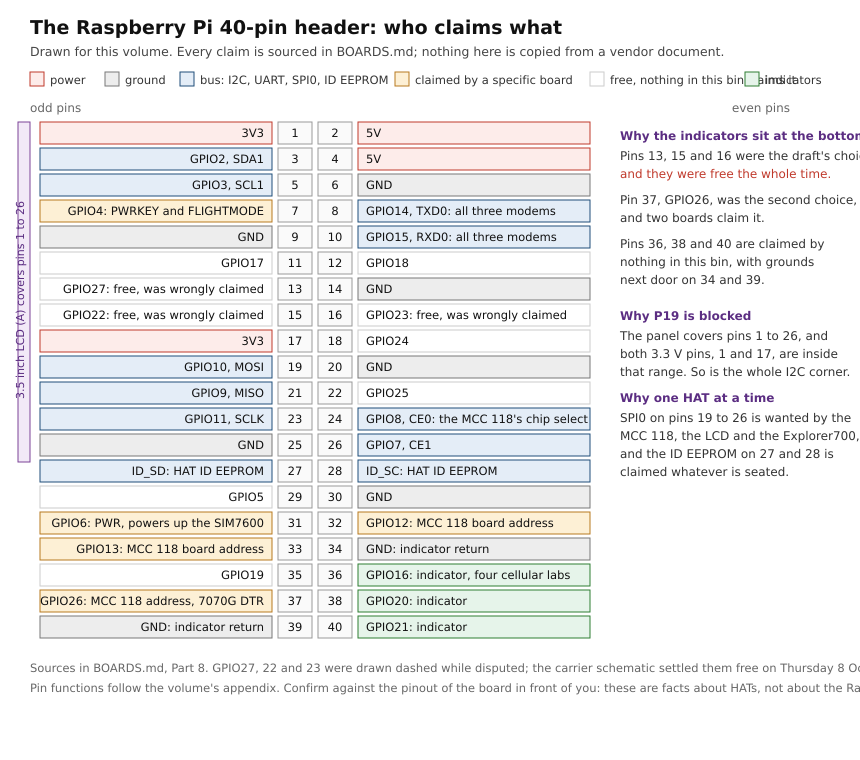

# What every board in this bin actually claims

Welcome. This is the page to read **before** you pick up a jumper wire.

Every lab in this volume is wired from a table, and every one of those tables
rests on facts about a particular board: which header pin it owns, what voltage
its logic runs at, which jumper changes that, and what it quietly connects that
the silkscreen does not mention. Those facts live scattered across twenty
chapters, each stated where it is used. This page gathers all of them in one
place, with their provenance attached, so you can check a pin without reading a
lab you are not building.

It is deliberately pedantic. Three of the corrections in this volume's history
came from a sentence that sounded authoritative and had never been checked
against the page it claimed to summarise, so here every line says where it came
from. If that makes it slower to read, that is the intended trade.

## How to read this page

Every fact below carries one of three marks, and the mark matters more than the
fact:

| Mark | Means |
|---|---|
| **vendor** | The board's own datasheet, wiki or product page says this. It has been read, not summarised from somewhere else |
| **measured** | Someone on this bench put an instrument on it and wrote the number down, with the date |
| **open** | Nobody has established this yet. It is written here as a question, not an answer |

There is no fourth mark for "obviously true". If you find yourself about to wire
something on the strength of a fact with no mark, that is the moment to stop and
look it up, and then please add the mark.

**A note on pin numbering, which has already caused one near miss.** Every pin in
this volume is given as *header pin and BCM number together*, like "pin 7,
GPIO4". That is not padding. One vendor's product page calls the same conductor
"P4" and its own wiki calls it "P7 (wiringPi number)", and neither page says
which scheme it is using. They are the same wire: wiringPi 7 is BCM GPIO4 is
physical header pin 7. A reader who assumes physical numbering on the first page
wires a modem's power key to the 5 V rail. Give both numbers, always, and you
cannot make that mistake.

---

## Part 1: Setting up, before any board comes out of its bag

Three things are worth establishing once, because every later decision leans on
them.

**Which host you actually have.** "Raspberry Pi 3" is not specific enough. This
bench's board reports `Raspberry Pi 3 Model B Rev 1.2` from
`/proc/device-tree/model` **(measured, Friday 2 October 2026)**, and that is a Pi
3 Model B, not a 3B+, although both are in the bin. The same sitting recorded
`gpiochip0`, driver `pinctrl-bcm2835`, 54 lines, with libgpiod v2.2.1 in
userspace. Write those three down for your own host before you begin, because a
chapter that says "the Pi 3" means whichever one you are holding.

**Which header you are looking at.** There are two shapes in this bin and they
are not interchangeable. The Raspberry Pi boards carry a 40-pin header. The
NanoPi NEO Air carries a **24-pin** one **(vendor)**, and no 40-pin HAT seats on
it. This is rule 3 of the volume and it exists because an earlier draft had an
NB-IoT HAT on the NEO Air in two separate projects.

**Which rail is which.** The POW-BB breadboard supply presents a 5 V rail and a
3.3 V rail side by side. Every host I/O pin in this bin is 3.3 V **(vendor, for
Pi, NanoPi and Nucleo alike)**. P15 is the lab that makes the two rails legible,
and the appendix marks it the one lab not to skip.

---

## Part 2: The hosts

| Host | Header | Logic | Notes |
|---|---|---|---|
| Raspberry Pi 3 Model B Rev 1.2 | 40-pin | 3.3 V | The measured host for P15's module work |
| Raspberry Pi 3B+ | 40-pin | 3.3 V | P03, P08 and P11's host |
| Raspberry Pi 4 | 40-pin | 3.3 V | P01, P04, P05, P10, P12, P16, P18 |
| NanoPi NEO Air | 24-pin | 3.3 V | Accepts no HAT in this bin. P09 and P17 |
| NUCLEO-H7A3ZI-Q | Arduino plus Morpho | 3.3 V | Hosts the X-NUCLEO shields, one at a time |

### The Raspberry Pi 40-pin header, and the three groups that matter

**About that drawing, and about every drawing on this page.** It is original work,
made for this volume, and it contains no vendor artwork. That is deliberate: a
board photograph or a datasheet figure belongs to the company that drew it, and
republishing one here would put their material under this repository's licence
without their agreement. What a diagram of our own can do, and a borrowed one
cannot, is show **our** claims and **our** uncertainty: the dashed boxes are the
three lines whose status is open, and no vendor figure would ever mark them that
way. The sources for every fact in it are in Part 8, and the pin functions follow
the volume's appendix.

The full pin table is in the volume's appendix. Three groups carry nearly all the
traffic in these labs, and it is worth knowing which is which before you plan any
wiring.

**Pins 1, 3, 5 and 6, the I2C corner.** 3V3, GPIO2 as SDA1, GPIO3 as SCL1, and a
ground. Most sensors in this bin arrive here.

**Pins 19, 21, 23, 24 and 26, SPI0.** GPIO10 as MOSI, GPIO9 as MISO, GPIO11 as
SCLK, GPIO8 as CE0, GPIO7 as CE1. This is the reason the MCC 118, the 3.5 inch
LCD and the Explorer700 cannot share a host: they all want this bus.

**Pins 27 and 28, the ID EEPROM.** `ID_SD` and `ID_SC`. These belong to the HAT
identification mechanism and are claimed whatever is seated, so no lab in this
volume uses them for anything else.

Ground is on pins 6, 9, 14, 20, 25, 30, 34 and 39. The only 3.3 V pins are 1 and
17, and remembering that pair becomes important the moment a board covers the
lower half of the header.

### The NanoPi NEO Air 24-pin header

**(vendor, confirmed against the silkscreen before use.)** Only the pins these
labs use are listed; the rest is outside this volume's scope.

| Pin | Signal | Used by |
|---|---|---|
| 1 | SYS_3V3 | ADXL345 VCC in P09, ESP8266 supply in P17. **Never put 5 V here** |
| 2 | VDD_5V | Board supply, 5 V at 2 A. Never a sensor or module supply |
| 3 | I2C0_SDA | ADXL345 SDA in P09 |
| 5 | I2C0_SCL | ADXL345 SCL in P09 |
| 6 | GND | Common ground in P09 and P17 |
| 8 | UART1_TX, PG6 | To the ESP8266 RX pin in P17 |
| 10 | UART1_RX, PG7 | From the ESP8266 TX pin in P17 |

There is a **separate 4-pin debug header** carrying UART0: pin 1 GND, pin 2 5V,
pin 3 TX, pin 4 RX, at 3.3 V logic, 115200 8N1. That is the first login in P09.

Please confirm each of these against the silkscreen before applying power. The
NEO Air is a small board with two serial headers and a 3.3 V supply pin sitting
next to a 5 V one, which is a layout that rewards a second look.

---

## Part 3: The six boards that own the 40-pin header

Rule 2 of this volume: six boards each own the header, and you fit one. The
official DSI touchscreen is the documented exception, because it uses the DISPLAY
connector and not the header at all.

### SIM7600E-H 4G HAT (P01, P13)

**The reason the indicator pins moved, and the board whose claim is now in
question.** Read Part 7a before relying on the first three rows.

| What | Header pin | BCM | Mark |
|---|---|---|---|
| UART, module TXD to Pi RXD | 10 | GPIO15 | vendor, manual Table 1 |
| UART, module RXD to Pi TXD | 8 | GPIO14 | vendor, manual Table 1 |
| PWR, powers the module up | 31 | GPIO6 | vendor, manual Table 1, printed there as wiringPi 22 |
| FLIGHTMODE, pull high to enable | 7 | GPIO4 | vendor, manual Table 1, printed there as wiringPi 7 |
| VCCIO select, 3.3 V or 5 V | jumper | | vendor. **Confirm 3.3 V before power** |
| UART select, positions A, B, C | jumper | | vendor. **B is the position that lets the Pi drive the modem** |
| Antenna connectors | MAIN, AUX, GNSS | | vendor. Three, not two |
| Full 40-pin pass-through | all | | vendor, and checked: pins 3 and 5 stay reachable |
| Ring indicator | 13 | GPIO27 | **open, see Part 7a** |
| Data terminal ready | 15 | GPIO22 | **open, see Part 7a** |
| Clear to send | 16 | GPIO23 | **open, see Part 7a** |

Those last three are exactly the pins an earlier draft had chosen for status
indicators, and the stated reason for moving them was that hanging an LED on any
of them puts a second driver on a line the modem is already using. That reasoning
is sound and the premise is now in doubt: the manual's own table of control pins
does not list them. The wiring stays where it is while the question is open, for
the reason given in Part 7.

This board does carry a full pass-through, so the I2C corner remains available,
which is what lets P01 run an accelerometer and a modem on one host.

Some Waveshare HATs carry a jumper block selecting which Pi GPIO reaches each
control line. If the board in front of you has one, removing three jumpers is the
other way to free those pins. Check yours; this is a fact about a board, not
about the Raspberry Pi.

### SIM7020E NB-IoT HAT (P02, P13)

| What | Header pin | BCM | Mark |
|---|---|---|---|
| PWRKEY | 7 | GPIO4 | vendor wiki. PWR jumper, default on |
| UART | 8 and 10 | GPIO14, GPIO15 | vendor |
| VCCIO select | jumper, no header pin | | vendor. 3.3 V or 5 V, **confirm 3.3 V before power** |
| DTR, RI | module control header | not routed to a Pi GPIO | vendor |
| **GPIO27** | | | **free on this board** |

**This board is the subject of this volume's most instructive correction**, and it
is kept in the chapters rather than quietly fixed. An earlier note recorded
GPIO27 as this HAT's power key, and reasoned that an indicator there would pulse
the modem's power with every change of state. That reasoning was sound and the
premise was false: it came from a secondhand summary, and the vendor's own wiki
puts PWRKEY on pin 7, GPIO4, exactly where the SIM7070G puts it. The claim was
withdrawn by name in four files on Sunday 4 October 2026.

**The NET LED is this lab's second instrument (vendor).** Four states, and the
last one is the one P02 is about:

| Pattern | Means |
|---|---|
| 64 ms on, 800 ms off | no network registered |
| 64 ms on, 3000 ms off | registered |
| 64 ms on, 300 ms off | data moving |
| **off** | **power down, or PSM sleep** |

For a lab whose whole subject is the power-saving duty cycle, a dark NET LED
between wakes is the module doing exactly what it was asked. A NET LED that keeps
blinking is the sign that power saving was requested and not granted.

### SIM7070G Cat-M / NB-IoT / GPRS HAT (P03)

| What | Header pin | BCM | Mark |
|---|---|---|---|
| PWRKEY | 7 | GPIO4 | vendor. PWR jumper default; the other position takes it to the supply |
| UART | 8 and 10 | GPIO14, GPIO15 | vendor |
| DTR | 37 | GPIO26 | vendor, **only** with the DTR jumper in position A. Default is disconnected |
| IO level select | jumper, no header pin | | vendor. Default 3.3 V; the other position makes the HAT's logic **5 V** |

The module's own hardware design document settles only half the question. It
confirms the SIM7070G has the lines to route, PWRKEY on module pin 1, UART1_DTR
on 3, UART1_RI on 4, UART1_DCD on 5, UART1_CTS on 7, UART1_RTS on 8, STATUS on 66
and NETLIGHT on 52. **Which Raspberry Pi header pin each of those reaches is the
carrier board's decision, not the module's**, so the module datasheet cannot
answer it and the HAT's own pages must. That distinction is worth internalising:
a module datasheet and a HAT pinout answer different questions.

**Never move the IO level jumper.** Its other position puts 5 V logic on a header
whose every pin is a 3.3 V input. That is precisely the connection P15 exists to
prevent, offered here as a two-position jumper.

### MCC 118 DAQ HAT (P05)

| What | Value | Mark |
|---|---|---|
| Analog inputs | 8 single-ended | vendor |
| Resolution | 12-bit | vendor |
| Sample rate | 100 kS/s **aggregate across the scan**, not per channel | vendor |
| Input limit | **plus or minus 10.1 V on any channel** | vendor |
| Interface | SPI plus the daqhats userspace library | vendor |
| Board address | jumpers all off is board 0 | vendor |
| Also claims | GPIO12, GPIO13, GPIO26 as address pins | vendor |
| ID EEPROM | pins 27 and 28 | vendor |

**There is no IIO device for this board, and looking for one is time spent on
something that does not exist.** The supported path is SPI plus daqhats. An
earlier draft specified it as a mainline IIO device with DMABUF and io_uring, and
there is no `IIO_BUFFER_DMABUF_ATTACH_IOCTL` for this HAT.

The 100 kS/s figure is aggregate. Enabling all eight channels on a first run
divides it eight ways and asks the host to move and store every sample. Start
with two.

A Raspberry Pi header pin is **not** an analog source. It is a digital output
with a series impedance you do not control, so it is not a voltage reference and
should never be wired into a screw terminal to generate a test voltage. The 5 V
rail is acceptable on CH1, and only because 5 is less than 10.1.

### JOY-iT RB-Explorer700 (P11)

**(vendor.)** Wants SPI0, which is why it cannot share a host with the MCC 118 or
the LCD. Carries, among other parts, a DS3231 real-time clock at I2C 0x68, a
BMP280 at 0x76 or 0x77, a PCF8591 at 0x48 and a PCF8574 at 0x20 to 0x27.

### Waveshare 3.5 inch RPi LCD (A) (P06, P19)

This is the board with the most consequential gap in its documentation, so it
gets the longest entry.

| What | Value | Mark |
|---|---|---|
| Resolution | 480 x 320 | vendor |
| Interface | SPI for display and for resistive touch | vendor |
| Socket | **26-pin**, mating header pins 1 to 26 | vendor |
| Pass-through | **none** | vendor, and this blocks a lab |
| Panel | INANBO-T35BLV2, controller ILI9486L, 320 x 480, 37-pin FPC | vendor drawing |
| Panel outline | 54.94 plus or minus 0.15 mm across, active area 49.76 mm | vendor drawing |
| Panel long dimension | about 85 mm, active area 74.24 mm | vendor drawing, read with difficulty |
| Board size | "Same size as your Raspberry Pi 3 / 4 / 5" | vendor wiki, exact words |
| **Carrier outline** | **85.06 x 56.21 mm**, against the Pi's 85 x 56 mm | vendor dimension drawing |
| **Carrier covers pins 27 to 40** | **yes** | **vendor, settled Thursday 8 October 2026** |
| ICs on the carrier | XPT2046 touch controller, 74HC4040 counter, two 74HC4049, 74HC04D, AMS1117-3.3 and CAT6219 regulators | vendor schematic |

**This row used to say open, and it is now settled. Here is what settled it**,
because the evidence is a better lesson than the answer.

The carrier schematic is the document that answers it, and it answers it without
any measuring at all. Its Raspberry Pi connector symbol, `Pi_1`, is drawn as
thirteen rows of two, numbered 1 and 2 down to **25 and 26**, and it stops there.
The netlist carries pads `PIH0Pi01` through `PIH0Pi026` and nothing above. **Pins
27 to 40 are not contacts on this board and are not listed even as "not
connected".** Waveshare's own connection note says the same thing in words: the
Pi has 40 pins, this screen has 26, and the socket is lined up with pins 1 to 26.

The mechanical half follows from the outline. The carrier is 85.06 by 56.21 mm
against the Pi's 85 by 56 mm, so it is the same board outline. Pin 1 of the
26-pin socket sits at the SD card and power end of the header, which puts pins 27
to 40 roughly 15 mm further along toward the USB end, at 2.54 mm pitch, with the
carrier continuing over the remainder of its 85 mm. **Those pins end up under the
PCB.** There is no pass-through header on this carrier.

So the position is: electrically those fourteen pins are untouched, and
mechanically they are buried the moment the panel is seated. **A stacking header,
or an extra-tall header whose pins 27 to 40 clear the 26-pin socket, is what gets
them back.**

**What this says about the reasoning that preceded it.** The earlier inference
pointed at the same answer and was still refused, because it rested on a
marketing sentence plus a dimension drawing of the glass panel rather than the
carrier. Being right by luck is not the same as being right, and the page would
have carried a true sentence resting on a false method. The schematic made it a
fact. The ruler was never needed, which is itself worth noting: **the cheapest
measurement is often a document nobody had opened.**

The drawing was redrawn on Thursday 8 October 2026 when the question closed. The
carrier outline that used to be dashed is now a solid line, and the two
side-by-side outcomes have become one.

**Why anyone cares.** The socket mates pins 1 to 26, so with the panel seated,
pins 1, 3, 5 and 6 are underneath it. Since pins 1 and 17 are the only 3.3 V pins
on the whole header and both are inside the covered range, a sensor on that host
has no supply pin available. Hardware I2C1 exists only on pins 3 and 5, so there
is no second I2C bus to move to either. What remains above pin 26 is grounds on
30, 34 and 39, and GPIOs on 29, 31, 32, 33, 35, 36, 37, 38 and 40, with 27 and 28
reserved for the ID EEPROM.

**P19 had two candidate routes, and this closes one of them.** The volume used to
offer a choice: a 2x20 stacking header to raise the panel and restore every pin,
or the sensor taking 3.3 V from the POW-BB rail, grounding above pin 26, and
running on a bit-banged bus through the `i2c-gpio` overlay. The second was the
attractive one because it costs nothing.

**It is not available.** Those GPIOs are under the carrier once the panel is
seated, so there is nowhere to attach a jumper to them. A seated board leaves no
free bit-bang bus, and no amount of overlay configuration changes where a
connector physically fits. P19 therefore needs **one small part that this bin
does not contain**: a stacking header, or a tall header whose pins 27 to 40 clear
the 26-pin socket.

That is a cleaner position than the volume had before. The lab is not blocked on
an unknown any more; it is blocked on a purchase, and it can say which one.

**A note for anyone holding a different revision.** The (A) is the carrier in
this bin: 480 x 320, SPI, resistive touch, green carrier, no pass-through. The
(B), (C) and (G) are different boards. The (G) schematic, dated Saturday
28 March 2025, draws a full 40-pin header and still has no pass-through, so the
same physical conclusion applies to it unless someone measures a cut-back edge on
that revision. The official 7 inch DSI panel is not this carrier at all and does
not touch the GPIO header.

---

## Part 4: The Arduino-form shields

**(vendor.)** All three are X-NUCLEO boards in Arduino form factor. They stack on
the NUCLEO-H7A3ZI-Q **one at a time**, or reach a Raspberry Pi I2C bus on flying
leads. Rule 5 of this volume counts them as three different instruments and they
are never interchangeable.

| Shield | Carries | At |
|---|---|---|
| X-NUCLEO-IKS4A1 | LSM6DSO16IS or LSM6DSV16X | 0x6A |
| | SHT40AD1B humidity | 0x44 |
| | LPS22DF pressure | 0x5C |
| | STTS22H temperature | 0x38 |
| | LIS2MDL magnetometer | 0x1E |
| X-NUCLEO-IKS5A1 | **ISM6HG256X** | 0x6A |
| | **ISM330IS**, the one with the ISPU | 0x6B |
| | ILPS22QS | 0x5C |
| | IIS2DULPX | 0x19 |
| X-NUCLEO-53L8A1 | VL53L8CX, 8x8 multizone time of flight | 0x29 in I2C mode |

**The IKS5A1 does not carry an ISM330DHCX.** An earlier draft specified a machine
learning core lab on that part and placed it on this shield. That IMU is on the
STWIN.box. The IKS5A1 has the ISM330IS with its ISPU, and the ISM6HG256X, so P08
uses the chips that are actually present.

**The VL53L8CX needs ST's ULD, STSW-IMG040, which is a licence-gated download.**
The specified test build links it, so even the hardware-free tests cannot run
without accepting that licence. That is a real constraint on anyone reproducing
this work and is stated rather than discovered.

---

## Part 5: USB devices, flying leads and supplies

| Part | What it is | Mark |
|---|---|---|
| STEVAL-STWINBX1, the STWIN.box | A **USB-C device**, not a shield and not a HAT | vendor |
| | CDC-ACM appears only after the firmware declares it. USB-C is the connector, not a promise of a virtual COM port | vendor |
| SBC-NodeMCU-ESP32 | USB and UART | vendor |
| Joy-it SBC-ESP8266-PROG | USB and UART; AT set is short: `AT`, `AT+CWMODE=1`, `AT+CWJAP`, `AT+CIFSR` | vendor |
| DFRobot SEN0032, ADXL345 | 3-axis accelerometer, I2C **0x53 with SDO floating**, INT1 available | vendor |
| Renkforce USB/TTL cable | Sealed PL2303HX moulding, four leads | vendor |
| nRF Power Profiler Kit II | Source meter from 0.8 to 5.0 V, up to about 1 A, over USB | vendor |
| SBC-POW-BB | Breadboard rail splitter presenting 5 V and 3.3 V | vendor |
| Joy-it LK-LED10 | 10 mm indicator module with its own resistor R1 fitted | vendor and measured |

### The Renkforce USB/TTL cable, lead by lead

**(vendor.)** The moulding is sealed, so there is nothing to open and check.

| Lead | Signal | Connect to |
|---|---|---|
| Red | 5 V | **nothing**. The target powers itself |
| Black | GND | target ground |
| Green | TX | target RX |
| White | RX | target TX |

Its 3.3 V logic level is **documented by the vendor and has not been measured on
this bench**, which is the honest state of that claim. 115200 8N1 is the console
setting used throughout.

### The LK-LED10 modules, where vendor and measurement disagree pleasantly

The module has four pins, S1, S2, U and G, with R1 the fitted resistor, all
printed on the silkscreen. It carries a 2.54 mm male header beside the white
2.0 mm LinkerKit socket, **so ordinary Dupont jumpers mate with it** (measured).

That last sentence has a history worth telling, because believing otherwise was
expensive. A note once recorded that the 2.0 mm socket could not take Dupont
jumpers and that a dedicated cable or a soldered pigtail was required. On that
basis one project deferred its LED output after driving three pins into open air,
another deferred three status indicators, and a third was designed around bare
LEDs and resistors that are not in this bin at all. Nothing was ever missing. A
photograph settled it.

**Measured on Friday 2 October 2026**, on the Pi 3 Model B Rev 1.2: the signal pin
is the **anode** side, so the header pin **sources** current, a pin driven high
is lit, low is dark, and a line released to an input is dark and reads low. The
module needs **signal and ground only**; one module had U wired and lit
identically with that jumper pulled out. Three lit together from pins 11, 13 and
15 with no visible dimming.

**Which way round the LED sits is not printed on the board**, so test one module
with three controls before wiring three: drive high, drive low, release.

**Measured with the PPK2 on Saturday 3 October 2026**, each module alone on the
source meter, S1 to VOUT and G to GND, window on the lit stretch:

| | blue | green | yellow | red |
|---|---|---|---|---|
| at 5.000 V | 9.81 mA | 15.98 mA | 13.10 mA | 13.16 mA |
| at 3.300 V | 2.94 mA | 7.39 mA | 6.20 mA | 6.34 mA |
| effective R | 247 ohm | 198 ohm | 246 ohm | 249 ohm |
| derived Vf | 2.57 V | 1.84 V | 1.77 V | 1.72 V |

The fraction kept at 3.3 V is `(3.3 - Vf) / (5 - Vf)` and it matches all four.
Blue keeps 30 per cent and the other three about half. **This green is the old
low-forward-voltage type, not an InGaN green**, so it sits with yellow and red; a
prediction that put it beside blue was wrong and is recorded as wrong in P15.
Three modules on the Pi together draw 16.5 mA at 3.3 V.

---

## Part 6: Decisions taken before any wire was cut

These are the choices the wiring tables encode. Each is listed with the reason,
because a reason you can read is a reason you can disagree with.

**One 40-pin board per host.** Six boards own that header and they overlap on
SPI0 and on the ID EEPROM. There is no arrangement in which two of them work,
so the labs tear one down before the next goes on.

**Indicators on BCM16, BCM20 and BCM21, pins 36, 38 and 40, for all four cellular
labs.** Not because those are special, but because nothing in this volume
documents a claim on them, and **one assignment that is safe on all four labs is
easier to hold in the head than four different ones**. Grounds to pin 34 or 39.

**No jumper between the 5 V rail and any header pin, on any host, at any point.**
Two boards in this bin offer a jumper that makes this easy to do by accident, the
SIM7020E's VCCIO select and the SIM7070G's IO level select. Both default to
3.3 V. Confirm, do not assume.

**Antennas and SIM fitted before power, every time.** Transmitting into an open
port stresses the module's own power amplifier, and a SIM inserted under power is
not detected until the next boot anyway.

**A module datasheet does not answer a carrier board question.** The SIM7070G
entry above is the worked example. Module pin numbers tell you what exists; the
HAT's pinout tells you where it goes.

---

## Part 7: Reflections on rewiring, and on the wiring that stayed put

This is the section that was hardest to write honestly, and probably the most
useful. The indicator pins in this volume moved **three times**. Here is each
move with its reason, including the one whose reason turned out to be wrong.

### Move 1: off pins 13, 15 and 16. Correct, and for the stated reason.

The draft put three indicators on header pins 13, 15 and 16, GPIO27, GPIO22 and
GPIO23. On a bare Pi that is perfectly fine and it is what P15 still uses. Under
the SIM7600E-H it is not: those are the modem's ring indicator, data terminal
ready and clear to send. **This move was right and the reason holds.**

### Move 2: onto BCM26. Wrong, and caught by an unrelated reading.

The replacement landed on BCM26 among others. Two separate boards claim it: the
MCC 118 uses GPIO26 as a board-address pin, and the SIM7070G's DTR jumper
connects GPIO26 when it sits in position A. Neither of those was known when the
pin was chosen.

**The uncomfortable part is how it was caught.** It was abandoned because of the
MCC 118, found while writing a different chapter, and the SIM7070G collision was
only noticed later when that HAT's pages were read properly. The right answer
arrived partly by luck. That is worth admitting in a document whose whole purpose
is that facts get checked rather than guessed.

### Move 3: onto BCM16, BCM20 and BCM21. Where it rests.

Chosen because no board in this bin documents a claim on them, and kept uniform
across all four cellular labs on purpose.

### The move that was made for a reason that was then withdrawn

P02's indicator was moved off GPIO27 on the grounds that the SIM7020E used that
pin for the module's power key. **That reason was false**, from a secondhand note
rather than the vendor. GPIO27 is free on that board.

**The indicator did not move back**, and the volume says why: the uniform
assignment across four labs is worth more than reclaiming one pin, and the board
that genuinely does claim GPIO27 is the SIM7600E-H in a neighbouring lab. So the
wiring is unchanged and only the justification was rewritten. **A correct
conclusion resting on a false premise is still a defect**, and leaving the
conclusion while fixing the premise is the honest repair.

### The wiring that did not change at all, and why that is a result

The sibling twenty-project volume specified bare LEDs with 330 ohm series
resistors, which this bench does not have. When it was corrected to the LK-LED10
modules, **the electrical arrangement did not change by one wire**: it already had
the anode on the GPIO and the cathode on ground, which is exactly what the bench
then measured. Only the parts list was wrong.

The kit labs volume had the polarity the other way round and needed a real
correction. Two sibling volumes, the same parts, one wrong about components and
one wrong about physics. It is a good reminder that "we corrected that volume"
does not tell you what was corrected.

### What is deliberately not rewired

**P19 is left blocked rather than quietly rerouted.** It would be easy to specify
the bit-banged route and move on. Whether that route exists at all depends on a
measurement nobody has taken, so the chapter says it is blocked, says what the
two routes are, and says which single measurement decides. A lab that admits it
is stuck is more useful than one that confidently prescribes something that may
not fit.

---

## Part 7a: What changed when the datasheets were read in full

Everything above Part 7 was assembled from facts already in the chapters. On
**Wednesday 7 October 2026** two of the source documents were opened and read
end to end rather than cited. This section records what that found, including one
result that puts a load-bearing claim of this volume in doubt.

### The MCC 118, in the detail the chapters never carried

From the [electrical specification](https://mccdaq.github.io/daqhats/_static/esmcc118.pdf),
revision 1.1, dated 10/09/19. Everything here is **vendor**.

| Parameter | Specification |
|---|---|
| Converter | Successive approximation, 12 bits, 8 single-ended |
| Input voltage range | plus or minus 10 V |
| **Maximum working voltage** | **plus or minus 10.1 V relative to AGND** |
| **Absolute maximum input** | **plus or minus 25 V, power on or power off** |
| Input impedance | 1 Mohm, power on or power off |
| Input bias current | 12 uA at 10 V, 2 uA at 0 V, 12 uA at minus 10 V |
| Input bandwidth | 150 kHz small signal, minus 3 dB |
| Crosstalk | minus 75 dB, adjacent channels, DC to 10 kHz |
| **Recommended warm-up** | **1 minute minimum** |
| Internal scan clock | 0.004 S/s to 100 kS/s, software-selectable |
| Conversion time | 8 us per channel |
| Channel queue | up to eight unique, **ascending** channels |
| Data FIFO | 7 K, that is 7168 analog input samples |
| Supply current from 3.3 V | 35 mA typical, 55 mA maximum |
| SPI | slave, CE0 chip select, **mode 1**, 10 MHz maximum |
| Pi GPIO used | GPIO8, 9, 10, 11 for SPI; ID_SD and ID_SC; **GPIO12, GPIO13, GPIO26** for board address |
| Dimensions | 65 x 56.5 x 12 mm maximum |

**Two corrections of emphasis, not of fact.** This volume has been saying "never
exceed plus or minus 10.1 V", which is right as a working rule and was slightly
wrong about what kind of limit it is. 10.1 V is the *maximum working voltage*.
The *absolute maximum* before the input stage is at risk is plus or minus 25 V,
power on or off. Keep obeying 10.1; now you also know that a slip to 12 V is a
reading you cannot trust rather than a part you have lost. And the GPIO claim the
chapters make is confirmed exactly, GPIO12, GPIO13 and GPIO26, which is pleasant
because that is the claim that sent the indicators to BCM16, 20 and 21.

**Three figures that settle questions P05 left open.** The accuracy table gives,
for the plus or minus 10 V range, gain error 0.098 per cent of reading, offset
error 11 mV, absolute accuracy at full scale 20.8 mV. So at a 3.3 V reading the
converter's own worst-case error is roughly 14 mV, comfortably inside P05's
acceptance band of plus or minus 0.05 V. **That acceptance test was set before
anyone had read this table, and it turns out to be a fair test rather than a
generous or an impossible one.** The 7168-sample FIFO is the number that explains
why a scan read of 20000 samples must be drained in blocks. And the one-minute
warm-up the chapter already instructs is the vendor's own recommended minimum.

**One footnote worth knowing.** The throughput table notes that the highest
throughput "may be achieved by using a Raspberry Pi 3 B+". This volume puts the
MCC 118 on the Pi 4. Nothing here says the Pi 4 is worse, and the note is from
2019, so this is **open** rather than a correction: if P05 ever misses its sample
count, the host is a thing to vary.

### The SIM7600E-H, where the manual and this volume disagree

From the [HAT user manual](https://www.waveshare.com/w/upload/6/6d/SIM7600E-H-4G-HAT-Manual-EN.pdf),
Rev1.0, dated June 8, 2018.

**First, three facts this volume did not have.**

**This board also carries a 3.3 V / 5 V selection jumper**, item 20 in the
manual's board diagram: "Operating voltage selection jumper: VCCIO - 3.3V: set
operating voltage as 3.3V; VCCIO - 5V: set operating voltage as 5V". The chapters
name that hazard on the SIM7020E and the SIM7070G and say nothing about it here.
**All three modem HATs in this bin can be jumpered to 5 V logic**, and that is a
stronger statement than any single chapter was making. Confirm it sits on 3.3 V
before power, on every one of the three.

**It carries three antenna connectors, not two**: MAIN, AUX and GNSS. The kit
lines say "LTE and GNSS antennas". AUX is a diversity receive input, and whether
this bin has a third antenna is **open**.

**The UART selection jumper has three positions**, A to access the Raspberry Pi
via the onboard USB to UART, B to control the SIM7600 from the Raspberry Pi, and
C to control it via USB to UART. **Position B is the one P01 needs.** The manual
also notes the console device differs by host: `ttyAMA0` on the Pi 2B and Zero,
`ttyS0` on the Pi 3B.

**Now the disagreement, and please read this one carefully.**

The manual's Table 1 is captioned "The relationship between SIM7600 control pins
and Raspberry Pi IOs" and lists **six** rows, and only six:

| SIM7600 | IO of Raspberry Pi B+ | Description |
|---|---|---|
| 5V | 5V | Power supply (5V) |
| GND | GND | Ground |
| TXD | RXD (BCM P15) | UART pin |
| RXD | TXD (BCM P14) | UART pin |
| PWR | P22 (BCM P6) | Power up the module |
| FLIGHTMODE | P7 (BCM P4), pull high enable flight mode | Flight mode |

**RI, DTR and CTS do not appear.** This volume states, in P01, in P03 and in the
appendix, that the SIM7600E-H drives GPIO27, GPIO22 and GPIO23 as ring indicator,
data terminal ready and clear to send, and **that claim is the entire reason the
indicator pins were moved off header pins 13, 15 and 16**. The manual does not
support it. What it shows instead is a separate "SIM7600 control interface" on
the board, item 8, described as being for host boards like Arduino or STM32,
which is the same arrangement the SIM7020E has: the module's control lines live
on their own header rather than on Pi GPIOs.

**This is marked open, not corrected, and the distinction matters.** One document
is not a refutation any more than one secondhand note was a confirmation, and
there are honest reasons the manual might be incomplete: it is Rev1.0 from June
2018, board revisions change, and a wiki page may carry a fuller table. But the
volume's claim now rests on something that the vendor's own manual does not say,
which is exactly the position the SIM7020E power-key claim was in before it was
withdrawn. **It is the third time this failure mode has appeared in this bin.**

What settles it, in order of effort: read the product wiki's pinout table; look at
the board's silkscreen next to the 40-pin header; or, decisively, seat the HAT,
drive each of GPIO27, GPIO22 and GPIO23 as an input and watch whether anything
moves while the modem registers.

**The wiring does not change while this is open**, and the reason is the same one
given in Part 7: BCM16, 20 and 21 are free on every board checked, and a uniform
assignment across four cellular labs is worth more than reclaiming three pins. If
the claim falls, what changes is a justification in three files, not a wire.

Two more rows for the record, both **vendor** and both new: the manual gives PWR
as wiringPi 22, BCM GPIO6, and FLIGHTMODE as wiringPi 7, BCM GPIO4. **GPIO4 again**,
the same pin the SIM7020E and SIM7070G use for PWRKEY, and spelled in the same
wiringPi-without-saying-so style this page warns about in its opening. Neither
pin collides with BCM16, 20 or 21.

## Part 8: Where to check any of this

Every **vendor** mark above points at one of the documents below. They are listed
so you can disagree with this page by reading its sources rather than by trusting
it, which is the only kind of disagreement worth having.

**This list is deliberately short.** A document earns a place here only if a claim
on *this page* rests on it. That rule left out a good deal of material that is
genuinely about these boards, and the reasons are given at the end, because an
omission you can see is better than a list you cannot audit.

**One caveat, in the spirit of the rest of this page.** These are the documents
the facts above came from, gathered at different times as each lab was written.
They were not all re-read in one sitting while this list was assembled, so treat
the list as "here is where to check this claim" rather than as "all of this was
verified again today". If you do re-read one and it disagrees with a line here,
the document wins and the line is wrong.

### Hosts

| Board | Document | What it settles here |
|---|---|---|
| Raspberry Pi 4 | [Raspberry Pi 4 datasheet](https://datasheets.raspberrypi.com/rpi4/raspberry-pi-4-datasheet.pdf) | The 40-pin header, and the standing instruction to confirm pins 4, 7, 17, 27 and 28 against it |
| Raspberry Pi 3B+ | [Raspberry Pi 3 Model B+ datasheet](https://datasheets.raspberrypi.com/rpi3/raspberry-pi-3-b-plus-datasheet.pdf) | The same header on the other Pi generation in this bin |
| NanoPi NEO Air | [Schematic V1.1](https://wiki.friendlyelec.com/wiki/images/7/70/Schematic_NanoPi-NEO-Air-V1.1_1708.pdf) | The 24-pin header, SYS_3V3 on pin 1, VDD_5V on pin 2, and the separate UART0 debug header |
| NUCLEO-H7A3ZI-Q | [UM2408](https://www.st.com/resource/en/user_manual/um2408-stm32h7-nucleo144-boards-mb1363-stmicroelectronics.pdf) | That the Arduino and Morpho headers are what the X-NUCLEO shields stack on |
| Official touchscreen | [7 inch display product brief](https://datasheets.raspberrypi.com/display/7-inch-display-product-brief.pdf) | That it uses the DISPLAY connector, which is why it is rule 2's documented exception |

### The boards that own the 40-pin header

| Board | Document | What it settles here |
|---|---|---|
| SIM7600E-H | [HAT manual](https://www.waveshare.com/w/upload/6/6d/SIM7600E-H-4G-HAT-Manual-EN.pdf) | GPIO27, GPIO22 and GPIO23 as ring indicator, DTR and CTS, and the full pass-through |
| SIM7020E | [HAT wiki](https://www.waveshare.com/wiki/SIM7020E_NB-IoT_HAT) | PWRKEY on pin 7, GPIO4, the VCCIO jumper, and the four NET LED patterns. **This is the page that withdrew the GPIO27 claim** |
| SIM7070G | [HAT wiki](https://www.waveshare.com/wiki/SIM7070G_Cat-M/NB-IoT/GPRS_HAT) | PWRKEY on pin 7, DTR on pin 37 only with jumper A, and the IO level jumper |
| SIM7070G module | [SIM7000 series documents](https://simcom.ee/documents?dir=SIM7000x) | The module-side pin numbers: PWRKEY 1, DTR 3, RI 4, DCD 5, CTS 7, RTS 8, STATUS 66, NETLIGHT 52. Note it answers the module question and **not** the carrier question |
| MCC 118 | [Electrical specification](https://mccdaq.github.io/daqhats/_static/esmcc118.pdf) | Plus or minus 10.1 V, 12-bit, 100 kS/s aggregate, 8 single-ended inputs, the address jumpers |
| Explorer700 | [RB-Explorer700 manual](https://www.joy-it.net/files/files/Produkte/RB-Explorer700/RB-Explorer700-Manual-16.11.2020.pdf) | The DS3231, BMP280, PCF8591 and PCF8574 and their addresses |
| 3.5 inch LCD (A) | [Waveshare wiki](https://www.waveshare.com/wiki/3.5inch_RPi_LCD_(A)) | 480 x 320, SPI, the 26-pin socket, the absence of a pass-through, the carrier outline of 85.06 x 56.21 mm, and the exact words "Same size as your Raspberry Pi 3 / 4 / 5" |
| 3.5 inch LCD (A) carrier | [Schematic](https://www.waveshare.com/w/upload/f/fb/3.5inch-RPi-LCD-A-Schematic.pdf) | **The document that settled P19.** Its `Pi_1` connector symbol runs 1 and 2 down to 25 and 26 and stops, and the netlist has pads 1 to 26 and nothing above |
| XPT2046 | [Datasheet](https://www.waveshare.com/w/upload/f/f7/XPT2046.pdf) | The resistive touch controller on that carrier, sharing SPI0 with the display |
| 74HC4040, 74HC4049 | [CD74HC4040](https://www.ti.com/lit/ds/symlink/cd74hc4040.pdf), [CD74HC4049](https://www.ti.com/lit/ds/symlink/cd74hc4049.pdf) | The counter and inverters that turn the Pi's serial clock into the panel's parallel bus, which is why this carrier is not a plain SPI display |
| AMS1117-3.3, CAT6219-330 | [AMS1117](https://www.advanced-monolithic.com/pdf/ds1117.pdf), [CAT6219](https://www.onsemi.com/download/data-sheet/pdf/cat6219-d.pdf) | The two regulators on the carrier, for anyone budgeting its draw |
| Other 3.5 inch revisions | [(B)](https://www.waveshare.com/wiki/3.5inch_RPi_LCD_(B)), [(C)](https://www.waveshare.com/wiki/3.5inch_RPi_LCD_(C)), [(G) schematic](https://www.waveshare.net/w/upload/6/63/3.5inch_RPi_LCD_%28G%29.pdf) | Listed so nobody applies this page's conclusion to the wrong board. The (G) draws a full 40-pin header and still has no pass-through |

### Shields and instruments

| Part | Document | What it settles here |
|---|---|---|
| X-NUCLEO-IKS4A1 | [UM3239](https://www.st.com/resource/en/user_manual/um3239-getting-started-with-the-xnucleoiks4a1-motion-mems-and-environmental-sensor-expansion-board-for-stm32-nucleo-stmicroelectronics.pdf) | The shield's sensor complement and its I2C addresses. Already cited by chapter 7 |
| X-NUCLEO-IKS5A1 | [Product page](https://www.st.com/en/evaluation-tools/x-nucleo-iks5a1.html) | Which parts are actually on this shield |
| ISM330IS | [Datasheet](https://www.st.com/resource/en/datasheet/ism330is.pdf) | That this is the IKS5A1's IMU, the one with the ISPU, at 0x6B |
| ISM6HG256X | [Datasheet](https://www.st.com/resource/en/datasheet/ism6hg256x.pdf) | The IKS5A1's other IMU, at 0x6A |
| ISM330DHCX | [Datasheet](https://www.st.com/resource/en/datasheet/ism330dhcx.pdf) | Listed **because of where it is not**: it is on the STWIN.box, not the IKS5A1, which is the correction P08 rests on |
| X-NUCLEO-53L8A1 | [Product page](https://www.st.com/en/evaluation-tools/x-nucleo-53l8a1.html) | The carrier for the time of flight sensor |
| VL53L8CX | [Datasheet](https://www.st.com/resource/en/datasheet/vl53l8cx.pdf) | 8x8 multizone ranging, and 0x29 in I2C mode |
| STWIN.box | [STEVAL-STWINBX1 product page](https://www.st.com/en/evaluation-tools/steval-stwinbx1.html) | That it is a USB-C device rather than a shield or a HAT |
| ADXL345 | [Datasheet Rev G](https://www.analog.com/media/en/technical-documentation/data-sheets/ADXL345.pdf) | 0x53 with SDO floating, and the INT1 line |
| nRF PPK2 | [User guide](https://docs.nordicsemi.com/bundle/ug_ppk2/page/UG/ppk/PPK_user_guide_Intro.html) | Source meter mode, its voltage range and its current ceiling |

### What was deliberately left out, and why

Please add any of these the moment a claim here starts depending on one.

- **BCM2711 and BCM2835 peripherals manuals.** Nothing on this page makes a
 register-level claim. They are the right source the moment one does.
- **STM32H7A3 datasheet and RM0455.** Same reason. This volume treats the Nucleo
 as a host that speaks over USB; the part's internals belong to the firmware
 volume, where RM0455 is load-bearing.
- **Allwinner H3 datasheet.** The NEO Air's schematic answers every header
 question asked here without going to the SoC.
- **The SIM7600E-H module manual.** The HAT manual answers the carrier question,
 and the carrier question is the one that decides wiring. The SIM7070G is the
 exception above precisely because its module document was needed to show what
 the carrier page leaves out.
- **The ILI9486 datasheet.** The panel drawing names an ILI9486**L**, and treating
 a datasheet for the unsuffixed part as the source for the suffixed one is the
 kind of near-enough that this page exists to avoid.
- **Individual IKS4A1 sensor datasheets, the remaining IKS5A1 and STWIN.box
 sensors, and the Explorer700's four parts.** Their addresses come from the
 shield or board document already listed. The individual datasheets become the
 right source when a lab starts caring about a register, a range or a rate.
- **ESP32 and ESP8266EX datasheets.** This page claims nothing about either part
 beyond how it connects, and the AT command set is firmware rather than silicon.

## Part 9: What is still open

Please consider this an invitation. Each of these is small, and each would close
a real gap.

| Open question | How to settle it |
|---|---|
| ~~Does the LCD's carrier cover pins 27 to 40?~~ | **Closed Thursday 8 October 2026: yes.** The carrier schematic's connector stops at pin 26 and the outline is 85.06 x 56.21 mm. P19 needs a stacking header |
| What voltage are the rails actually at? | A multimeter. There is none on this bench, which is the single purchase that unblocks the most acceptance tests |
| Is the Renkforce cable's logic really 3.3 V? | Documented by the vendor, never measured here |
| Which OS image and kernel were the measurements taken on? | `cat /etc/os-release`, `uname -a` and `cat /proc/device-tree/model`, recorded together next time |
| Does the SIM7600E-H in this bin have the GPIO-select jumper block? | Look at the board. Some Waveshare HATs have one |

If you settle one, the thing that matters most is not the answer. It is adding
the mark: **vendor**, **measured** with a date, or still **open**. That is the
whole discipline of this page, and it is the reason the three withdrawn claims in
this volume were found at all.
