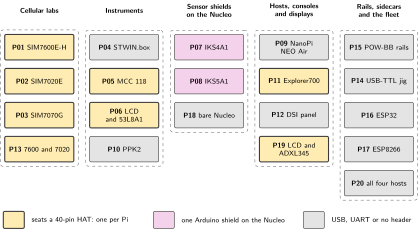

# Embedded Linux Top 20

*audited kit cookbook, illustrated edition*

Joseph Ambrose Pagaran. Wednesday 30 September 2026.

## About this edition

This volume re-publishes the audited kit cookbook with the diagrams it never had. The text you are reading is the cookbook: its twenty labs, its verdicts, its corrections and its refusals. Nothing in the audit has been softened, and no hardware appears here that is not in the bin the cookbook was written against.

What this edition adds is drawing. Every lab now carries an architecture diagram, a schematic with a wiring table of real pin numbers, a bench layout, a UML view of the software or the procedure, an ASCII data flow and a short pitfalls list. Those six additions are the work of this edition. The content, the verdicts and the corrections are the cookbook's own.

The cookbook itself starts from two sources: the kit-only 20-lab split, and a 198-page collection of advanced architectural blueprints. The draft had the right ambition, including QMI instead of PPP, PSM and eDRX, sensor-hub modes, the PPK2 on the modem rail and store-and-forward. It also contained pairings that cannot be built from this bin. This book keeps the ambition and throws out the impossible wiring.

Hosts run Raspberry Pi OS Bookworm; the NanoPi runs FriendlyElec Ubuntu.



*Figure 1. The twenty labs, grouped by the five parts of this book, with the exclusive part each one occupies. The eight labs drawn with a heavy border seat a 40-pin HAT, and only one of those can sit on a given Pi at a time.*

## Non-negotiable lab rules

> [!IMPORTANT]
> **Non-negotiable lab rules**
>
> 1. **No new parts.** HAT antennas are in-scope. A data SIM is assumed only for P01 to P03 and P13. Without a SIM those labs stop at AT bring-up, and that is still a pass.
> 2. **HAT exclusivity.** SIM7600E-H, SIM7070G, SIM7020E, MCC 118, JOY-iT Explorer700 and the Waveshare 3.5 inch LCD (A) each own the 40-pin header. Fit one. The official DSI touchscreen does not consume the header.
> 3. **NanoPi is 24-pin.** It cannot accept any 40-pin HAT. Do not seat SIM7020, SIM7070, SIM7600, MCC 118, Explorer700 or the 3.5 inch LCD on the NEO Air.
> 4. **3.3 V GPIO.** Pi, NanoPi and Nucleo I/O are 3.3 V. POW-BB is a labelled rail splitter.
> 5. **One physics per lab.** IKS4A1, IKS5A1, STWIN, ADXL345, VL53L8CX and MCC 118 are six different instruments, never interchangeable.
> 6. **Linux owns the system.** Nucleo, STWIN, ESP32 and ESP8266 speak USB-CDC, UART or I2C to a host that owns storage, time, networking and the UI. A bare-metal sketch is allowed only when a Linux host still records the stream (P18).

Build one lab at a time. Tear the 40-pin HAT off before the next lab.

## The three ways to damage this kit

Each of these is stated again inside the lab that owns it. They are repeated here because the labs are written to be opened one at a time from a table, and a reader who starts at P05 has not read P15. No other mistake in this volume costs a part.

> [!IMPORTANT]
> **Read this before powering anything**
>
> 1. **A 5 V rail on a 3.3 V header pin.** Pi, NanoPi and Nucleo I/O are 3.3 V, and the POW-BB presents both rails side by side on the same breadboard. No jumper runs from the 5 V rail to any header pin, on any host, at any point in any lab. P15 is the lab that proves the two rails are told apart by reading rather than by guessing, and it is the one lab the appendix marks do not skip.
> 2. **More than <span class="math">±</span>10.1 V on an MCC 118 input.** That is the converter's limit on any channel. The 5 V rail is acceptable on CH1 only because 5 is less than 10.1. A Pi header pin is not an analog source: it is a digital output with a series impedance you do not control, so never wire one into a screw terminal to generate a test voltage. P05 owns this.
> 3. **A cellular modem powered with no antenna fitted.** Transmitting into an open port stresses the module's own power amplifier. Fit every antenna the HAT expects, and the SIM, before applying power, because a SIM inserted under power is not detected until the next boot either. This applies to the SIM7600E-H of P01, the SIM7020E of P02, the SIM7070G of P03 and both modems of P13, and the appendix repeats it for teardown: refit antennas before the next transmission.

## The audit

Every lab in this book was checked against the parts that actually exist in the bin. The verdict table is the result. A status of Buildable means the wiring closes with the kit in hand, not that the lab is easy.

| Lab | Primary capability | Host and exclusive part | Status |
| --- | --- | --- | --- |
| P01 | LTE Cat-4 default route plus shock events | Pi 4 + SIM7600 + ADXL | Buildable |
| P02 | NB-IoT PSM/eDRX CoAP | Pi 3 + SIM7020 | Buildable, SIM required for RF |
| P03 | Cat-M MQTT plus GNSS stamp | Pi 3B+ + SIM7070 | Buildable; lock AT+CMNB=1 |
| P04 | 6 kHz vibration and ultrasound CDC | Pi 4 + STWIN + DSI | Buildable; firmware chooses CDC |
| P05 | 10 V 100 kS/s analog | Pi 4 + MCC 118 | Buildable via daqhats, not IIO |
| P06 | 8x8 ToF occupancy kiosk | Pi 3 + LCD + Nucleo + 53L8 | Buildable; two hosts |
| P07 | Consumer 9-DoF plus RH and Qvar | Nucleo + IKS4A1 + Pi CDC | Buildable |
| P08 | Industrial high-g and 4060 hPa | Nucleo + IKS5A1 + Pi CDC | Buildable; not ISM330DHCX |
| P09 | Allwinner headless I2C hub | NanoPi + ADXL + UART0 | Buildable; 24-pin only |
| P10 | Source-measure energy figures | Pi 4 + PPK2 + ESP32 DUT | Buildable; isolate DUT USB |
| P11 | RTC, OLED, IR and DTO console | Pi 3B+ + Explorer700 | Buildable |
| P12 | Operator glass plus Mosquitto | Pi 4 + official DSI + keyboard | Buildable; no 40-pin HAT |
| P13 | Signalling failover 4G to NB | Pi 4+7600 and Pi 3+7020 | Buildable; two hosts |
| P14 | Serial provisioning jig | Pi 3 + USB-TTL + ESP32/8266 | Buildable |
| P15 | Mixed-voltage GPIO discipline | POW-BB + LEDs + any host | Buildable |
| P16 | Wi-Fi/BLE sidecar | Pi 4 + ESP32 | Buildable |
| P17 | AT-command air-gap modem | NanoPi + ESP8266, onboard Wi-Fi off | Buildable |
| P18 | High-rate USB-CDC recorder | Pi 4 + bare Nucleo, EKF optional | Buildable; Linux still records |
| P19 | Offline SPI-LCD tilt meter | Pi 3 + 3.5 inch LCD + ADXL | Buildable; LCD owns header |
| P20 | Four-host fleet health | All Linux boards + SSH | Buildable |

*Table 1. The audit verdict for all twenty labs.*

> [!IMPORTANT]
> **Do not build these pairings**
>
> Errors found in the 198-page blueprint.
>
> - **NanoPi plus any 40-pin HAT** (draft P4, P12). NEO Air is a 24-pin header. SIM7020E does not seat. NB-IoT moves to Pi 3, our P02.
> - **Explorer700 plus SIM7600 on one Pi** (draft P18). Two 40-pin HATs. Split across hosts, or drop one HAT.
> - **IKS5A1 hosting an ISM330DHCX MLC** (draft P13). That IMU is on the STWIN.box. IKS5A1 has ISM330IS with the ISPU, and ISM6HG256X. Our P08 uses the chips that are actually on IKS5A1.
> - **MCC 118 as a mainline IIO plus DMABUF and io\_uring device** (draft P2, P17). The supported path is SPI plus the daqhats userspace library. There is no IIO\_BUFFER\_DMABUF\_ATTACH\_IOCTL for this HAT.
> - **Intel MKL on a Pi 4** (draft P1). Use NumPy, FFTW or OpenBLAS.
> - **SIM7070 stacked on the Nucleo as a HAT** (draft P3). The modem is a Pi HAT. The Nucleo talks UART to a Pi that owns the modem, or to breakout pins with flying leads, never as a stacked Arduino HAT.
> - **Yocto-from-scratch as a week-one lab** (draft P12). A valid stretch goal on a separate x86 build machine. The kit lab is FriendlyElec Ubuntu on eMMC, our P09.
> - **VCP as a property of USB-C** (draft P1). USB-C is the connector. CDC-ACM appears only after the STWIN firmware declares it.
> - **stsw-img042 V4L2 ToF node on Raspberry Pi OS** (draft P8). ST's Linux ToF stack is not a drop-in Bookworm camera device. Stream 64 ranges over the Nucleo USB-CDC instead, our P06.
> - **Draft P1 and P20 both owning STWIN vibration uplink.** Keep P04 as USB raw plus FFT and do not add a second STWIN product lab.

Ideas from the draft that are kept: QMI and RNDIS instead of PPP for Cat-4; PSM and eDRX on NB-IoT; GNSS powered down during LTE-M transmission; PPK2 in the DUT power rail; DS3231 as hwclock; Explorer700 overlays; anomaly-only uplink as a software policy on P04, not a second project; isolcpus for the FFT thread.

## Inventory and interface map

| Item | PN | Role |
| --- | --- | --- |
| RPi 4 / 3B+ / 3 | RPi | Bookworm hosts |
| NanoPi NEO Air | FriendlyElec | H3, 512 MB, 8 GB eMMC, Wi-Fi and BT, **24-pin** |
| NUCLEO-H7A3ZI-Q | ST | STM32H7A3 USB-CDC sensor brain |
| X-NUCLEO-IKS4A1 | ST | LSM6DSO16IS, LSM6DSV16X, LIS2DUXS12, LIS2MDL, LPS22DF, SHT40, STTS22H, Qvar |
| X-NUCLEO-IKS5A1 | ST | ISM6HG256X, ISM330IS, IIS2DULPX, IIS2MDC, ILPS22QS |
| X-NUCLEO-53L8A1 | ST | VL53L8CX 8x8 ToF |
| STEVAL-STWINBX1 | ST | IIS3DWB 6 kHz, ISM330DHCX with MLC, IMP34DT05, IMP23ABSU |
| nRF PPK2 | Nordic | 100 kS/s current source-measure |
| SEN0032 ADXL345 | DFRobot | I2C 0x53 3-axis, INT1 available |
| SIM7600E-H 4G HAT | Waveshare | LTE Cat-4 plus GNSS, USB RNDIS or QMI |
| SIM7070G HAT | Waveshare | Cat-M, NB-IoT or GPRS, plus GNSS |
| SIM7020E HAT | Waveshare | NB-IoT only |
| MCC 118 | Digilent/MCC | 8 ch, 10 V, 12-bit, 100 kS/s, SPI |
| 3.5 inch RPi LCD (A) | Waveshare | 480x320 SPI plus resistive touch |
| RB-Explorer700 | JOY-iT | OLED, DS3231, BMP280, PCF8591, PCF8574, joystick, IR, buzzer |
| SBC-NodeMCU-ESP32 | JOY-iT | Wi-Fi plus BLE coprocessor |
| SBC-ESP8266-PROG | JOY-iT | AT-modem sidecar |
| USB/TTL cable | Renkforce | 3.3 V UART |
| SBC-POW-BB and LEDs | JOY-iT | Rails and semaphores |
| Touchscreen and keyboard | RPi | Operator HMI, DSI, not a HAT |

*Table 2. The bin. No lab in this book adds a part to it.*

| Device | Board | Address |
| --- | --- | --- |
| ADXL345 | SEN0032 | 0x53 |
| LIS2MDL / IIS2MDC | IKS4 / IKS5 / STWIN | 0x1E |
| SHT40AD1B | IKS4A1 | 0x44 |
| STTS22H | IKS4 / STWIN | 0x38 |
| LPS22DF | IKS4A1 | 0x5C |
| LSM6DSO16IS / LSM6DSV16X | IKS4A1 | 0x6A |
| ISM6HG256X | IKS5A1 | 0x6A |
| ISM330IS | IKS5A1 | 0x6B |
| ILPS22QS | IKS5 / STWIN | 0x5C |
| IIS2DULPX | IKS5A1 | 0x19 |
| DS3231 | Explorer700 | 0x68 |
| BMP280 | Explorer700 | 0x76 or 0x77 |
| PCF8591 | Explorer700 | 0x48 |
| PCF8574 | Explorer700 | 0x20 to 0x27 |
| VL53L8CX | 53L8A1 I2C mode | 0x29 |

*Table 3. Default I2C map, 7-bit addresses.*

```text
40-pin XOR (one per Pi):  SIM7600 | SIM7070 | SIM7020 | MCC118 | Explorer700 | 3.5" LCD
May coexist with a HAT:   official DSI touchscreen, USB gadgets
USB-host gadgets:         STWIN, Nucleo, PPK2, ESP32, ESP8266, Renkforce TTL
NanoPi 24-pin only:       I2C0 / UART1 / SPI0 / GPIO --- no 40-pin HAT
Arduino-stack XOR:        IKS4A1 | IKS5A1 | 53L8A1  (one shield on the Nucleo)
```

## How this book is built

The whole volume is one command:

```bash
python build.py
```

`build.py` renders each figure on its own through `latex` and `dvisvgm`, then runs `pdflatex` over `main.tex` to make the PDF. The same sources are parsed a second time and converted to one self-contained HTML file, which is why the LaTeX in the section files is a small, fixed subset: the converter understands exactly that subset and nothing else. Figures reach the HTML as inline SVG, so the web version carries the same drawings as the page.

`lint.py` enforces the house rules on the section sources: no em or en dashes, ASCII only inside code blocks, no line too long to print, and the required subsection skeleton in every lab. A single lab can be compiled and checked alone with `python build.py --check sections/pNN.tex`, which is how each chapter in this edition was proofed before it joined the book.

---

[Contents](../README.md) &nbsp;&nbsp;|&nbsp;&nbsp; [Next](01-lte-cat-4-motion-triggered-gateway.md)
