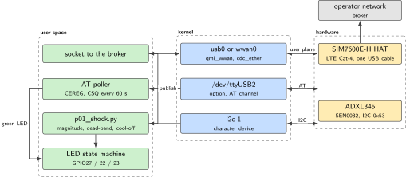
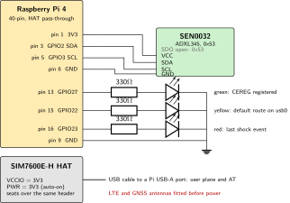
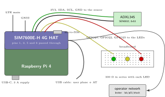
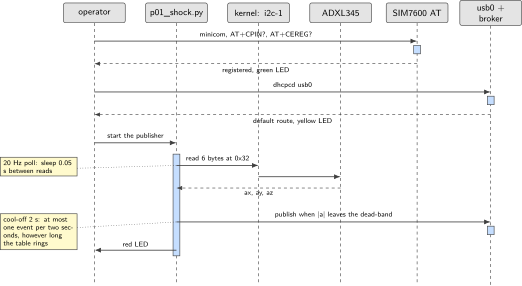

# P01. LTE Cat-4 motion-triggered gateway

> **Host:** Raspberry Pi 4 + SIM7600E-H + ADXL345  
> **Owns:** the only Cat-4 default route, plus shock-event compression

> [!NOTE]
> **Why this lab is unique**
>
> Owns the only Cat-4 *default route* in the book, plus ADXL345 event compression. Cat-M and NB-IoT are P03 and P02.

> [!NOTE]
> **What the 198-page blueprint got wrong**
>
> Draft P5 is the same radio used as a NAT router; draft P1 used Intel MKL. We use QMI/RNDIS for the WAN and NumPy for nothing heavier than a magnitude check. Do not also put GNSS tracking here, that is P03.

## Intent

The Pi 4 gets a default IPv4 route through the SIM7600E-H over USB, as RNDIS or as QMI-WWAN. The ADXL345 publishes a shock event only when the acceleration magnitude leaves a dead-band around 1 g, so the uplink carries events rather than a sample stream. Three LEDs report the three states that matter on a bench: the modem registered, the default route moved to the modem, and an event fired.

The lab is a gateway, not a tracker and not a router. Two things are deliberately out of scope. GNSS belongs to P03, because a Cat-4 module that also chases a fix hides which subsystem failed. Network address translation for other hosts belongs to nothing in this book, because one SIM and one bench do not need it.

> [!NOTE]
> **Kit from the bin**
>
> Pi 4, SIM7600E-H with LTE and GNSS antennas and a micro-SIM, SEN0032 ADXL345, three LK-LED10 modules on BCM 16/20/21, a 3 A USB-C supply, keyboard.

## System architecture



*Figure 1.1. The two planes of the lab. The user plane is the modem's USB network interface; the control plane is an AT character device on the same cable. The accelerometer never touches either.*

The SIM7600E-H presents several interfaces on one USB cable. One of them is a network device that carries the user plane, and another is a character device that accepts AT commands. Keeping those apart is the whole discipline of the lab: the WAN comes up through `dhcpcd` or ModemManager on the network device, and diagnostics go to the AT device. Point-to-point protocol is not used at all, because running it alongside QMI or RNDIS gives two things one modem cannot serve at once.

The event path is independent of the network path. A Python loop reads six registers over I2C at 20 Hz, computes a magnitude, and calls `mosquitto_pub` when the magnitude leaves the dead-band. If the WAN is down the publish fails and the loop continues, which is the behaviour you want from a field gateway.

## Wiring and schematic



*Figure 1.2. The accelerometer on the HAT pass-through header and the three status LEDs. SDO left floating selects address 0x53.*

| Signal | Pi header pin | BCM GPIO | Note |
| --- | --- | --- | --- |
| ADXL345 VCC | 1 | 3V3 | Never 5 V |
| ADXL345 SDA | 3 | GPIO2 | I2C1 data |
| ADXL345 SCL | 5 | GPIO3 | I2C1 clock |
| ADXL345 GND | 6 | GND |  |
| ADXL345 SDO |  |  | Left floating, selects 0x53 |
| ADXL345 INT1 | 11 | GPIO17 | Optional, not needed for the magnitude poll |
| Green module, S1 | 36 | GPIO16 | CEREG registered. Lit when driven high |
| Yellow module, S1 | 38 | GPIO20 | Default route on usb0 or wwan0 |
| Red module, S1 | 40 | GPIO21 | Last shock event |
| Module grounds | 34 or 39 | GND | The breadboard ground rail, as in P15 |
| Pins 13, 15, 16 |  | GPIO27, 22, 23 | Free. Pass-through only on this HAT, see the note |

*Table 1.1. Wiring. The HAT carries a full 40-pin pass-through, so the accelerometer and the modem coexist on one header and pins 3 and 5 are untouched by the HAT. The indicator pins are not the ones the draft used; the note below says why.*

> [!NOTE]
> **The status triple cannot sit on BCM 27, 22 and 23 under this HAT**
>
> **Withdrawn on Thursday 8 October 2026, and this is the third withdrawal of its kind in this book.** Earlier versions of this note said that on the SIM7600E-H header pins 13, 15 and 16 are the modem's own control lines, GPIO27 the ring indicator, GPIO22 data terminal ready and GPIO23 clear to send, and that an LED hung on any of them would be a second driver on a line the modem was already using. **That is not true.** On this HAT those three pins are header pass-through and nothing else: no net leaves the header from them, they do not reach the module, the level translator, the USB bridge, the power jumper or the flight-mode jumper, and the board puts no pull on them. Driving them as inputs or outputs from the Pi contends with nothing.
>
> What the HAT actually attaches to the header is shorter than its own pin table suggests, and the table is part of the problem. That table lists six lines: 5 V, ground, the module's RXD to BCM GPIO14, its TXD to BCM GPIO15, PWR to BCM GPIO6 and FLIGHTMODE to BCM GPIO4, and it even says flight mode is wired to a pull-up. **The same wiki's configuration section contradicts its own table.** The jumpers arrived with the late-2021 board, and on that board neither net reaches a GPIO unless a jumper is moved: PWR ships shorted to 3V3 so the module auto-starts and GPIO6 stays open, and Flight ships not connected so GPIO4 stays open. The older board had no such jumpers at all and was button-controlled, where auto-on meant a wire from PWR to ground on the breakout rather than a strap to any Pi pin.
>
> So the honest list of what is attached with the module seated and the jumpers as shipped is this, and it is worth reading carefully because two entries are easy to miss.
>
> - **5 V and ground, always.** The 5 V pins feed the HAT's regulators.
> - **The 3.3 V pin, also always.** VCCIO is soldered to 3.3 V on this board, and that rail is the high side of the level translator. The HAT draws on the Pi's 3.3 V rail whether or not anything else is configured, which belongs in any power budget for this lab.
> - **GPIO14 and GPIO15, only while the UART jumper sits in position B.** B is the position in which the Pi controls the module. A connects the onboard USB bridge to the Pi's console and C connects that bridge to the module, and in either of those the two UART lines are not on the SIM7600 at all. **The manual never states the factory position**, so this is the first thing to check at the bench rather than the last.
>
> GPIO27, GPIO22 and GPIO23 appear in none of those nets, on either board revision. As inputs they simply float, so if this lab ever wants them pulled, the pull has to come from the Pi.
>
> **The consequence is uncomfortable and is stated rather than buried: the draft's pins were free all along, and this move was never necessary.** It is kept anyway, and the reason is the one in the next paragraph rather than the one withdrawn here. The SIM7020E of P02 and the SIM7070G of P03 also put their power key on header pin 7, BCM GPIO4, and an earlier version of this note had the SIM7020E's power key on GPIO27, which the vendor's wiki contradicted and which was withdrawn in P02. Of the three reasons this book has given for moving the indicators, two were false and only the MCC 118's claim on BCM26 was real.
>
> One trap the vendor's own pages set, and the reason every pin in this book carries two numbers: the silkscreen naming on this board changed from wiringPi to BCM. On the older sheet `P4` means BCM GPIO4, not GPIO23, and `P22` means BCM GPIO6, not GPIO25. A reader who takes those as physical pin numbers wires the power key to the wrong conductor.
>
> The pins above are chosen from the high end of the header, where no modem HAT in this bin documents a connection, with the module grounds going to pin 34 or 39. **Confirm them against the pinout of the HAT in front of you before wiring**, because this is a fact about one board and not about the Raspberry Pi, and because this chapter has now been wrong about exactly that twice. An earlier version of this paragraph also offered removing jumpers as a way to free the draft's three pins; there was never anything to free, so that sentence is withdrawn with the rest.

```text
ADXL345                 Pi 40-pin (HAT pass-through pins 1/3/5/6 still available)
VCC ------------------- pin 1  3V3      NEVER 5V
GND ------------------- pin 6  GND
SDA ------------------- pin 3  GPIO2
SCL ------------------- pin 5  GPIO3
SDO floating => 0x53
INT1 optional --------- BCM17  (not required for the magnitude poll)

SIM7600 jumpers:
  VCCIO = 3V3
  PWR   = 3V3   (auto-on). Use PWR=D6 only if you want a GPIO power-key.
  UART  = B if you need ttyAMA0; prefer the HAT USB cable for AT + data.
USB cable: HAT USB-A/micro -> Pi USB-A  (user plane + AT channels)
Antennas: LTE main + GNSS. No antenna = no attach, and can stress the PA.
```

## Bench layout



*Figure 1.3. Bench layout. The short USB cable between the HAT and the Pi carries the user plane, so it is not optional. The 3 A supply is not optional either: a transmit burst on Cat-4 draws current the Pi cannot lend.*

Seat the HAT, fit both antennas and insert the SIM before applying power. Connect the HAT USB cable in the same pass. A modem that is powered with no antenna fitted can stress its own power amplifier, and a SIM inserted under power is not detected until the next boot.

## Software design (UML)



*Figure 1.4. Bring-up sequence. The AT channel confirms registration, the network interface carries traffic, and the accelerometer loop is a separate process that survives a WAN outage.*

The publisher is a single loop with one piece of state, a cool-off timestamp. It is a token bucket in its simplest form: at most one event every two seconds, no matter how long the table keeps ringing. Without it, one fist produces a burst of twenty publishes and the value of the compression is lost.

## Data flow (ASCII)

```text
  Pi 4                                            SIM7600E-H HAT
  +---------------------------------+             +------------------------+
  | p01_shock.py                    |             |  LTE Cat-4 radio       |
  |   i2c-1 -> 0x53 ADXL345 @20 Hz  |             |    |                   |
  |   |a| - 1g > 0.35 ?             |             |    v                   |
  |   |  yes -> mosquitto_pub ------------------> | usb0 / wwan0  (user)   |---> broker
  |   |  cool-off 2 s               |             |                        |
  |   v                             |   USB       | /dev/ttyUSB2  (AT) <--------+
  | gpio: GRN 16  YEL 20  RED 21    |<===========>|                        |     |
  +---------------------------------+             +------------------------+     |
        ^                                                                        |
        +--- AT+CSQ every 60 s, AT+CEREG? for the green LED --------------------+
```

## Steps

**Step 1.** **Prepare the host.** Flash Raspberry Pi OS Bookworm 64-bit. Enable I2C under `raspi-config`, Interface options. Use a 3 A supply.

**Step 2.** **Assemble before power.** Seat the HAT, fit both antennas, insert the SIM, and connect the HAT USB cable, all before applying power.

**Step 3.** **Identify the modem and the accelerometer.**

```bash
lsusb | grep -iE "sim|1e0e"
dmesg | tail -n 40
ls /dev/ttyUSB* /dev/ttyACM* 2>/dev/null
sudo apt-get update
sudo apt-get install -y minicom i2c-tools mosquitto-clients python3-smbus python3-rpi.gpio
sudo i2cdetect -y 1          # must show 53
```

**Step 4.** **Open the AT port.** It is commonly `/dev/ttyUSB2` on the SIM7600. If minicom shows nothing, try USB3 then USB1.

```text
sudo minicom -D /dev/ttyUSB2 -b 115200
AT
ATE1
AT+CPIN?
AT+CSQ
AT+COPS?
AT+CEREG?
AT+CGDCONT?
```

**Step 5.** **Bring up the WAN.** Prefer RNDIS or QMI over the point-to-point protocol.

```bash
# RNDIS path: usb0 typically appears when the HAT USB cable is connected
ip link
sudo dhcpcd usb0 || sudo dhclient usb0
ip route
# If usb0 did not appear, load qmi_wwan / option and use ModemManager:
sudo apt-get install -y modemmanager libqmi-utils
mmcli -L
# Do not run PPP in parallel with QMI or RNDIS.
```

**Step 6.** **Confirm and lock the default route**, so the modem wins over wlan0.

```bash
ip route | grep default
# optional: give wlan0 a higher metric so LTE wins
sudo ip route del default dev wlan0
```

**Step 7.** **Run the event publisher**, saved as `/home/pi/p01_shock.py`.

```python
import time, math, json, subprocess, smbus
bus = smbus.SMBus(1); A = 0x53
bus.write_byte_data(A, 0x2D, 0x08)   # measure
bus.write_byte_data(A, 0x31, 0x0B)   # full-res +/-16g

def g(lo, hi):
    v = (hi << 8) | lo
    if v & 0x8000:
        v -= 65536
    return v / 256.0

cool = 0
while True:
    b = bus.read_i2c_block_data(A, 0x32, 6)
    ax, ay, az = g(b[0], b[1]), g(b[2], b[3]), g(b[4], b[5])
    mag = math.sqrt(ax*ax + ay*ay + az*az)
    if abs(mag - 1.0) > 0.35 and time.time() > cool:
        payload = json.dumps({"mag": round(mag, 3), "ax": round(ax, 3)})
        subprocess.run(["mosquitto_pub", "-h", "test.mosquitto.org",
                        "-t", "lab/p01/shock", "-m", payload], check=False)
        cool = time.time() + 2
    time.sleep(0.05)
```

**Step 8.** **Drive the LEDs from state, not from hope.** Green follows `AT+CEREG?`, yellow follows the presence of a default route on `usb0`, red follows the last publish. Poll `AT+CSQ` every 60 s and log it.

## Acceptance test

- A fist on the table produces exactly one MQTT JSON message and lights the red LED.
- `ping -I usb0 8.8.8.8` succeeds, or the operator's own DNS address does.
- `ip route | grep default` names the modem interface, not wlan0.
- Outdoors, `AT+CGPS=1` then `AT+CGPSINFO` returns non-blank fields. That is a side check on the hardware, not this lab's product.

## Practices

User plane on USB, AT on a ttyUSB. Token-bucket the publisher, which is what the two-second cool-off is. Log `AT+CSQ` every 60 s so a weak-signal night is visible the next morning. Do not seat the MCC 118 or the 3.5 inch LCD at the same time: one 40-pin HAT per host.

## Pitfalls

- **No antenna fitted.** The module will not attach, and transmitting into an open port stresses the power amplifier. Fit both antennas before power.
- **A 2.5 A supply.** The Pi 4 alone is close to that budget. A Cat-4 transmit burst on top of it produces undervoltage warnings in `dmesg` and random resets that look like software faults.
- **Running the point-to-point protocol next to QMI.** Two user planes, one radio. The symptom is a route that appears and then carries nothing.
- **Picking the wrong AT device.** Several `ttyUSB` nodes appear. The wrong one is silent rather than an error, so try USB2, then USB3, then USB1.
- **Publishing every sample.** Without the cool-off, one impact produces a burst and the dead-band logic buys nothing.
- **5 V on the accelerometer.** The SEN0032 goes to pin 1, never pin 2.

## Sources

- Waveshare SIM7600E-H 4G HAT wiki, <https://www.waveshare.com/wiki/SIM7600E-H_4G_HAT>
- SIMCom SIM7600 series AT command manual (module vendor documentation)
- DFRobot SEN0032 ADXL345 product wiki, <https://wiki.dfrobot.com/>
- Analog Devices ADXL345 data sheet, register map 0x2D, 0x31, 0x32
- ModemManager and libqmi documentation, <https://www.freedesktop.org/wiki/Software/ModemManager/>
- Raspberry Pi hardware documentation, 40-pin header, <https://www.raspberrypi.com/documentation/computers/raspberry-pi.html>

---

[Previous](00-about-this-volume.md) &nbsp;&nbsp;|&nbsp;&nbsp; [Contents](../README.md) &nbsp;&nbsp;|&nbsp;&nbsp; [Next](02-nb-iot-psm-edrx-coap-field-node.md)
