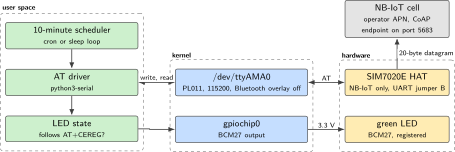
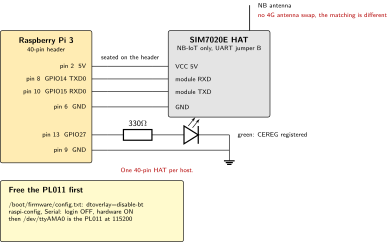
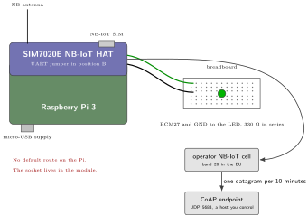
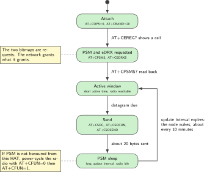

# P02. NB-IoT PSM/eDRX CoAP field node

> **Host:** Raspberry Pi 3 + SIM7020E  
> **Owns:** NB-IoT and the power-saving duty cycle

> [!NOTE]
> **Why this lab is unique**
>
> Owns NB-IoT and the PSM/eDRX duty cycle. No default IPv4 WAN, no GNSS, no MQTT. The opposite of P01.

> [!NOTE]
> **What the 198-page blueprint got wrong**
>
> Draft P4 seated the SIM7020E on the NanoPi. That header is 24-pin. NB-IoT lives on the Pi 3 in this book.

## Intent

The SIM7020E sits on a Pi 3 as a power-saving NB-IoT endpoint. Every 10 minutes the node wakes, sends an approximately 20-byte CoAP/UDP datagram, and returns to idle. Acceptance is the duty cycle, not a continuous ping. A green LK-LED10 module on BCM16 reports one fact only, that `AT+CEREG?` says the module is registered on a cell.

Nothing else belongs here. There is no default route on the Pi, because the UDP socket lives inside the module and is opened with `AT+CSOC`. There is no GNSS, because that is P03. There is no MQTT, because NB-IoT is not a phone network and the public broker is usually unreachable from an NB APN. Energy figures are measured in P10 with the PPK2, not estimated here.

> [!NOTE]
> **Kit from the bin**
>
> Pi 3, SIM7020E HAT with an NB antenna and an NB-IoT SIM, green LK-LED10 module on BCM16.

> [!NOTE]
> **Without a SIM**
>
> A data SIM is assumed only for P01 to P03 and P13. Without one this lab stops at AT bring-up, and that is still a pass. Steps 1 and 2 up to `AT+CPIN?` exercise the UART, the overlay and the HAT seating, which is most of what goes wrong.

## System architecture



*Figure 2.1. One serial line and one GPIO. The Linux host holds no IP address for this path: the UDP socket is created inside the module by `AT+CSOC`, so the kernel network stack is not involved at all.*

The whole path is a character device. The Pi opens `/dev/ttyAMA0` at 115200, writes AT commands and reads responses, and that is the entire interface between Linux and the radio. The module holds the socket, the APN context and the power-saving state. This is the opposite arrangement from P01, where the modem presents a network interface and the kernel routes packets through it.

The consequence is that the Pi cannot ping anything over this link, and should not try. The evidence that the node works is a datagram arriving at the CoAP endpoint once per wake, plus `AT+CEREG?` and `AT+CSQ` showing a cell between wakes. A continuous ping is a fail, because it also prevents the module from ever entering power-saving mode.

| Command | What it proves |
| --- | --- |
| `AT+CPIN?` | The SIM is seated and unlocked |
| `AT+CBAND=20` | The band is set. EU deployments are commonly B8 or B20, so this is operator-specific |
| `AT+COPS=0` | Automatic operator selection, the normal case for an NB SIM |
| `AT+CEREG?` | Registration on a cell. This is what the green LED follows |
| `AT+CGATT?` | The packet service is attached, which is a step beyond registration |
| `AT+CSQ` | Signal quality, the number to write in the lab book with the antenna in place |
| `AT+CGDCONT?` | The APN context the module will actually use |
| `AT+CPSMS?` | The power-saving values as granted, which may differ from the request |

*Table 2.1. The bring-up commands and what each one settles. Run them in this order: a failure at any line makes the following lines meaningless.*

## Wiring and schematic

The electrical work is almost nothing. The HAT seats on the header and takes its power and its serial line from there. One LK-LED10 module is the only part on the breadboard, and it carries its own resistor, so nothing is added beside it. The configuration work, on the other hand, is the reason this section exists: on a Pi 3 the PL011 is wired to the Bluetooth controller by default, and the port that carries the AT dialogue only becomes `ttyAMA0` after the overlay moves Bluetooth out of the way.



*Figure 2.2. The HAT seats on the 40-pin header and reaches the Pi over the PL011 UART. The UART jumper is in the Waveshare B position, so the Pi controls the modem. The LED branch is the only flying wiring in the lab.*

| Signal | Pi header pin | BCM GPIO | Note |
| --- | --- | --- | --- |
| HAT 5 V | 2 and 4 |  | Supplied through the header when the HAT is seated |
| UART TXD0 | 8 | GPIO14 | Pi transmit, to the module receive pin |
| UART RXD0 | 10 | GPIO15 | Pi receive, from the module transmit pin |
| HAT GND | 6 | GND |  |
| Green module, S1 | 36 | GPIO16 | CEREG registered. Lit when the pin is driven high |
| Green module, G | 39 | GND | The return. The module's resistor is inside it |
| PWRKEY | 7 | GPIO4 | The HAT's own, by its PWR jumper. Never drive it from anything else |
| Pin 13 |  | GPIO27 | The draft's choice. Free on this HAT, see the note |
| NB antenna |  |  | On the NB port of the HAT, not a 4G antenna |

*Table 2.2. Wiring. This HAT carries a full 40-pin pass-through stacking header, so every pin is reachable from above, and pin 9 is a ground that is safe to tap. The pin that is not free is 7, the module's power key, and the note below says how that was nearly recorded as 13.*

> [!NOTE]
> **What this HAT claims on the header, and a correction to an earlier correction**
>
> The draft put the indicator on GPIO27. An earlier version of this note said that pin is the module's power key on this HAT and that an indicator there would pulse the modem's power. That claim came from a secondhand note, not from the vendor, and the vendor's own wiki says otherwise: PWRKEY is on header pin 7, BCM GPIO4, selected by the PWR jumper and on by default. **GPIO27 is free on this board.** The earlier sentence was wrong in exactly the way the LED cable claim was wrong, a note trusted over the page it should have been checked against.
>
> | HAT connection | Header pin | BCM GPIO | Note |
> | --- | --- | --- | --- |
> | PWRKEY | 7 | GPIO4 | PWR jumper, default on. The other position takes it off the Pi |
> | UART | 8 and 10 | GPIO14, 15 | The AT dialogue, on the PL011 after the overlay |
> | VCCIO select | none | none | 3.3 V or 5 V. Confirm it sits on 3.3 V before power |
> | DTR, RI | breakout |  | Module pins on the control header; not routed to a Pi GPIO |
>
> *Table 2.3. What the SIM7020E HAT puts on the header, from the vendor's wiki.*
>
> The indicator stays on BCM16 anyway, and for the reason P03 gives rather than the one withdrawn here: one assignment that is safe on all four cellular labs is easier to hold than four. **A second withdrawal belongs in this paragraph too.** It used to end by saying that the board which does claim GPIO27 is the SIM7600E-H of P01, where it is the ring indicator. That was withdrawn on Thursday 8 October 2026: the vendor's schematic shows GPIO27, GPIO22 and GPIO23 are header pass-through on that HAT, with no net leaving the header. **No modem HAT in this bin claims GPIO27 at all.** BCM16 is free on every HAT checked, which is now the whole of the argument.
>
> **The HAT's own NET LED is this lab's second instrument.** It shows 64 ms on and 800 ms off while no network is registered, 64 ms on and 3000 ms off once registered, 64 ms on and 300 ms off while data moves, and **off for power down or PSM sleep**. That last state is the one this chapter is about: a dark NET LED between wakes is the module doing what it was asked to, not a fault, and a NET LED that keeps blinking is the sign that power saving was requested and not granted. The slow blink is the cross-check for `AT+CEREG?`, and the host's own green module adds the one thing the NET LED cannot, which is a state the host decided rather than the module.

```text
HAT seated on Pi 3. UART jumper = Waveshare "B" (Pi controls modem).
Disable Bluetooth to free PL011 ttyAMA0:
  /boot/firmware/config.txt   dtoverlay=disable-bt
  raspi-config -> Serial: login=OFF, hardware=ON
LED GRN BCM16 = CEREG registered.
Antenna on the NB port. No 4G antenna swap, the matching is different.
```

> [!IMPORTANT]
> **Before the supply goes in**
>
> The SIM7020E owns the 40-pin header: fit one HAT, and tear it off before the next lab. Pi I/O is 3.3 V, so the LED branch goes to a header pin and never to a 5 V rail. Fit the NB antenna before power, and fit the NB antenna, not the 4G one.

## Bench layout



*Figure 2.3. Bench layout. One HAT, one antenna, one LED. The CoAP endpoint is a host you control on the operator's network, because a public echo server is frequently unreachable from an NB-IoT APN.*

Seat the HAT with the power off, fit the NB antenna, insert the SIM, then apply power. The NB antenna and the 4G antenna are not interchangeable: the matching is different, and swapping them produces a module that reports a poor `AT+CSQ` and never completes the attach.

The rest of the bench is deliberately empty. One LED, one breadboard, one supply. There is no second HAT, because the SIM7020E owns the 40-pin header, and there is no USB gadget to watch, because this radio reaches Linux through the header UART rather than through a cable. If the bench looks too quiet for a day's work, that is the shape of an NB-IoT node: most of its life is spent doing nothing, on purpose.

## Software design (UML)



*Figure 2.4. The duty cycle as a state machine. The long timer is the requested tracking-area update, the short one is the requested active time. Between them the module is idle and the Pi has nothing to do.*

The lab is the state machine, not the payload. Two timers are requested with `AT+CPSMS`: a long tracking-area update interval that sets how often the module must announce itself, and a short active time that sets how long it stays reachable after each exchange. The encoded bitmaps are requests, not guarantees. The network grants what it grants, which is why `AT+CPSMS?` is read back and why the fallback in step 5 exists.

The software on the Pi is correspondingly small. There is one process, and its loop has four phases: read the registration state, open the socket, send, sleep. It holds no buffer worth protecting and no connection worth keeping, so a restart costs one missed datagram at most. Resist the urge to add a retry queue before the duty cycle itself is measured, because an aggressive retry is exactly the behaviour that keeps the radio awake and makes the lab prove the opposite of its intent.

One consequence is worth stating plainly before the steps begin. Everything the Pi knows about this radio arrives as text on one file descriptor, so every diagnostic in the lab is a command you can type by hand in `minicom` first and automate afterwards. Type it by hand first.

## Data flow (ASCII)

```text
  Pi 3                                        SIM7020E HAT
  +------------------------------+            +---------------------------+
  | p02_coap.py                  |            |  NB-IoT radio, band 20    |
  |   every 10 minutes:          |            |    |                      |
  |     AT+CSOC=1,2,1            |            |    v                      |
  |     AT+CSOCON=0,5683,"..."   |  ttyAMA0   | UDP socket INSIDE the     |
  |     AT+CSOSEND=0,8,"50494E47"|<==========>| module (no Linux route)   |--> CoAP
  |   between sends: nothing     |  115200    |                           |    5683
  |                              |            | PSM: idle, radio off      |
  | gpio: GRN BCM16 <- CEREG     |            |                           |
  +------------------------------+            +---------------------------+
        ^                                             |
        +--- AT+CEREG? and AT+CSQ on each wake -------+
  duty cycle:  |<-- ~20 B --> . . . . . . . . . . . . . . . . |<-- ~20 B -->
               wake           idle, about 10 minutes           wake
```

The payload budget is about 20 bytes. That is not a limitation of the radio so much as a discipline: a field node that sends a compact binary record every 10 minutes stays inside the smallest data plan on the market, and one that sends a formatted JSON document with a timestamp string does not. Decide the record layout before the first send, and write it in the lab book next to the endpoint address.

## Steps

**Step 1.** **Assemble before power.** Seat the HAT on the Pi 3 with the supply unplugged, check that the UART jumper is in the Waveshare B position, fit the NB antenna, and insert the NB-IoT SIM. A SIM inserted under power is not detected until the next boot, and a module powered with no antenna fitted will not attach.

**Step 2.** **Free the PL011 and open the port.** Bluetooth owns `ttyAMA0` on a Pi 3 until the overlay moves it, so apply `dtoverlay=disable-bt` in `/boot/firmware/config.txt`, set the serial login shell off and the serial hardware on under `raspi-config`, and reboot.

```bash
sudo systemctl disable --now hciuart
sudo apt-get install -y minicom python3-serial
sudo minicom -D /dev/ttyAMA0 -b 115200
```

**Step 3.** **Identity and attach.** The band is operator-specific. In the EU it is commonly B8 or B20.

```text
AT
AT+CPIN?
AT+CBAND=20
AT+COPS=0
AT+CEREG?
AT+CGATT?
AT+CSQ
AT+CGDCONT?
```

**Step 4.** **Enable power-saving mode.** The encoded tracking-area-update and active-time bitmaps are operator-checked. The values below request a long update interval and a short active window. Confirm them with the SIM sheet before leaving this running unattended.

```text
AT+CPSMS=1,,"00100011","00000101"
AT+CEDRXS=1,5,"0010"
AT+CPSMS?
```

**Step 5.** **Open a UDP socket toward a CoAP endpoint you control.** Use `coap.me` only as a lab echo, and expect it to be unreachable: many NB APNs cannot reach the public Internet. The payload below is four bytes of hexadecimal, eight characters on the wire.

The three arguments of `AT+CSOC` select an IPv4 datagram socket, and `AT+CSOCON` gives that socket its destination port and address. Confirm the encoding against the SIMCom AT manual for your firmware revision before you rely on it in a script, because the argument order is a module convention and not a standard.

```text
AT+CSOC=1,2,1
AT+CSOCON=0,5683,"172.16.0.1"
AT+CSOSEND=0,8,"50494E47"
```

**Step 6.** **Wrap the send in a schedule.** A 10-minute cron entry or a Python loop is enough. If the operator does not honour power-saving mode from this HAT, power-cycle the radio between sends with `AT+CFUN=0` and `AT+CFUN=1` instead of trusting the timers.

```python
import time, serial

ser = serial.Serial("/dev/ttyAMA0", 115200, timeout=2)

def at(cmd, wait=1.0):
    ser.write((cmd + "\r\n").encode())
    time.sleep(wait)
    return ser.read(ser.in_waiting or 1).decode(errors="ignore")

while True:
    print(at("AT+CEREG?"), at("AT+CSQ"))
    at("AT+CSOC=1,2,1")
    at("AT+CSOCON=0,5683,\"172.16.0.1\"")
    print(at("AT+CSOSEND=0,8,\"50494E47\""))
    # if PSM is not granted, uncomment the two lines below
    # at("AT+CFUN=0", 2.0)
    # at("AT+CFUN=1", 8.0)
    time.sleep(600)
```

**Step 7.** **Drive the LED from the registration state.** Green on BCM16 follows `AT+CEREG?` and nothing else. It is not a link light and not a transmit light, because on this radio neither of those is meaningful between wakes.

**Step 8.** **Count the duty cycle at the endpoint, not on the Pi.** The product of this lab is a record on the receiving side. Leave the node running for an hour and count the datagrams that arrived.

```bash
# on the CoAP endpoint host
sudo tcpdump -n -i any udp port 5683 -ttt
# six datagrams in an hour is the target, not six hundred
```

## Acceptance test

- `AT+CSQ` and `AT+CEREG?` show a cell.
- One datagram per 10 minutes appears on the server. Count them over an hour: six, not five hundred.
- A continuous ping is a fail. It is also impossible on this path, because the Pi holds no route.
- `AT+CPSMS?` reads back the requested values, or shows what the network granted instead.
- Without a SIM the lab stops at AT bring-up, and that is still a pass.
- The green LED is on while `AT+CEREG?` reports a cell and off when it does not, with no other condition attached to it.
- Between wakes the Pi holds no route, no socket and no open connection. `ip route` shows wlan0 or eth0 only.

## Practices

NB-IoT is not a phone network. Do not expect `test.mosquitto.org` to answer, and do not treat an unreachable public host as a hardware fault. Use the APN printed on the SIM sleeve, not the one from the Cat-4 SIM in P01.

- **Endpoint first.:** Have the CoAP endpoint listening and logging before the first `AT+CSOSEND`. A datagram that nothing recorded did not happen, and this radio gives you no second chance to look at it.
- **One instrument per question.:** Measure watts in P10, with the PPK2 in the power rail. A figure copied from a datasheet is not a measurement, and this bench has no current shunt in it.
- **One HAT per host.:** The MCC 118, the Explorer700 and the 3.5 inch LCD stay on the shelf while this lab is seated. Power off before unseating anything.

## Pitfalls

- **Bluetooth still owns the PL011.** Without `dtoverlay=disable-bt` the AT port is the mini UART, whose baud rate follows the core clock. The symptom is silence or corrupted characters at 115200, which reads like a dead module.
- **The serial login shell is still enabled.** The getty consumes the module's responses. The symptom is an AT port that echoes but never returns `OK`.
- **A 4G antenna on the NB port.** The matching is different. The symptom is a low `AT+CSQ` and an attach that never completes.
- **An overlay that was edited but not applied.** `dtoverlay=disable-bt` takes effect at boot. The symptom is a port that behaves exactly as it did before the edit, which invites a second and unnecessary edit.
- **The wrong APN.** `AT+CGDCONT?` shows what the module will use. The symptom is a registration that succeeds while `AT+CSOCON` times out.
- **Expecting a public broker.** An NB APN commonly has no route off the operator's network. Point the datagram at an endpoint you control.
- **Proving the link with a ping loop.** It defeats power-saving mode, so the module never sleeps and the lab measures nothing.
- **Trusting the requested timers.** `AT+CPSMS` is a request. Read it back, and use the `AT+CFUN` fallback when the network declines.
- **Taking the AT port away from the HAT.** If the UART jumper is not in the B position the Pi is not the controller, and the port answers nothing that the Pi sends.
- **Seating a second HAT.** The SIM7020E owns the header. The MCC 118, the Explorer700 and the 3.5 inch LCD each want the same pins, and stacking two of them is how a lab afternoon is lost to a fault that is not a fault.
- **Leaving minicom open while the script runs.** Two writers on one serial port interleave their commands and read each other's responses. The symptom is an AT dialogue that looks intermittent rather than broken, which is the hardest kind to diagnose. Close the terminal session first.
- **A cold module and an impatient timeout.** The attach on a first power-up takes longer than a warm one. Give `AT+CEREG?` several attempts before deciding the antenna or the band is at fault.
- **Reading the LED as a link light.** Green means registered. It does not mean the last datagram arrived, and on this radio nothing on the Pi can tell you that. The endpoint's log can.

## Sources

- Waveshare NB-IoT HAT wiki for the SIM7020E, jumper positions and antenna ports, <https://www.waveshare.com/wiki/>
- SIMCom SIM7020 series AT command manual, `AT+CBAND`, `AT+CPSMS`, `AT+CEDRXS`, `AT+CSOC`, `AT+CSOCON`, `AT+CSOSEND` (module vendor documentation)
- The Constrained Application Protocol, RFC 7252, <https://www.rfc-editor.org/rfc/rfc7252>
- Raspberry Pi documentation, UART configuration and the Bluetooth overlay, <https://www.raspberrypi.com/documentation/computers/configuration.html>
- Raspberry Pi hardware documentation, 40-pin header, <https://www.raspberrypi.com/documentation/computers/raspberry-pi.html>
- The operator's own NB-IoT APN and band notes, which arrive with the SIM and outrank every other document listed here
- P01 in this volume for the Cat-4 contrast, and P10 for the energy measurement this lab deliberately does not attempt
- P13 in this volume, which reuses this attachment unchanged as the backup signalling path

---

[Previous](01-lte-cat-4-motion-triggered-gateway.md) &nbsp;&nbsp;|&nbsp;&nbsp; [Contents](../README.md) &nbsp;&nbsp;|&nbsp;&nbsp; [Next](03-cat-m-mqtt-node-with-gnss-stamp.md)
