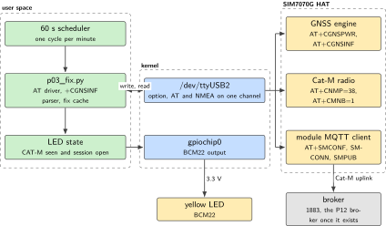
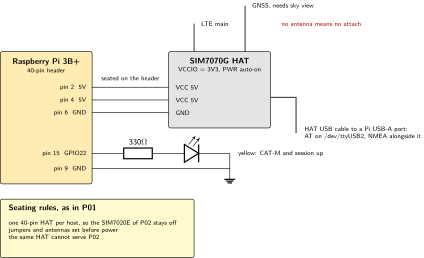
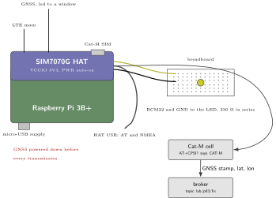
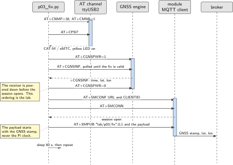

# P03. Cat-M MQTT node with GNSS stamp

> **Host:** Raspberry Pi 3B+ + SIM7070G  
> **Owns:** Cat-M and the GNSS-timestamp-in-payload rule

> [!NOTE]
> **Why this lab is unique**
>
> Owns Cat-M and the GNSS-timestamp-in-payload rule. Dual-mode silicon, single-mode lab.

> [!NOTE]
> **What the 198-page blueprint got wrong**
>
> Draft P19 drove the SIM7070 from an ESP32 as the application processor. That is valid with flying UART leads, but then it stops being an embedded-Linux lab. We keep the Pi 3B+ as the host and use the module's built-in MQTT and GNSS AT set. Power GNSS down during transmission.

## Intent

Lock the SIM7070G to Cat-M with `AT+CMNB=1` and keep it there. The module is dual-mode silicon: it will also do NB-IoT and it will fall back to GPRS. This lab is single-mode on purpose, because a node that quietly changes bearer changes its latency, its power profile and its cost without telling anyone, and the log then describes a network that was never configured.

Every publish carries a GNSS time, not `date` from the Pi. That is the rule this chapter owns. The Pi clock on a Pi 3B+ is whatever the last network time synchronisation left behind, and in the field there may not have been one. The GNSS engine on the same module has a better one, so the payload starts with the stamp from `+CGNSINF` and the Pi clock is not consulted at all.

> [!NOTE]
> **Kit from the bin**
>
> Pi 3B+, SIM7070G HAT with LTE and GNSS antennas and a Cat-M SIM, yellow LK-LED10 module on BCM16.

> [!NOTE]
> **Without a SIM**
>
> A data SIM is assumed only for P01 to P03 and P13. Without one this lab stops at AT bring-up, and that is still a pass. `AT+CGNSPWR=1` and `AT+CGNSINF` still work with no SIM at all, so the GNSS half of the lab can be completed on its own.

## System architecture



*Figure 3.1. Two subsystems inside one module, reached over one AT channel. The MQTT session and the GNSS engine never run at the same moment, and that ordering is the lab.*

The SIM7070G carries its own MQTT client. The session is configured with `AT+SMCONF`, opened with `AT+SMCONN` and used with `AT+SMPUB`, all over the AT character device. Nothing in Python holds a socket, which is the opposite arrangement from a host-side client library. The advantage is that the session, and any transport security you later add to it, stays on the modem where the radio state also lives. The cost is that every publish is a short AT dialogue with return codes to parse, so the host script has to be written as a protocol driver rather than as a call to a client library.

The GNSS engine is the second subsystem, and it is the one that has to be managed. It is powered on with `AT+CGNSPWR=1`, polled with `AT+CGNSINF`, and powered off again with `AT+CGNSPWR=0` before the module transmits. The host cycle is therefore: acquire a fix, power the receiver down, then open the MQTT session and publish the fix that was just cached. USB is preferred for the AT and NMEA traffic, so the character devices appear when the HAT USB cable is connected.

| Command | What it settles |
| --- | --- |
| `AT+CPIN?` | The SIM is seated and unlocked |
| `AT+CNMP=38` | LTE only, so the module does not choose a 2G bearer |
| `AT+CMNB=1` | Cat-M, not NB-IoT. This is the line the lab is named after |
| `AT+CPSI?` | The bearer actually in use. It must mention CAT-M or eMTC |
| `AT+CGNSPWR` | Powers the GNSS receiver on, and off again before every transmission |
| `AT+CGNSINF` | The fix: run status, fix status, UTC time, latitude, longitude |
| `AT+SMCONF` | Broker address, port and client identifier, held on the module |
| `AT+SMCONN` | Opens the session from the module, not from Python |
| `AT+SMPUB` | Publishes one payload to one topic |

*Table 3.1. The AT set this lab uses and what each command settles. Two of them, `AT+CMNB` and `AT+CGNSPWR`, carry the whole discipline of the chapter.*

## Wiring and schematic

The seating rules are the same as P01: one 40-pin HAT, jumpers set before power, antennas fitted before power. The only flying wire in the lab is the yellow LK-LED10 module on BCM16.



*Figure 3.2. The HAT on the header, the USB cable that carries the AT and NMEA channels, and the single status LED. The GNSS antenna needs sky view, which on most benches means a window and a longer lead.*

| Signal | Pi header pin | BCM GPIO | Note |
| --- | --- | --- | --- |
| HAT 5 V | 2 and 4 |  | Supplied through the header when the HAT is seated |
| HAT GND | 6 | GND |  |
| Yellow module, S1 | 36 | GPIO16 | Cat-M confirmed and the session open. Lit when driven high |
| Yellow module, G | 39 | GND | The return. The module's resistor is inside it |
| Pin 15 |  | GPIO22 | The draft's choice. Unconfirmed on this HAT, see the note |
| VCCIO jumper |  |  | 3V3 |
| PWR jumper |  |  | Auto-on, as in P01 |
| LTE antenna |  |  | Main port on the HAT |
| GNSS antenna |  |  | Separate port, needs sky view |
| HAT USB cable |  |  | To a Pi USB-A port: AT and NMEA |

*Table 3.2. Wiring. Confirm the jumper block legend on the silkscreen before power, since the HAT revision decides which position is which.*

> [!NOTE]
> **The indicator pin moved, and this one is a judgement rather than a measurement**
>
> The draft put the indicator on GPIO22. On the two sibling HATs that have been checked, the draft's indicator pins turned out to be modem control lines: the SIM7600E-H of P01 uses GPIO27, GPIO22 and GPIO23 for ring indicator, data terminal ready and clear to send, and the SIM7020E of P02 uses GPIO27 as the power key. Nobody has checked the SIM7070G, so what is known is a pattern and not a fact about this board.
>
> The pin therefore moves to the high end of the header, where no HAT in this book documents a connection, and the move is recorded as a precaution rather than as a correction. **Read this HAT's pinout before wiring**, and if GPIO22 is genuinely free on it, the draft's pin is fine and this note is the explanation for why it looked wrong.

```text
Same seating rules as P01. USB preferred for AT + NMEA.
VCCIO = 3V3, auto PWR.
GNSS antenna needs sky view.
No second HAT.
LED YEL BCM16 pin 36 = Cat-M confirmed, module MQTT session open.
```

> [!IMPORTANT]
> **Before the supply goes in**
>
> One 40-pin HAT per host: the SIM7070G cannot serve P02, and P02's SIM7020E cannot serve this lab. Fit both antennas before power. Pi I/O is 3.3 V, so the LED branch goes to a header pin and never to a 5 V rail.

## Bench layout



*Figure 3.3. Bench layout. The GNSS antenna is the part that decides whether the lab finishes today: indoors, under a concrete ceiling, a cold start may never complete.*

Put the GNSS antenna where it can see sky, and accept that a first fix can take minutes. This is the reason the software caches the last good fix rather than blocking on the receiver. Fit the LTE antenna too, because a module that transmits into an open port is stressing its own power amplifier for no result.

## Software design (UML)



*Figure 3.4. The publish cycle. Note the ordering: the GNSS receiver is powered down before the module opens its MQTT session, and the fix in the payload is the one cached a moment earlier.*

The sequence is the product of this lab. Read it from the top: lock the bearer, confirm it, power the GNSS engine, poll until `+CGNSINF` carries usable fields, power the engine down, then open the session and publish. The host script never holds both subsystems active, and it never blocks the publish on a cold start. If no fix has been acquired yet, the cached value from the previous cycle is used and marked as such, and if there is no cached value the cycle is skipped rather than filled with the Pi clock.

## Data flow (ASCII)

```text
  Pi 3B+                                      SIM7070G HAT
  +---------------------------------+         +-----------------------------+
  | p03_fix.py                      |         | GNSS engine                 |
  |   AT+CNMP=38 ; AT+CMNB=1        |         |   AT+CGNSPWR=1  (on)        |
  |   AT+CPSI?      -> CAT-M ?      |  USB    |   AT+CGNSINF    -> fix      |
  |   AT+CGNSPWR=1                  |<=======>|   AT+CGNSPWR=0  (off)       |
  |   parse +CGNSINF -> cache fix   |  ttyUSB2|                             |
  |   AT+CGNSPWR=0     <-- ALWAYS   |         | Cat-M radio + MQTT client   |
  |   AT+SMCONF / AT+SMCONN         |         |   AT+SMCONN                 |
  |   AT+SMPUB "lab/p03/fix",0,1    |         |   AT+SMPUB ---------------------> broker
  |   payload: <GNSS stamp>,lat,lon |         |                             |    1883
  |   sleep 60 s                    |         +-----------------------------+
  | gpio: YEL BCM16 = Cat-M + up    |
  +---------------------------------+
  ordering:  GNSS on -> fix -> GNSS OFF -> transmit.  Never GNSS on during TX.
```

The cycle is one minute long and it has exactly one slow part, the fix. Everything else is a short AT exchange. When a cycle produces no new fix, the cached one is published again, which is honest as long as the stamp inside the payload is the stamp the receiver reported, because a repeated stamp is visibly a repeat. That property is lost the moment a host clock is substituted, which is the whole argument for this lab's rule.

## Steps

**Step 1.** **Assemble before power.** Seat the HAT on the Pi 3B+ with the supply unplugged, set VCCIO to 3V3 and leave PWR on auto-on, fit the LTE and GNSS antennas, insert the Cat-M SIM, and connect the HAT USB cable to a Pi USB-A port. No second HAT.

**Step 2.** **AT bring-up on the USB AT port.** Lock the bearer before anything else, and confirm it with `AT+CPSI?` rather than assuming.

```text
sudo minicom -D /dev/ttyUSB2 -b 115200
AT+CPIN?
AT+CNMP=38          # LTE only
AT+CMNB=1           # Cat-M, NOT NB-IoT
AT+CPSI?            # must mention CAT-M / eMTC
AT+CSQ
```

**Step 3.** **GNSS with radio courtesy.** Power the receiver, wait outdoors, read the fix, and power the receiver down again before any transmission.

```text
AT+CGNSPWR=1
# wait, outdoors
AT+CGNSINF
# before MQTT TX:
AT+CGNSPWR=0
```

**Step 4.** **Module MQTT.** This keeps the session, and any transport security you add later, on the modem rather than in Python.

```text
AT+SMCONF="URL","test.mosquitto.org",1883
AT+SMCONF="CLIENTID","p03-catm"
AT+SMCONN
AT+SMPUB="lab/p03/fix",0,1
# type payload:  2026-09-14T10:00:00Z,lat,lon
```

**Step 5.** **Automate.** A 30-line Python script talks AT over `serial.Serial`, parses `+CGNSINF`, powers GNSS off, publishes, and sleeps 60 s.

```python
import time, serial

ser = serial.Serial("/dev/ttyUSB2", 115200, timeout=2)
last_fix = None

def at(cmd, wait=1.0):
    ser.write((cmd + "\r\n").encode())
    time.sleep(wait)
    return ser.read(ser.in_waiting or 1).decode(errors="ignore")

at("AT+CNMP=38"); at("AT+CMNB=1")
print(at("AT+CPSI?"))          # must mention CAT-M / eMTC

while True:
    at("AT+CGNSPWR=1")
    inf = at("AT+CGNSINF", 2.0)
    for line in inf.splitlines():
        if line.startswith("+CGNSINF:"):
            f = line.split(":", 1)[1].split(",")
            if len(f) > 5 and f[1].strip() == "1" and f[2].strip():
                last_fix = (f[2].strip(), f[3].strip(), f[4].strip())
    at("AT+CGNSPWR=0")         # power down BEFORE the transmission
    if last_fix:
        at("AT+SMCONF=\"URL\",\"test.mosquitto.org\",1883")
        at("AT+SMCONF=\"CLIENTID\",\"p03-catm\"")
        at("AT+SMCONN", 4.0)
        at("AT+SMPUB=\"lab/p03/fix\",0,1")
        ser.write((",".join(last_fix) + "\x1a").encode())
    time.sleep(60)
```

**Step 6.** **Keep the evidence.** Append the `+CPSI` line and the published payload to a log on every cycle. The pair is what proves the lab afterwards: the bearer that was in use, and the stamp that went out with it.

```bash
# one line per cycle, appended by the script
# 2026-09-14T10:00:00Z  CPSI=LTE CAT-M1,...  lab/p03/fix  published
tail -f /home/pi/p03.log
```

**Step 7.** **Drive the LED from two conditions, not one.** Yellow on BCM16 is on when `AT+CPSI?` last contained CAT-M and the module reported the session open. If the bearer changed, the LED goes out, which is the fastest way to notice a silent fallback from across the bench.

## Acceptance test

- `AT+CPSI?` contains CAT-M.
- The broker payload starts with a GNSS stamp, not the Pi clock. Compare the two deliberately once: set the Pi clock wrong and confirm the payload does not move.
- A module that silently falls to GPRS fails the lab. Fix `AT+CMNB` before continuing.
- `AT+CGNSPWR` is 0 during every transmission, and the transcript shows it.
- Without a SIM the lab stops at AT bring-up, and that is still a pass.
- One publish per minute arrives at the topic, and the yellow LED is out whenever the last `+CPSI` line did not say CAT-M.
- The GNSS half of the lab passes on its own: `AT+CGNSINF` returns non-blank fields with the antenna at a window, with or without a SIM.

## Practices

Cache the last good fix. Do not block MQTT on a cold GNSS start. The same HAT cannot serve P02, so plan the sitting: this lab and the NB-IoT lab are different modules on different hosts, and the source's build order puts P01, then this lab, then P02, then P13.

- **Confirm, do not assume, the bearer.:** `AT+CMNB=1` is a request to the module, and `AT+CPSI?` is the evidence. Log the `+CPSI` line with every publish cycle so a fallback is visible in the record and not just on the LED.
- **Stamp at the source.:** The payload carries the time reported by the GNSS receiver. A stamp added by the broker, or by the Pi, describes when the message was handled, which is a different quantity.
- **One radio question per lab.:** Cat-4 routing is P01, NB-IoT duty cycling is P02, and failover across two of them is P13. Do not blend them here.
- **Give the cold start its own session.:** Prove `AT+CGNSINF` by hand at a window before wiring it into the loop. A receiver that has never had a fix and a script that has never had a fix are two separate problems, and finding out which one you have costs an afternoon if they are debugged together.

## Pitfalls

- **A silent fall to GPRS.** The module attaches, the publish succeeds and nothing looks wrong. The symptom is in `AT+CPSI?`, which stops mentioning CAT-M. Check it on every cycle, not once at bring-up.
- **GNSS still powered during transmission.** The source's rule exists because the two subsystems share the module. Power the receiver down first, every time, and put the command in the script rather than in the operator's memory.
- **Blocking on a cold start.** A first fix can take minutes and may never arrive indoors. A publisher that waits for it sends nothing at all, which is worse than publishing a cached fix marked as cached.
- **The Pi clock in the payload.** It is the failure this lab is built to prevent. If the script ever calls `date` or `time.time()` for the stamp, the lab is not passed.
- **The GNSS antenna indoors.** Under a concrete ceiling there is no fix to acquire. Move the antenna to a window before suspecting the module.
- **Reading a fix status of zero as a coordinate.** `+CGNSINF` returns its fields whether or not the fix is valid. Check the fix-status field before caching anything from that line.
- **Picking the wrong AT device.** Several `ttyUSB` nodes appear on the HAT USB cable. The wrong one is silent rather than an error, so try the next one before suspecting the module.
- **Two HATs in one sitting.** The SIM7070G and the SIM7020E of P02 both want the 40-pin header. Finish one lab, power off, unseat, then start the other.
- **Leaving minicom open while the script runs.** Two writers on one serial port interleave their commands and read each other's responses.
- **The payload terminator.** `AT+SMPUB` asks for the payload after the command line, and the module decides how that input ends. Confirm the terminator in the AT manual for your firmware revision: a publish that never completes usually means the module is still waiting for it.
- **A session left open across a bearer change.** `AT+SMCONN` succeeded once, the radio then changed state, and the next `AT+SMPUB` returns an error that reads like a broker problem. Re-read `AT+CPSI?` before blaming the broker host.
- **Expecting the public broker to be reachable.** It usually is on a Cat-M APN, unlike the NB APN in P02, but it is a lab convenience and not a product. Point at your own broker, for example the one built in P12, as soon as the path is proven.

## Sources

- Waveshare SIM7070G Cat-M/NB-IoT/GPRS HAT wiki, jumper positions and antenna ports, <https://www.waveshare.com/wiki/>
- SIMCom SIM7070 series AT command manual, `AT+CNMP`, `AT+CMNB`, `AT+CPSI`, `AT+CGNSPWR`, `AT+CGNSINF`, `AT+SMCONF`, `AT+SMCONN`, `AT+SMPUB` (module vendor documentation)
- SIMCom application note on the module MQTT AT set, for the return codes the driver must parse
- Eclipse Mosquitto documentation, <https://mosquitto.org/documentation/>
- Raspberry Pi hardware documentation, 40-pin header, <https://www.raspberrypi.com/documentation/computers/raspberry-pi.html>
- P01 in this volume for the seating rules this lab reuses, and P12 for the broker that should replace the public one
- P02 in this volume, which owns NB-IoT: the second mode of this module is deliberately not exercised here
- The operator's own Cat-M coverage and APN notes, which arrive with the SIM

---

[Previous](02-nb-iot-psm-edrx-coap-field-node.md) &nbsp;&nbsp;|&nbsp;&nbsp; [Contents](../README.md) &nbsp;&nbsp;|&nbsp;&nbsp; [Next](04-stwin-box-vibration-and-ultrasound-usb-gateway.md)
