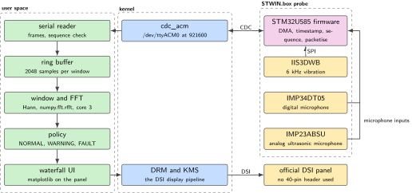
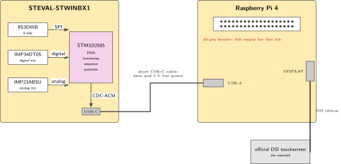
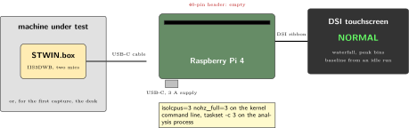
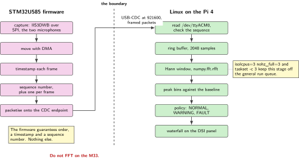

# P04. STWIN.box vibration and ultrasound USB gateway

> **Host:** Raspberry Pi 4 + STEVAL-STWINBX1 + official DSI touchscreen  
> **Owns:** 6 kHz vibration and the ultrasonic microphones

> [!NOTE]
> **Why this lab is unique**
>
> Owns the only 6 kHz vibration sensor, the IIS3DWB, and the only ultrasound and industrial MEMS microphones. USB-CDC into Linux. The DSI glass is the waterfall. No HAT.

> [!NOTE]
> **What the 198-page blueprint got wrong**
>
> Draft P1 called USB-C a "VCP" and invoked Intel MKL. USB-C is the connector; CDC-ACM exists only after HSDatalog or USB-CDC firmware is present. Use a NumPy FFT. Draft P20 reused the STWIN as a BLE factory tier, which would double-own this silicon. Anomaly-only uplink is a policy in this lab, not a second project.

## Intent

The STWIN.box is a USB industrial probe. The Pi 4 isolates one CPU core for the FFT thread with `isolcpus` and `taskset`, and classifies NORMAL, WARNING or FAULT from spectral peaks. The DSI panel carries the waterfall, and the 40-pin header stays empty, which is what makes this lab compatible with the panel in the first place.

The demonstration is an orthogonality test, and it is worth stating before the wiring. Touch the case and the vibration energy rises. Speak near the digital microphone and the microphone RMS rises while the vibration band does not move. Two physical quantities, two independent paths through the same cable, and one host that can tell them apart. A system that cannot separate them is not measuring what its labels claim.

> [!NOTE]
> **Kit from the bin**
>
> Pi 4, official DSI touchscreen, STWIN.box, USB-C cable. The optional STWIN LiPo only if it already sits in the kit box.

> [!NOTE]
> **The firmware decides whether this lab exists**
>
> CDC-ACM appears only after HSDatalog or a USB-CDC firmware is present on the probe. Until then the USB-C connector carries power and a DFU interface and nothing else. Flash first, then look for `/dev/ttyACM0`, and read the frame format from ST's tools rather than guessing at it.

## System architecture



*Figure 4.1. The probe and the host. The microcontroller moves samples and stamps them. Linux does every arithmetic operation that matters, on a core that the scheduler has been told to leave alone.*

The boundary is the design. On the STWIN side, the STM32U585 reads the IIS3DWB over SPI and the microphones over their own interfaces, moves the samples with DMA, applies a timestamp and a sequence number, and packetises the result onto the USB CDC endpoint. It does not transform the data. On the Linux side, a reader pulls frames from `/dev/ttyACM0` into a ring buffer, a windowed FFT runs on the isolated core, and a policy decides NORMAL, WARNING or FAULT from the resulting peaks.

Note what is missing from that list. There is no analysis on the probe, no storage on the probe, and no decision on the probe. The device is a well-behaved source of stamped samples, and everything downstream of the cable can be rewritten, restarted and rerun against a recorded file without touching the firmware at all.

That split is not a stylistic preference. The Cortex-M33 in the probe has better access to the sensors and worse access to everything else: no file system worth the name, no display, no package manager and no way to change the analysis without a reflash. Linux owns the system. The microcontroller is a peripheral that happens to contain a processor, and the moment an FFT moves into it, the parts of the lab you most want to change become the parts that are hardest to change. Do not FFT on the M33.

| Part | What it measures | Why it is here |
| --- | --- | --- |
| IIS3DWB | Vibration to 6 kHz | The only 6 kHz vibration sensor in the kit. The ADXL345 of P01 and P19 cannot do this band |
| ISM330DHCX | Inertial, with a machine learning core | On the probe, not on the IKS5A1. The draft placed it on the wrong board |
| IMP34DT05 | Digital microphone | The acoustic half of the orthogonality test |
| IMP23ABSU | Analog microphone, ultrasonic range | The only ultrasonic path in the kit |
| STM32U585 | Nothing. It moves samples | DMA, timestamp, sequence number, packetise. No arithmetic on the signal |

*Table 4.1. What is on the probe. One physics per lab: these are not the IKS4A1 sensors of P07 and not the ADXL345 of P19.*

## Wiring and schematic



*Figure 4.2. The probe's internal signal paths and the two cables that leave it. Nothing here touches the 40-pin header, which is what lets the DSI panel and this probe coexist on one Pi.*

| Connection | Connector | Note |
| --- | --- | --- |
| STWIN.box to Pi 4 | USB-C on the probe to USB-A on the Pi | Data and 5 V bus power on one cable. Keep it short and strain-relieved |
| Touchscreen to Pi 4 | DSI ribbon to the DISPLAY connector | Not the 40-pin, and not the CAMERA connector |
| 40-pin header | None | Left empty for the whole lab |
| IIS3DWB to STM32U585 | SPI, inside the probe | The 6 kHz vibration path |
| IMP34DT05 to STM32U585 | Digital microphone interface, inside the probe | The digital microphone path |
| IMP23ABSU to STM32U585 | Analog microphone input, inside the probe | The ultrasonic analog path |

*Table 4.2. Connections. This lab has no header pins to number: everything arrives over two cables. Confirm the connector legend on the silkscreen before seating the ribbon.*

```text
STWIN USB-C  --->  Pi 4 USB-A     (data + 5V bus power)
DSI ribbon   --->  Pi 4 DISPLAY   (not the 40-pin)
40-pin left empty. Strain-relieve the USB cable.
Mount STWIN on the machine under test, not on a ringing desk if you
can avoid it. The desk is a valid first stimulus.
```

> [!IMPORTANT]
> **Before the probe goes on the machine**
>
> CDC-ACM appears only after the firmware declares it. USB-C is the connector, not a protocol, and `/dev/ttyACM0` is the evidence that the right image is running. Seat the DSI ribbon with the Pi powered off.

## Bench layout



*Figure 4.3. Bench layout. A short USB cable, a probe mounted on the thing under test, and a panel that shows the spectrum. The 40-pin header is visible and empty in this drawing on purpose.*

Mount the STWIN.box on the machine under test, not on a ringing desk if you can avoid it. The desk is a valid first stimulus, and for the first capture it is the right one, because a hand on a desk produces a repeatable excitation that everyone at the bench can perform. Once the pipeline works, move the probe onto something that actually turns.

Keep the panel out of the mechanical path. It is the readout, not part of the experiment, and a panel resting against the machine under test will put its own resonance into every capture.

Strain-relieve the USB cable at both ends. The probe is mounted on something that moves, and the cable is the one part of this lab that is asked to tolerate that movement while carrying high-rate data and the probe's own supply. Tape it to the bench, leave a service loop, and keep the run short.

## Software design (UML)



*Figure 4.4. The boundary the source insists on. Everything left of the dashed line is firmware that moves and labels samples. Everything right of it is Linux, on a core the scheduler does not touch.*

Read the diagram as a contract. The firmware guarantees three properties and no more: samples arrive in order, each frame carries a timestamp, and each frame carries a sequence number that increases by one. Those three are exactly what the host needs to detect a gap, and a gap is the only transport fault that matters here. The host side then owns the window, the transform, the baseline and the decision, which are the four things you will want to change during the lab.

The sequence number is the cheapest instrument in the lab. It costs four bytes per frame and it is the only way to tell a quiet machine from a stalled reader, because both look like an absence of energy in the spectrum. Check it on every frame, and count the gaps rather than logging them, so that a long run produces one number instead of a scroll.

The isolated core is part of the same argument. With `isolcpus=3 nohz_full=3` on the kernel command line and `taskset -c 3` on the analysis process, the completely fair scheduler stops migrating the FFT thread and stops interrupting it with unrelated work. Without it the transform still runs, but its timing wanders with whatever else the desktop is doing, and a wandering pipeline produces dropped frames that look like a hardware fault.

## Data flow (ASCII)

```text
IIS3DWB --SPI--> STM32U585 --USB-C--> Pi 4 /dev/ttyACM*
IMP34DT05 / IMP23ABSU --I2S/analog--> STM32U585 --same CDC-->
Pi: serial reader -> ring buffer -> window+FFT -> peak bins
     -> NORMAL | WARNING | FAULT  (DSI waterfall)
Boundary: STM32 does DMA + timestamp + sequence + packetize.
          Linux does DSP + policy. Do not FFT on the M33.
```

Two properties of that block are worth naming. The first is that the same cable carries the vibration stream and both microphone streams, so a transport fault appears in all of them at once, which makes it easy to recognise. The second is that the DSI panel sits on its own connector, so the display costs the analysis nothing on the header and very little on the bus.

## Steps

**Step 1.** **Flash the probe.** On a PC or on the Pi, load ST HSDatalog or the Zephyr `steval_stwinbx1` sensors sample, which enumerates as USB CDC. STM32CubeProgrammer works in USB DFU mode on the same USB-C connector.

```bash
lsusb | grep -i st
# hold BOOT / DFU as in the UM of the STWIN.box, then
STM32_Programmer_CLI -c port=USB1 -w firmware.bin 0x08000000
```

**Step 2.** **Isolate a core** so the scheduler does not migrate the FFT thread.

```bash
# /boot/firmware/cmdline.txt append:
#   isolcpus=3 nohz_full=3
sudo reboot
ls /dev/ttyACM*
sudo apt-get install -y python3-serial python3-numpy python3-matplotlib
```

**Step 3.** **Ingest.** If the firmware is the Zephyr text dashboard, parse lines. If it is HSDatalog binary, use ST's host decoder first. Do not invent a frame format.

```bash
stty -F /dev/ttyACM0 921600 raw -echo
taskset -c 3 python3 p04_fft.py
```

**Step 4.** **Write the analysis.** `p04_fft.py` in outline: read 2048 int16 samples at the configured output data rate, apply a Hann window, call `numpy.fft.rfft`, take the magnitude, and compare a high-frequency band against a baseline captured on an idle machine. Print NORMAL, WARNING or FAULT.

```python
import numpy as np, serial

N = 2048
win = np.hanning(N)
baseline = None                 # captured once, on an idle machine

ser = serial.Serial("/dev/ttyACM0", 921600, timeout=2)

def band_energy(block):
    spec = np.abs(np.fft.rfft(block * win))
    return spec

while True:
    block = read_2048_samples(ser)      # parser for the firmware you flashed
    spec = band_energy(block)
    hf = spec[len(spec)//2:].sum()      # the high-frequency band
    if baseline is None:
        baseline = hf
        continue
    ratio = hf / baseline
    # WARN and FAULT are measured on your own idle machine.
    # The cookbook prescribes no numbers here: record what you used.
    state = "NORMAL"
    if ratio > WARN:
        state = "WARNING"
    if ratio > FAULT:
        state = "FAULT"
    print(state, round(ratio, 2))
```

The two thresholds are the one part of this pipeline with no prescribed value. Measure them: capture the idle baseline, capture the stimulus, and set the two ratios where they separate the two populations on your bench. Write both numbers in the lab book beside the baseline they belong to, because a threshold without its baseline is not a measurement.

**Step 5.** **Optional policy: publish only FAULT.** That is the anomaly-only uplink from draft P20, implemented here as a flag rather than as a second project. The uplink itself belongs to whichever radio lab is seated on another host.

**Step 6.** **Check the transport before trusting the spectrum.** Capture two seconds to a file and confirm that the sequence number is monotonic and that no frame is missing. A spectrum computed over a stream with holes in it is a picture of the holes.

```bash
# capture two seconds, then count the gaps offline
timeout 2 cat /dev/ttyACM0 > /home/pi/p04_capture.bin
ls -l /home/pi/p04_capture.bin
# the decoder reports: frames, first and last sequence number, gaps = 0
```

**Step 7.** **Run the orthogonality test and write down both numbers.** Touch the case, note the vibration band. Speak near the digital microphone, note the RMS and the vibration band again. The second number is the one that decides whether the mounting is honest.

## Acceptance test

- Touch the STWIN case: the vibration-band energy rises.
- Speak near the digital microphone: the RMS rises and the vibration band does not. That orthogonality is the lab.
- A 2-second capture file has a monotonic sequence number and no dropped frames.
- `ls /dev/ttyACM*` shows the CDC device, which is the evidence that the firmware declares the interface.
- The baseline, the two thresholds and the mounting are all written down together, so the run can be repeated next week.
- The same capture file, replayed through the analysis offline, produces the same classification. If it does not, the pipeline has state it should not have.
- The classifier prints NORMAL on an idle machine and moves to WARNING or FAULT under the stimulus, against a baseline you captured rather than a constant you guessed.
- The FFT process is on the isolated core: `taskset -cp` on its process identifier reports core 3 and nothing else.
- The 40-pin header is empty at the end of the lab, as it was at the start.
- Two consecutive idle captures give the same baseline within a tolerance you decided before looking at the second one.

## Practices

Short USB cable. No Wi-Fi scan during a capture. Timestamp with `CLOCK_MONOTONIC`, because a wall clock can step backwards during a run and a monotonic clock cannot. USB-powered is the Linux-gateway mode; the LiPo is for standalone logging you are not doing today.

- **Capture the baseline deliberately.:** The idle spectrum of the machine under test is data, not a formality. Record it, keep it in the file next to the captures it is compared against, and recapture it when the probe is remounted.
- **Keep the policy separate from the transform.:** The FFT produces numbers; the thresholds turn numbers into words. Keeping them in different functions is what lets you re-tune the lab without touching the signal path.
- **One physics per lab.:** The IIS3DWB is not the ADXL345 of P01 and P19, and it is not the IKS4A1 of P07. Six different instruments, never interchangeable.
- **Let the transport prove itself first.:** Sequence numbers and frame counts before spectra. The order matters, because a dropped frame produces a broadband artefact that reads like a real mechanical event.
- **Name the mounting in the file name.:** The probe on a desk and the probe on a motor are two different instruments. A capture whose name does not record which one it was cannot be compared with anything later.
- **Keep the probe on the probe's job.:** The anomaly-only uplink is a flag in this lab's policy function. It is not a reason to add a radio to this host, and it is not a second product.

## Pitfalls

- **No CDC device after flashing.** USB-C is the connector. CDC-ACM exists only after the firmware declares it, so an absent `/dev/ttyACM0` points at the image, not at the cable.
- **A capture started before the probe settled.** A probe just remounted, or just plugged in, is still moving. Give it a few seconds before the baseline run.
- **Inventing a frame format.** HSDatalog produces a binary layout that ST documents and decodes. Guessing at it produces a spectrum that looks plausible and means nothing.
- **Running the FFT on the microcontroller.** It moves the part of the lab you most want to change into the part that is hardest to change, and it gives up the host's memory and libraries for no gain.
- **Skipping isolcpus.** The transform still runs, but its timing wanders with the desktop's load, and the dropped frames that follow look like a hardware fault.
- **A hub between the probe and the host.** Bus power and a sustained high-rate stream through a shared hub produce drops that arrive in bursts. Use a port on the Pi itself.
- **A long or unsecured USB cable.** Bus power and high-rate data on a cable that moves with the machine under test produces enumeration faults in the middle of a capture.
- **A Wi-Fi scan during a capture.** It costs CPU and bus time at an unpredictable moment. Hold the scan until the file is closed.
- **Reading the microphone RMS as vibration.** The two paths share a cable and nothing else. If a sound moves the vibration band, the mounting is resonating and the mechanical setup needs attention before the software does.
- **Seating a HAT.** The 40-pin header stays empty in this lab. The DSI panel does not consume it, which is the only reason the panel is here.
- **A baseline captured on a running machine.** The reference has to be the idle state. A baseline taken while the machine turns hides exactly the energy the classifier is meant to notice.
- **Comparing today's ratio against last week's baseline after remounting.** Mounting stiffness changes the coupling. Recapture the baseline whenever the probe moves.
- **Quoting a threshold without its baseline.** The ratios are specific to one mounting on one machine. Reported alone, they describe nothing.
- **A wall clock in the timestamp.** `CLOCK_MONOTONIC` cannot step backwards; a wall clock can, and a time synchronisation during a capture will put a negative interval in the middle of the file.
- **Treating a LiPo run as the same experiment.** USB-powered is the Linux-gateway mode. Standalone logging on the battery is a different lab, and it is not this one.

## Sources

- ST STEVAL-STWINBX1 product page and user manual, for the DFU procedure and the connector legend, <https://www.st.com/en/evaluation-tools/steval-stwinbx1.html>
- Raspberry Pi documentation, the DSI display connector, <https://www.raspberrypi.com/documentation/>
- ST HSDatalog host tools and the documented file format, <https://www.st.com/>
- Zephyr `steval_stwinbx1` board support and the sensors sample, <https://docs.zephyrproject.org/>
- IIS3DWB, ISM330DHCX, IMP34DT05 and IMP23ABSU data sheets (ST)
- The STWIN.box user manual, for the BOOT and DFU procedure referenced in step 1
- NumPy FFT documentation, <https://numpy.org/doc/stable/reference/routines.fft.html>
- The kernel parameter list for `isolcpus` and `nohz_full`, <https://www.kernel.org/doc/html/latest/admin-guide/kernel-parameters.html>
- P12 in this volume for the DSI panel, and P18 for the other high-rate USB-CDC recorder in this book
- P10 in this volume, which owns the energy figures this lab does not attempt
- P07 and P08 in this volume, for the two Nucleo shields that are deliberately not this instrument
- STM32CubeProgrammer documentation, for the DFU command line used in step 1, <https://www.st.com/en/development-tools/stm32cubeprog.html>

---

[Previous](03-cat-m-mqtt-node-with-gnss-stamp.md) &nbsp;&nbsp;|&nbsp;&nbsp; [Contents](../README.md) &nbsp;&nbsp;|&nbsp;&nbsp; [Next](05-mcc-118-100-ks-s-voltage-recorder.md)
