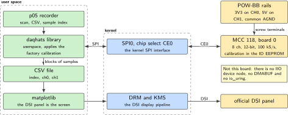
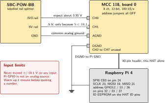
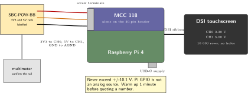
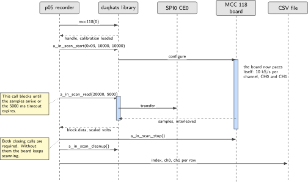

# P05. MCC 118 100 kS/s voltage recorder

> **Host:** Raspberry Pi 4 + MCC 118 + official DSI touchscreen + POW-BB  
> **Owns:** the only calibrated 10 V analog path

> [!NOTE]
> **Why this lab is unique**
>
> Owns the only calibrated 10 V analog path in the book. Not an IMU lab.

> [!NOTE]
> **What the 198-page blueprint got wrong**
>
> Draft P2 and P17 claimed Linux IIO with DMABUF and io\_uring on this HAT. The MCC 118 talks SPI to the official daqhats library. There is no mainline IIO driver and no `IIO_BUFFER_DMABUF_ATTACH_IOCTL` for this board. Draft P17 also closed a PID loop onto a green LED, which is a demo, not a process plant. We record voltages correctly first.

## Intent

Eight single-ended 12-bit inputs, 100 kS/s as the board maximum, and factory calibration held in the board's EEPROM. The Pi 4 with the DSI panel is the instrument's screen. The POW-BB 3.3 V rail on CH0 is the known reference, which is what turns a plausible number into a checked one.

The product of this lab is a file, not a plot. A hardware-paced scan that runs for one second at 10 kS/s per channel must produce exactly 10 000 samples per enabled channel, with a monotonic sample index and no holes. Everything else in the chapter exists to make that sentence true: the common analog ground, the warm-up, the single-shot sanity read and the refusal to stack a second SPI board.

> [!NOTE]
> **Kit from the bin**
>
> Pi 4, MCC 118, official DSI touchscreen, POW-BB, jumpers.

> [!IMPORTANT]
> **The analog limits before anything is connected**
>
> Never exceed <span class="math">±</span>10.1 V on any input. The Pi GPIO is not an analog source: do not wire a header pin into a screw terminal to "generate" a test voltage. The 5 V rail is acceptable on CH1 only because 5 is less than 10.1. Warm the board up for one minute before quoting a number.

> [!NOTE]
> **Where the 100 kS/s goes**
>
> 100 kS/s is the board cap across the scan, not per channel. Two channels at 10 kS/s each is a comfortable first run and is what the acceptance test uses. Eight channels at the cap is a different problem, because the host still has to move, convert and store every sample, and the file writing is not paced by anything.

## System architecture



*Figure 5.1. The supported path. SPI in the kernel, the daqhats library in user space, and no IIO device node anywhere in the diagram. The screen is on the DSI connector, so it costs the header nothing.*

The board is an SPI peripheral and the supported software path is the vendor's userspace library. There is no industrial input and output device node to open, no buffer to map, and no ring to share with the kernel. A Python process calls into daqhats, the library talks SPI through the kernel's SPI interface, and the board returns blocks of samples that it converted on its own clock. That last point is the one that matters: the pacing belongs to the board, not to the process, which is why a busy Pi still produces an evenly spaced file.

The display side is separate and cheap. The official panel is on the DSI connector, so it takes no header pins and shares no bus with the converter. That is the only reason a screen appears in an analog lab at all: it costs the measurement nothing.

The calibration lives in the board's EEPROM and is applied by the library, which is why `daqhats_read_eeproms` is part of the installation rather than an optional step. A board whose EEPROM has not been read into the host's configuration will still return numbers, and those numbers will be wrong in a way that looks like a wiring fault.

| Call | What it does |
| --- | --- |
| `daqhats_read_eeproms` | Reads the factory calibration out of the board's ID EEPROM. Part of the installation |
| `daqhats_list_boards` | Names the boards the host can see, and at which address |
| `hat_list` | The same question from Python, filtered by board type |
| `mcc118(0)` | Opens board 0, which is what all address jumpers off means |
| `a_in_read` | One single-shot reading from one channel. Sanity, not product |
| `a_in_scan_start` | Hands the pacing to the board: channel mask, sample count, rate |
| `a_in_scan_read` | Blocks until the samples arrive or the timeout expires |
| `a_in_scan_stop` | Ends the conversion |
| `a_in_scan_cleanup` | Releases the library's scan buffer |

*Table 5.1. The library calls this lab uses. The last four are the hardware-paced scan, and they belong together in that order.*

## Wiring and schematic



*Figure 5.2. The screw terminals. CH0 carries the POW-BB 3.3 V rail as the known reference, CH1 carries the 5 V rail, and AGND is the common analog ground that makes both of them meaningful.*

| Signal | Connection | Pi header pin | Note |
| --- | --- | --- | --- |
| CH0 | POW-BB 3V3 | Screw terminal | Expect about 3.30 V, the known reference |
| CH1 | POW-BB 5V | Screw terminal | Only because 5 is less than 10.1 |
| AGND | POW-BB GND | Screw terminal | Common analog ground |
| DGND | Pi GND | Screw terminal | Digital ground |
| SPI0 CE0 | Through the header | 24 | GPIO8, the board's chip select |
| SPI0 SCLK | Through the header | 23 | GPIO11 |
| SPI0 MOSI | Through the header | 19 | GPIO10 |
| SPI0 MISO | Through the header | 21 | GPIO9 |
| Board address | Address jumpers | 32, 33, 37 | GPIO12, GPIO13, GPIO26. All jumpers off is board 0 |
| ID EEPROM | HAT ID pins |  | Read once with `daqhats_read_eeproms` |

*Table 5.2. Wiring. The HAT sits alone on the 40-pin header. Confirm the terminal order on the silkscreen before landing a wire, since the block legend is printed on the board.*

```text
MCC 118 seated ALONE on the 40-pin
  uses SPI0 CE0, ID EEPROM, address GPIO12/13/26
  address jumpers all OFF = board 0

Screw terminals:
  CH0  ---- POW-BB 3V3     expect ~3.30 V
  CH1  ---- POW-BB 5V      only because 5 < 10.1
  AGND ---- POW-BB GND     common analog ground
  DGND ---- Pi GND
Never exceed +/-10.1 V. Pi GPIO is not an analog source.
Warm up 1 minute before quoting a number.
```

## Bench layout



*Figure 5.3. Bench layout. Four wires from the rail splitter into the terminal block, a panel on the DSI connector, and nothing else on the header. The multimeter is optional but it is the only way to know the reference is what the label says.*

Keep the analog wires short and keep them away from the supply lead. This is a bench with a rail splitter in it, and the two rails that matter are the ones being measured, so anything that couples into those four wires becomes part of the reading.

Land the four wires, tighten the terminals and check them with a gentle pull before power. Then leave the board alone for a minute. A converter that has just been powered is still settling, and a number quoted in the first seconds is a number about temperature rather than about the rail.

## Software design (UML)



*Figure 5.4. The hardware-paced scan. The library call that blocks is `a_in_scan_read`, and the board is filling its buffer on its own clock the whole time. The two closing calls are not optional.*

A closed-loop demonstration belongs after all of this, if at all. Driving an output from a reading is easy to show and easy to misread as process control, and the draft that did it had not yet produced an honest file. Record correctly first, then decide whether the loop adds anything.

Four calls make the product. `a_in_scan_start` tells the board which channels to convert and how fast, and from that moment the board paces itself. `a_in_scan_read` blocks until the requested samples have arrived or the timeout expires, and it returns a block whose data are already scaled and calibrated. `a_in_scan_stop` ends the conversion, and `a_in_scan_cleanup` releases the buffer the library allocated. Leaving either of the last two out leaves the board scanning into a buffer nobody is emptying, and the next run then starts against a board that is already busy.

## Data flow (ASCII)

```text
  POW-BB                 MCC 118 (board 0)            Pi 4
  +-----------+          +---------------------+      +----------------------+
  | 3V3 rail  |--CH0---->|                     |      | daqhats (userspace)  |
  | 5V  rail  |--CH1---->| 8 ch, 12-bit        |      |   a_in_scan_start    |
  | GND       |--AGND--->| 100 kS/s max        |      |   a_in_scan_read <-- blocks
  +-----------+          | factory cal in      | SPI0 |   a_in_scan_stop     |
                         | the ID EEPROM       |<====>|   a_in_scan_cleanup  |
   Pi GND ------DGND---->|                     | CE0  |          |           |
                         +---------------------+      |          v           |
                                                      | CSV: index,ch0,ch1   |
                                                      |          |           |
                                                      |          v           |
                                                      | matplotlib on the DSI|
                                                      +----------------------+
  Limits: never exceed +/-10.1 V.  Pi GPIO is not an analog source.
```

One more property of that drawing deserves attention. The POW-BB is the only voltage source in the lab, and it is a rail splitter with printed labels rather than a calibrator. It is good enough to be a known reference on a bench because its rails are regulated and because a multimeter can confirm them in ten seconds. It is not a traceable standard, and nothing in this chapter claims that it is.

## Steps

**Step 1.** **Install the library and read the board.** The EEPROM read is part of the installation, not an extra.

```bash
git clone https://github.com/mccdaq/daqhats.git
cd daqhats && sudo ./install.sh
sudo daqhats_read_eeproms
daqhats_list_boards
```

**Step 2.** **Land the wires and wait.** Tighten the four screw terminals, confirm the two rails with a multimeter and write the numbers in the lab book, then power the board and leave it for a minute before reading anything. The wait is part of the procedure, not a courtesy.

**Step 3.** **Single-shot sanity.** One read per channel, to confirm the reference before anything is paced.

```python
from daqhats import mcc118, hat_list, HatIDs
print(hat_list(filter_by_id=HatIDs.MCC_118))
h = mcc118(0)
print([round(h.a_in_read(ch), 4) for ch in range(8)])
```

**Step 4.** **Hardware-paced scan.** This is the product, not the single read.

```python
from daqhats import mcc118, OptionFlags
h = mcc118(0)
h.a_in_scan_start(0x03, 10000, 10000, OptionFlags.DEFAULT)
block = h.a_in_scan_read(20000, 5000)
print(len(block.data), block.data[:8])
h.a_in_scan_stop(); h.a_in_scan_cleanup()
```

The channel mask `0x03` selects CH0 and CH1. At 10 kS/s per channel, a 10 000 sample request is one second of recording per channel, and the second argument of `a_in_scan_read` is a timeout in milliseconds. The returned block carries the two channels interleaved, which is why the sample count that comes back is twice the per-channel figure.

**Step 5.** **Write the file.** One second at 10 kS/s on CH0 and CH1, as CSV with a monotonic sample index, then plot it on the DSI panel with matplotlib.

```python
import csv
from daqhats import mcc118, OptionFlags

h = mcc118(0)
h.a_in_scan_start(0x03, 10000, 10000, OptionFlags.DEFAULT)
block = h.a_in_scan_read(20000, 5000)
h.a_in_scan_stop(); h.a_in_scan_cleanup()

data = block.data                      # CH0, CH1, CH0, CH1, ...
with open("/home/pi/p05_scan.csv", "w", newline="") as f:
    w = csv.writer(f)
    w.writerow(["index", "ch0", "ch1"])
    for i in range(len(data) // 2):
        w.writerow([i, round(data[2*i], 6), round(data[2*i + 1], 6)])
print("rows:", len(data) // 2)         # expect 10000
```

**Step 6.** **Check the file before you look at the picture.** Count the rows, check that the index is monotonic, and confirm that the CH0 column sits on the reference. A plot hides a hole; a row count does not.

```bash
wc -l /home/pi/p05_scan.csv          # 10001 lines: 10000 rows and one header
head -n 3 /home/pi/p05_scan.csv
awk -F, 'NR>1 {s+=$2; n++} END {print "mean ch0:", s/n}' /home/pi/p05_scan.csv
```

## Acceptance test

- CH0 reads 3.30 V plus or minus 0.05 V against the POW-BB rail, after the one-minute warm-up.
- A 10 kS/s by 1 s file has 10 000 samples per enabled channel and no holes.
- `daqhats_list_boards` names one board at address 0, which is what all jumpers off means.
- The sample index in the file is monotonic from zero with no repeats.
- Nothing else is seated on the 40-pin header, and `daqhats_list_boards` still reports the board after a reboot.
- CH1 sits near 5 V, which is inside the limit and is the only reason that rail is on an input at all.
- The multimeter reading of the 3.3 V rail and the CH0 column of the file agree, and both are written down.
- The scan ends with `a_in_scan_stop` and `a_in_scan_cleanup`, and a second run starts cleanly without a reboot.

## Practices

Common AGND. Do not stack the 3.5 inch LCD or the Explorer700: both want SPI, and this board owns it for the duration. 100 kS/s is the board cap, so budget CPU before enabling all eight channels: the conversion is paced by the board, but the transfer and the file writing are not. A closed-loop demonstration that drives a PWM output at an LED is a stretch goal only after the file is honest.

- **Quote the reference with the reading.:** The sentence is "CH0 reads 3.30 V against the POW-BB 3.3 V rail", not "the board reads 3.30". One of those can be checked next week and the other cannot.
- **Warm up before quoting.:** One minute, every session. It costs a minute and it removes a whole class of argument about the first decimal place.
- **Count the rows before plotting.:** A plot interpolates over a missing sample and a row count does not. The file is the product, and the picture is a view of it.
- **Treat the EEPROM as part of the instrument.:** The factory calibration is the difference between this board and a generic converter. Read it once at installation and do not assume it survived a reflash of the host.

## Pitfalls

- **Treating the single-shot read as the measurement.** `a_in_read` is a sanity check. It is not paced, so a sequence of them is not a recording and their spacing is whatever the interpreter managed.
- **Looking for an IIO device.** There is none. The supported path is SPI plus the daqhats userspace library, and time spent looking for `/sys/bus/iio` is time spent on a device that does not exist here.
- **A second SPI board on the header.** The 3.5 inch LCD of P06 and P19 and the Explorer700 of P11 both want the same bus. One 40-pin HAT per host, and this lab's HAT is the MCC 118.
- **No common analog ground.** Without AGND tied to the POW-BB ground, the inputs float and the readings drift with whatever else is on the bench. The symptom is a reference that moves when a hand comes near the wires.
- **An input left floating.** An unconnected channel reads whatever the input stage drifts to. It is not a zero, and it should not be quoted as one.
- **A Pi GPIO used as an analog source.** It is a digital output with a series impedance you do not control, and it is not a voltage reference. The rail splitter is.
- **Quoting the first reading.** A converter that has just been powered is still settling. Wait the minute.
- **Skipping the EEPROM read.** The board returns numbers either way. Only one set of them is calibrated.
- **A rail measured at the splitter but read at the terminal.** If the two disagree, the wire or the terminal is the cause, and that is worth knowing before the converter is suspected.
- **Leaving the scan running.** Without `a_in_scan_stop` and `a_in_scan_cleanup`, the board keeps converting into a buffer nobody empties, and the next run meets a busy board.
- **Reading the block as one channel.** With a two-channel mask the samples are interleaved. Splitting them incorrectly produces a file that looks like noise at half amplitude.
- **Two boards at the same address.** All jumpers off is board 0. If a second MCC board ever joins the bench, the address jumpers are how they are told apart, and `daqhats_list_boards` is where the answer appears.
- **A loose screw terminal.** It reads as noise on one channel and nothing on the others. Pull each wire gently after tightening.
- **Calling the plot the result.** The acceptance test counts samples. A picture with a straight line through a gap passes no test.
- **Enabling all eight channels on the first run.** 100 kS/s is the board maximum across the scan, and the host still has to move and store every sample. Start with two.

## Sources

- MCC DAQ HAT library, installation and the Python API, <https://github.com/mccdaq/daqhats>
- MCC 118 documentation, input range, resolution and the 100 kS/s board maximum, <https://mccdaq.github.io/daqhats/>
- The daqhats Python examples, which include a scan written in the same four calls used here
- Digilent and Measurement Computing MCC 118 product documentation, terminal block legend and address jumpers
- P06 in this volume, the other SPI board in the book, for why the two cannot share a sitting
- JOY-iT SBC-POW-BB documentation, for the rail voltages used as the reference
- NumPy and matplotlib documentation, for the plot drawn on the panel, <https://matplotlib.org/>
- Raspberry Pi hardware documentation, 40-pin header and SPI0, <https://www.raspberrypi.com/documentation/computers/raspberry-pi.html>
- P12 in this volume for the DSI panel, P15 for the rail discipline this lab depends on, and P11 and P19 for the two boards that must stay off the header

---

[Previous](04-stwin-box-vibration-and-ultrasound-usb-gateway.md) &nbsp;&nbsp;|&nbsp;&nbsp; [Contents](../README.md) &nbsp;&nbsp;|&nbsp;&nbsp; [Next](06-8x8-tof-occupancy-kiosk.md)
