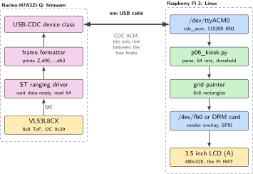
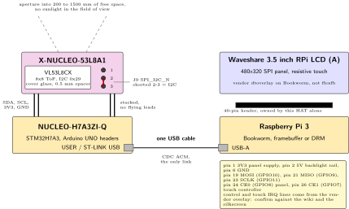
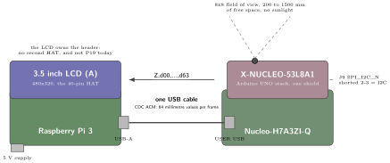
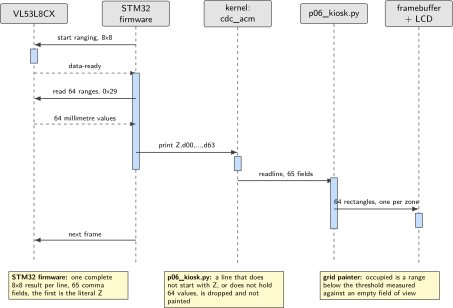

# P06. 8x8 ToF occupancy kiosk

> **Host:** Raspberry Pi 3 + 3.5 inch LCD + Nucleo-H7A3ZI-Q + X-NUCLEO-53L8A1  
> **Owns:** multi-zone ranging and the SPI heat map

> [!NOTE]
> **Why this lab is unique**
>
> Owns VL53L8CX multi-zone ranging and the Waveshare SPI LCD as a local heat map. Not an IMU and not V4L2.

> [!NOTE]
> **What the 198-page blueprint got wrong**
>
> Draft P8 loaded stsw-img042 as a V4L2 camera node and drove the LCD with flexfb/fbtft. On Bookworm the Waveshare 3.5 inch (A) uses the vendor overlay / DRM path, and ST's ToF Linux stack is not a Pi camera. Stream 64 millimetre values over the Nucleo USB-CDC.

## Intent

The Nucleo-H7A3ZI-Q carries the X-NUCLEO-53L8A1 and produces an 8x8 grid of millimetre ranges. The Pi 3, wearing the Waveshare 3.5 inch LCD (A), paints occupancy or desk presence from those 64 numbers. Nothing else happens on either board. The ToF sensor is an instrument with its own ranging core and its own timing, and the useful product of this lab is a grid that arrives complete, frame after frame, and lands on glass a person can read from across the room.

This is a two-host lab, and that is the design rather than an accident. The 40-pin header on the Pi 3 is taken by the LCD, so the ToF sensor cannot sit there. The Nucleo owns the sensor and hands Linux a line of text; Linux owns storage, the framebuffer and the threshold policy. Read the boundary as the book's standing rule made physical: one USB cable, firmware on one side, Linux on the other. P19 uses the same LCD on the same header for an ADXL345 tilt meter, so P19 and P06 cannot share a Pi in one sitting. Do that on a different afternoon.

> [!NOTE]
> **Kit from the bin**
>
> Pi 3, Waveshare 3.5 inch RPi LCD (A), Nucleo-H7A3ZI-Q, X-NUCLEO-53L8A1, USB cable.

## System architecture



*Figure 6.1. Two hosts, one USB cable. Everything left of the cable is STM32 firmware, everything right of it is Linux. The VL53L8CX is never visible to the Pi as an I2C device; only the 64 millimetre values cross the boundary.*

The figure has one load-bearing feature: the single USB cable in the middle. On the firmware side the VL53L8CX sits on the STM32 I2C bus at address 0x29 and is serviced by ST's driver inside the sketch, which collects a complete 8x8 result and formats one text line per frame. On the Linux side that line arrives on a CDC ACM character device, and a Python consumer turns it into 64 integers. No ToF driver, no V4L2 node and no ST Linux stack is installed on the Pi, because none of those is the supported path on Bookworm.

The second half of the Linux side is the panel. The 3.5 inch LCD (A) is an SPI display that the vendor overlay binds at boot, so the painting code writes to a framebuffer or a DRM device rather than to the SPI bus itself. That separation keeps the lab honest: if the grid stops arriving, the display stays up and shows stale values, which is the symptom you want rather than a blank screen that could mean either problem.

## Wiring and schematic



*Figure 6.2. The two stacks. On the left, the 53L8A1 on the Nucleo Arduino UNO headers with J9 set to I2C. On the right, the LCD seated on the Pi 3 40-pin header, which it owns alone. The only electrical link between the two is the USB cable at the bottom.*

| Signal or part | Connector | Pin | Note |
| --- | --- | --- | --- |
| X-NUCLEO-53L8A1 | Nucleo Arduino UNO headers | stacked | One shield only, no flying leads |
| J9 SPI\_I2C\_N | 53L8A1 jumper | 2-3 | Selects I2C, the default for this lab |
| VL53L8CX I2C | STM32 I2C bus | 0x29 | Behind the STM32, not on the Pi |
| Cover glass and spacer | sensor aperture | 0.5 mm | As shipped, do not remove |
| Nucleo USER or ST-LINK USB | Pi 3 USB-A | any | CDC ACM, one cable, the only link |
| LCD 3V3 | Pi 40-pin | 1 | Panel supply from the header |
| LCD 5V | Pi 40-pin | 2 | Backlight rail on the HAT |
| LCD GND | Pi 40-pin | 6 | Also pins 9, 20, 25 |
| LCD MOSI | Pi 40-pin | 19 | GPIO10, SPI0 |
| LCD MISO | Pi 40-pin | 21 | GPIO9, SPI0, touch read-back |
| LCD SCLK | Pi 40-pin | 23 | GPIO11, SPI0 |
| LCD CE0 | Pi 40-pin | 24 | GPIO8, panel chip select |
| LCD CE1 | Pi 40-pin | 26 | GPIO7, touch controller chip select |
| LCD control and touch IRQ | Pi 40-pin | vendor overlay | The exact GPIO assignment comes from the vendor overlay, confirm against the Waveshare wiki and the silkscreen |

*Table 6.1. Wiring. The LCD owns the Pi 40-pin header, so nothing else seats on it, and the ToF sensor reaches Linux only over USB.*

```text
53L8A1 stacked on Nucleo Arduino UNO headers.
J9 SPI_I2C_N = I2C (pins 2-3) unless you deliberately choose SPI.
Nucleo USER USB or ST-LINK USB --> Pi USB-A   (CDC ACM)
Waveshare 3.5" LCD seated on Pi 3 40-pin (this lab's HAT).
Two hosts, one USB cable between them.
Point the aperture at 200-1500 mm of free space; no sunlight in the FOV.
Cover glass + 0.5 mm spacer as shipped.
```

The shield reaches the STM32 through the Arduino UNO headers and nothing else. There are no flying leads in this lab, no level shifter and no second I2C master. If you deliberately choose SPI on J9 instead, the firmware example has to change with it, so make that a decision you write in the lab book rather than a jumper you find in the wrong position later.

## Bench layout



*Figure 6.3. Bench layout. The Pi 3 wears the LCD as its HAT, the Nucleo wears the 53L8A1 as its shield, and one USB cable joins them. The sensor aperture looks into 200 to 1500 mm of free space with no sunlight in the field of view.*

Put the two stacks side by side with the LCD facing you and the ToF aperture facing the space you want to measure. Give the sensor a clear volume between 200 and 1500 mm, and keep direct sunlight out of that volume, because ambient infrared raises the noise floor and the far zones start to report nonsense. Leave the cover glass and the 0.5 mm spacer as they shipped: the calibration in the part assumes them.

> [!NOTE]
> **One header and one HAT per sitting**
>
> The 3.5 inch LCD (A) is one of the six boards that own the 40-pin header outright. While it is seated, the MCC 118, the Explorer700 and every cellular HAT stay in their bags, and P19 waits for another afternoon even though it wants the same panel. Power the Pi off before unseating anything, and build one lab at a time.

## Software design (UML)



*Figure 6.4. One frame, from the ranging core to the glass. The firmware waits for data-ready, reads a complete 8x8 result, and prints one line. Linux parses 64 integers, applies the threshold it measured against an empty field of view, and paints 64 rectangles.*

The consumer is deliberately dull. It reads a line, checks that the line starts with `Z,`, splits on commas and converts to integers. A line that fails any of those checks is dropped rather than repaired, because a partial frame painted on the glass looks like a real reading and is not. Occupancy is one comparison per zone against a threshold you measured yourself with the field of view empty, not a constant somebody wrote down.

## Data flow (ASCII)

```text
  Nucleo-H7A3ZI-Q  (firmware)                Pi 3  (Linux)
  +------------------------------+           +-------------------------------+
  | X-NUCLEO-53L8A1              |           | /dev/ttyACM0  115200 8N1      |
  |   VL53L8CX 8x8 ToF           |           |   |                           |
  |   I2C 0x29, J9 = I2C         |           |   v                           |
  |        |                     |           | p06_kiosk.py                  |
  |        v  data-ready         |    USB    |   startswith("Z,") ? drop : ok|
  | ST driver: read 64 ranges    |==========>|   64 ints, min / max in mm    |
  |        |                     |  CDC ACM  |   range < threshold = occupied|
  |        v                     |           |   |                           |
  | printf "Z,d00,d01,...,d63"   |           |   v                           |
  +------------------------------+           | 8x8 rectangles -> /dev/fb0    |
                                             +-------------------------------+
                                                         |
                                                         v  SPI0, vendor overlay
                                             Waveshare 3.5" LCD (A) 480x320

  Nothing crosses the USB cable except text frames. The Pi has no ToF driver,
  no V4L2 node and no I2C path to the sensor: i2cdetect on the Pi is empty.
```

## Steps

**Step 1.** **Flash the Nucleo.** Use the STM32duino `X_NUCLEO_53L8A1_HelloWorld_I2C` sample or the Cube VL53L8CX example. Whichever you pick, make it print one line per frame, in millimetres:

```text
Z,d00,d01,...,d63
```

That format is the contract between the two hosts. Sixty-five comma-separated fields, the first of which is the literal `Z`.

**Step 2.** **Stack one shield and one shield only.** The 53L8A1 goes on the Nucleo Arduino UNO headers. Set J9 SPI\_I2C\_N to I2C, pins 2-3, unless you deliberately choose SPI. Do not also stack IKS4A1 or IKS5A1: those are P07 and P08, and the Arduino stack takes one shield.

**Step 3.** **Bring the LCD up on Bookworm.** Follow the current Waveshare 3.5 inch (A) note for Bookworm, which uses the vendor `dtoverlay`, not the 2016 flexfb recipe. Then confirm that a framebuffer actually exists before you write to it.

```bash
ls /dev/fb*
ls /dev/dri/
```

A `/dev/fb0` or a DRM card must be present. If neither is, the overlay did not load and no amount of Python will paint anything.

**Step 4.** **Find the Nucleo.** Connect the single USB cable from the Nucleo USER USB or ST-LINK USB port to a Pi USB-A port.

```bash
lsusb
ls /dev/ttyACM* 2>/dev/null
sudo apt-get install -y python3-serial
```

More than one `ttyACM` node can appear, because the ST-LINK enumerates as well. The node that carries `Z,` lines is the one you want.

**Step 5.** **Run the consumer.** Save this as `/home/pi/p06_kiosk.py` and confirm the numbers before you paint anything.

```python
import serial
ser = serial.Serial("/dev/ttyACM0", 115200, timeout=1)
while True:
    line = ser.readline().decode(errors="ignore").strip()
    if line.startswith("Z,"):
        z = [int(x) for x in line.split(",")[1:]]
        print(min(z), max(z), "mm", len(z))
```

The printed length must be 64 on every frame. If it is not, the firmware line is truncated and the serial settings or the print statement are the cause, not the sensor.

**Step 6.** **Measure the threshold, do not guess it.** With the field of view empty, watch the printed minimum for a minute and write the wall distance in the lab book. Occupied is a range below a threshold you set under that number with margin. Repeat the measurement if you move the bench, because the wall distance is a property of where the sensor sits and not of the part.

**Step 7.** **Paint the grid.** Draw an 8x8 rectangle grid on the framebuffer, one rectangle per zone, filled by range. Occupied means the zone range is below the threshold you just measured against the empty field of view. Keep the painting in the same loop as the parse, so a stalled sensor stops the repaint rather than leaving a stale frame that looks live.

**Step 8.** **Tear the stack down when the acceptance test passes.** Power the Pi off before you unseat the LCD, put the 53L8A1 back in its own bag, and leave the Nucleo bare for P18. The next lab that wants this Pi wants the header empty.

## Acceptance test

- A hand at 300 mm occupies 4 to 10 zones.
- An empty field of view reports the wall at a stable range, plus or minus 20 mm.
- The LCD shows a coarse heat map, 64 values every frame.
- `len(z)` is 64 on every accepted line, and lines that do not start with `Z,` are dropped rather than parsed.

## Practices

One Arduino shield on the Nucleo. Do not also stack IKS4A1 or IKS5A1. One 40-pin HAT on the Pi, which in this lab is the LCD, so the MCC 118, the Explorer700 and any cellular HAT stay on the shelf. The ToF sensor is one of six different instruments in this kit and it is not interchangeable with the ADXL345 or with the STWIN.box.

Keep the millimetre grid in its own log file if you record it, and keep the threshold you measured in the lab book beside the wall distance it came from. A threshold without the measurement behind it is a number somebody will copy into the next bench, where the wall is somewhere else.

## Pitfalls

- **Looking for the ToF sensor with `i2cdetect` on the Pi.** It is not there. The VL53L8CX sits on the STM32 I2C bus at 0x29 and reaches Linux only as text over USB. P07 makes that boundary its teaching point; here it is simply the reason the scan is empty.
- **Installing the ST Linux ToF stack.** stsw-img042 is not a drop-in Bookworm camera device and the Pi has no V4L2 node for this part. The symptom is a long detour that ends without a `/dev/video` node.
- **Following the 2016 flexfb or fbtft recipe.** On Bookworm the 3.5 inch (A) uses the vendor overlay and the DRM path. The symptom is a white or black panel with no error, because nothing failed loudly.
- **Sunlight or a bright window in the field of view.** Ambient infrared raises the noise floor. The symptom is far zones that jump by hundreds of millimetres between frames while near zones stay calm.
- **Stacking a second Arduino shield.** The IKS4A1 and IKS5A1 want the same stack and share addresses with each other. The symptom is a firmware scan that finds the wrong part, or nothing at all.
- **Trying to run P19 on the same Pi in the same sitting.** P19 wants the same LCD on the same header with an ADXL345 on the pass-through. Power off, tear the HAT down, and build one lab at a time.
- **Painting a partial frame.** A line that lost characters still parses into a short list. Check the length, drop the frame, and let the glass hold the last good grid rather than a half-drawn one.
- **The wrong ACM node.** With the ST-LINK enumerating as well, more than one `ttyACM` can appear. The wrong one is silent rather than an error, so check which node carries `Z,` lines.
- **Removing the cover glass or the spacer.** The part is calibrated with them fitted. The symptom is a constant offset across every zone that no threshold explains.

## Sources

- ST X-NUCLEO-53L8A1 expansion board page, <https://www.st.com/en/ecosystems/x-nucleo-53l8a1.html>
- ST VL53L8CX 8x8 multizone ranging sensor data sheet, <https://www.st.com/en/imaging-and-photonics-solutions/vl53l8cx.html>
- STM32duino X-NUCLEO-53L8A1 library and the HelloWorld I2C example, <https://github.com/stm32duino/X-NUCLEO-53L8A1>
- ST NUCLEO-H7A3ZI-Q board page, <https://www.st.com/en/evaluation-tools/nucleo-h7a3zi-q.html>
- Waveshare 3.5 inch RPi LCD (A) wiki, for the current Bookworm overlay note, <https://www.waveshare.com/wiki/3.5inch_RPi_LCD_(A)>
- Raspberry Pi hardware documentation, 40-pin header and SPI0, <https://www.raspberrypi.com/documentation/computers/raspberry-pi.html>
- Linux USB CDC ACM driver, for the `ttyACM` naming, <https://www.kernel.org/doc/html/latest/usb/index.html>

---

[Previous](05-mcc-118-100-ks-s-voltage-recorder.md) &nbsp;&nbsp;|&nbsp;&nbsp; [Contents](../README.md) &nbsp;&nbsp;|&nbsp;&nbsp; [Next](07-consumer-9-dof-plus-climate-iks4a1.md)
