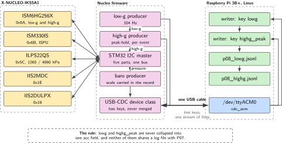
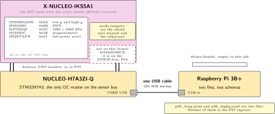
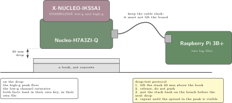
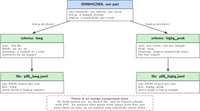

# P08. Industrial high-g and dual-scale baro (IKS5A1)

> **Host:** Raspberry Pi 3B+ + Nucleo-H7A3ZI-Q + X-NUCLEO-IKS5A1  
> **Owns:** simultaneous low-g and high-g, and the 4060 hPa scale

> [!NOTE]
> **Why this lab is unique**
>
> Owns ISM6HG256X simultaneous low-g and high-g, and ILPS22QS 1260/4060 hPa. No humidity. A different instrument from P07.

> [!NOTE]
> **What the 198-page blueprint got wrong**
>
> Draft P13 put an ISM330DHCX Machine Learning Core on the IKS5A1. That IMU is on the STWIN.box. IKS5A1 has ISM330IS (ISPU) and ISM6HG256X. Use the chips on the board.

## Intent

Two concurrent streams: a low-g IMU at 104 Hz, and a high-g peak-hold. The barometer runs in the 4060 hPa scale only when you actually pressurise something, and in its ordinary scale the rest of the time. That pairing is what the ISM6HG256X offers and what the IKS4A1 in P07 cannot do: a shock that saturates the low-g channel is still a number on the high-g channel, in the same event, from the same silicon.

The physical build is the P07 build with the other shield, so this chapter does not repeat it. Stack the IKS5A1 where the IKS4A1 was, with the IKS4A1 removed and bagged, and read P07 for the Arduino stack, the single USB cable and the reason the Pi scanner stays empty. What is new here is the data, and the data has a rule attached: two streams, two keys, two log files. Collapsing them into one acceleration field is how a wearable-grade number ends up wearing an industrial label.

> [!NOTE]
> **Kit from the bin**
>
> Pi 3B+, Nucleo-H7A3ZI-Q, X-NUCLEO-IKS5A1 with the IKS4A1 removed, USB cable.

## System architecture



*Figure 8.1. Five parts on the microcontroller I2C bus feed two streams that never merge. The low-g channel runs at 104 Hz; the high-g channel reports a peak-hold. Linux records them into two files with two schemas.*

The sensor side is five chips at five addresses on the STM32 bus, exactly as in P07, and the Pi again sees none of them. The difference begins at the sampler. The ISM6HG256X provides a low-g channel and a high-g channel at the same time, so the firmware carries two producers rather than one, with different rates and different meanings. The low-g producer emits at 104 Hz. The high-g producer emits a peak-hold, which is an event quantity: the largest magnitude seen since the last report.

Linux keeps that separation all the way to disk. Two JSON keys, `lowg` and `highg_peak`, or two MQTT topics, and two files. A reader that opens either one knows what it holds without asking which part of which event the numbers came from. The ILPS22QS sits beside both with its own quantity and its own scale, and the scale is part of the record: a pressure without the range it was measured in is a number with two possible meanings.

## Wiring and schematic



*Figure 8.2. The IKS5A1 on the Nucleo Arduino headers, its five default I2C addresses, and the one USB cable to the Pi 3B+. The stack itself is the P07 stack: see that chapter for the header detail.*

| Part or signal | Connector | Address | Note |
| --- | --- | --- | --- |
| ISM6HG256X | STM32 I2C bus | 0x6A | Low-g and high-g at the same time |
| ISM330IS | STM32 I2C bus | 0x6B | The ISPU part on this shield |
| ILPS22QS | STM32 I2C bus | 0x5C | 1260 and 4060 hPa scales |
| IIS2MDC | STM32 I2C bus | 0x1E | Magnetometer |
| IIS2DULPX | STM32 I2C bus | 0x19 | Low-power accelerometer |
| X-NUCLEO-IKS5A1 | Nucleo Arduino UNO headers | stacked | The P07 stack with the other shield |
| X-NUCLEO-IKS4A1 | off the board | none | Removed and bagged before this lab |
| Shield mode jumpers | IKS5A1 | see the manual | The source fixes the addresses, not the jumper table: confirm in the shield user manual and on the silkscreen |
| Nucleo USB | Pi 3B+ USB-A | any | CDC ACM, the only link to Linux |
| Pi 40-pin header | Pi 3B+ | empty | No HAT, nothing wired to the sensor bus |

*Table 8.1. Wiring. Five parts, five addresses, one shield. The ISM330DHCX is not among them: that IMU is on the STWIN.box in P04.*

```text
The same physical stack as P07, with the other shield.

IKS5A1 on Nucleo Arduino headers   (IKS4A1 removed and bagged)
Default I2C, all behind the STM32:
  ISM6HG256X ---- 0x6A     low-g and high-g together
  ISM330IS ------ 0x6B     ISPU
  ILPS22QS ------ 0x5C     1260 / 4060 hPa
  IIS2MDC ------- 0x1E     magnetometer
  IIS2DULPX ----- 0x19     low-power accelerometer
Nucleo USB --> Pi 3B+      CDC ACM
NOT on this board: ISM330DHCX.  That IMU is on the STWIN.box (P04).
```

Everything about the stack itself belongs to P07: the Arduino UNO headers, the single USB cable, and the empty Pi header. Read it there once. What this chapter adds to the wiring is a list of five addresses and one subtraction: the ISM330DHCX that the blueprint draft put here is not on this board and cannot be scanned into existence.

## Bench layout



*Figure 8.3. Bench layout. The drop test is 20 mm onto a book. The book is the point: it gives a repeatable shock that the high-g channel can report and that the bench, the shield and the connector all survive.*

Drop from 20 mm onto a book, not onto concrete. A concrete drop produces one impressive number, a damaged connector and no second measurement. The book gives a shock you can repeat ten times in a row, which is what turns a peak into a distribution. Keep the USB cable slack during the drop so the cable does not lift the board or pull the plug, and put the whole stack back on the bench between drops rather than measuring it in flight.

> [!NOTE]
> **Two shields that look alike**
>
> Put the IKS4A1 and the IKS5A1 back in separate bags every time. They carry different silicon, different addresses and different claims, and they are the same shape. The teardown line in the source says it plainly: they look similar from across the bench. A label on each bag costs nothing and settles the question at the start of the next session rather than at the end of it.

## Software design (UML)



*Figure 8.4. Two streams, two schemas, two files. The low-g stream and the high-g peak-hold share silicon and share a timestamp source, and share nothing else. There is no component that merges them, because merging them is the error this chapter exists to prevent.*

The diagram shows the rule as structure rather than as advice. Two producers in the firmware, two keys on the wire, two writers on the Linux side, two files on disk. An analysis that wants both opens both and joins on time, which is an explicit operation somebody has to write down. What it cannot do is find them already merged in a field called `acc` and assume the merge was correct.

## Data flow (ASCII)

```text
  X-NUCLEO-IKS5A1                 Nucleo-H7A3ZI-Q            Pi 3B+
  +---------------------+         +---------------------+    +----------------------+
  | ISM6HG256X   0x6A   |         | low-g producer      |    | reader on ttyACM0    |
  |   low-g channel ----------->  |   104 Hz            |--\ |   |                  |
  |   high-g channel ---------->  | high-g producer     |  | |   +--> p08_lowg.jsonl|
  | ISM330IS     0x6B   |         |   peak-hold, event  |--+-+->  |    key: lowg     |
  | ILPS22QS     0x5C   |         | baro producer       |  | |   |                  |
  | IIS2MDC      0x1E   |         |   scale in the record| | |   +--> p08_highg.jsonl|
  | IIS2DULPX    0x19   |         +---------------------+  | |        key: highg_peak|
  +---------------------+            |   USB CDC ACM       | +----------------------+
                                     +---------------------+

  Never collapse lowg and highg_peak into one "acc" field.
  These numbers live in a different log file from P07.
```

## Steps

**Step 1.** **Swap the shield, one at a time.** Remove the IKS4A1 and put it in its own bag before the IKS5A1 comes out of its bag. The two boards look similar from across the bench, and a lab that starts with the wrong shield produces P07 numbers under a P08 heading.

**Step 2.** **Build the stack as in P07.** Arduino UNO headers, one shield, one USB cable from the Nucleo to a Pi 3B+ USB-A port, and nothing on the Pi header. The jumper table for this shield is in its own user manual: confirm the mode positions there and on the silkscreen before you flash anything.

**Step 3.** **Flash the samples.** Use the STM32duino X-NUCLEO-IKS5A1 samples for the ISM6HG256X 6D and wake-up functions and for ILPS22QS pressure. Confirm in the firmware scan that the addresses answer:

```text
0x6A ISM6HG256X   0x6B ISM330IS   0x5C ILPS22QS   0x1E IIS2MDC   0x19 IIS2DULPX
```

**Step 4.** **Publish two topics or two JSON keys.** The names are `lowg` and `highg_peak`. Never collapse them into one `acc` field.

```text
{"lowg":{"ax":0.01,"ay":0.02,"az":1.00}}
{"highg_peak":{"mag":47.2}}
```

One object per line, one stream per key. If you use MQTT instead, the same rule applies to the topic names.

**Step 5.** **Record into two files.** The low-g stream and the high-g stream go to separate files, and both go somewhere that is not the P07 capture. A single directory per lab, named for the lab, is enough discipline to keep the two instruments apart.

**Step 6.** **Run the drop-test protocol.** Twenty millimetres onto a book, not onto concrete. Repeat the drop enough times to see the spread in the peak, and write the drop height in the lab book beside the numbers, because a peak without a height is not a measurement of anything.

**Step 7.** **Measure the barometer honestly.** Leave the ILPS22QS in its ordinary scale for room pressure and note the noise you see in a quiet room. Switch to the 4060 hPa scale only when you actually pressurise something, and record the scale alongside the reading, because the same number means two different things in the two ranges.

## Acceptance test

- On the drop, the high-g peak fires and the low-g channel saturates. Both facts appear in the record, in their own keys.
- Quiet-room ILPS22QS noise is a few Pa.
- The numbers live in a different log file from P07.
- The firmware scan answers at 0x6A, 0x6B, 0x5C, 0x1E and 0x19, and reports no ISM330DHCX, because there is none on this board.

## Practices

Mixing the P07 and P08 JSON schemas is how fake industrial wearables get invented. Do not. Keep the shields in separate bags, keep the captures in separate files, and keep the two chapters’ claims apart: consumer MEMS with humidity is P07, simultaneous low-g and high-g with a dual-scale barometer is this lab.

Record the scale, the drop height and the surface with every number. A peak-hold is an event quantity, so it is only comparable to another peak-hold taken the same way. When the high-g channel and the low-g channel disagree about an impact, that is the instrument working, not a fault to be smoothed away.

## Pitfalls

- **Looking for an ISM330DHCX.** It is on the STWIN.box, which is P04. The symptom is a scan that never finds the address and a sample that never compiles against this shield.
- **Collapsing `lowg` and `highg_peak` into one field.** The symptom is a file in which a saturated low-g sample and a valid high-g peak are indistinguishable, and every later analysis inherits the confusion.
- **Writing P08 numbers into the P07 capture.** Two instruments, one file. The symptom is a data set that claims humidity and high-g from the same silicon.
- **Leaving the IKS4A1 on the bench next to the IKS5A1.** They look similar. The symptom is a lab that produces the wrong chapter's addresses and a confident, wrong entry in the lab book.
- **Dropping onto concrete.** One number, then a damaged connector. The symptom is a peak you cannot reproduce because the hardware no longer enumerates.
- **Quoting a pressure without its scale.** The 1260 and 4060 hPa ranges are different instruments for this purpose. The symptom is a reading that cannot be compared with yesterday's.
- **Expecting `i2cdetect` on the Pi to answer.** As in P07, these chips are behind the STM32. An empty grid on the Pi is the architecture working.
- **Treating the peak-hold as a rate.** It is the largest magnitude since the last report, not a sample stream. Averaging peaks produces a number with no physical meaning.

## Sources

- ST X-NUCLEO-IKS5A1 expansion board page, <https://www.st.com/en/ecosystems/x-nucleo-iks5a1.html>
- STM32duino X-NUCLEO-IKS5A1 library and samples, <https://github.com/stm32duino/X-NUCLEO-IKS5A1>
- ST ISM6HG256X high-g and low-g inertial module data sheet, <https://www.st.com/en/mems-and-sensors/ism6hg256x.html>
- ST ISM330IS inertial module with ISPU data sheet, <https://www.st.com/en/mems-and-sensors/ism330is.html>
- ST ILPS22QS dual full-scale pressure sensor data sheet, <https://www.st.com/en/mems-and-sensors/ilps22qs.html>
- ST IIS2MDC magnetometer and IIS2DULPX accelerometer data sheets, <https://www.st.com/en/mems-and-sensors/accelerometers.html>
- ST NUCLEO-H7A3ZI-Q board page, <https://www.st.com/en/evaluation-tools/nucleo-h7a3zi-q.html>

---

[Previous](07-consumer-9-dof-plus-climate-iks4a1.md) &nbsp;&nbsp;|&nbsp;&nbsp; [Contents](../README.md) &nbsp;&nbsp;|&nbsp;&nbsp; [Next](09-nanopi-neo-air-headless-hub-and-honest-emmc.md)
