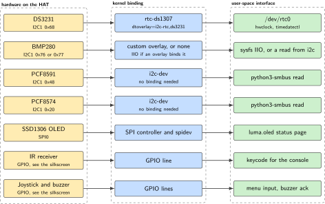
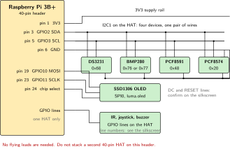
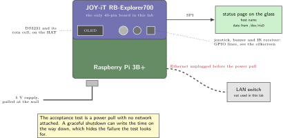
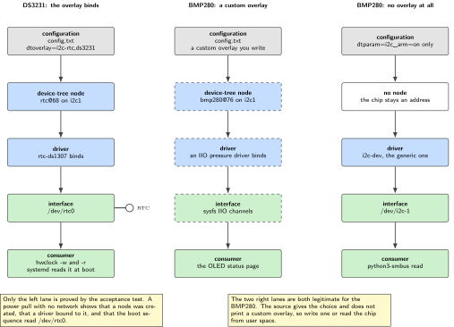

# P11. Explorer700 field console

> **Host:** Raspberry Pi 3B+ + JOY-iT RB-Explorer700  
> **Owns:** DS3231 as hwclock, the OLED, IR and the overlay lab

> [!NOTE]
> **Why this lab is unique**
>
> Owns DS3231 as `hwclock`, the SSD1306 OLED, IR, the joystick, the BMP280 and the PCF8591. The Device Tree overlay lab lives here because the chips do.

> [!NOTE]
> **What the 198-page blueprint got wrong**
>
> Draft P7 is this lab. Draft P18 then stacked the same HAT with a SIM7600. Forbidden: that is two 40-pin HATs on one header. Time-series store-and-forward without the second HAT is this: log locally, copy off on Ethernet later.

## Intent

The Pi 3B+ boots, loads an overlay that binds the DS3231 and the BMP280, sets the system time from the real-time clock, and puts status on the OLED. The joystick and the IR receiver are local operator inputs, and the buzzer is the acknowledgement. Nothing in this lab needs a network, which is the point: a field console is a device that is still correct when the network is not there.

This is the Device Tree overlay chapter of the book, and it is here rather than anywhere else because this is where the chips are. Six addressable devices arrive on one board, already wired, with no flying leads to get wrong. That leaves the whole exercise on the kernel side: which node the overlay creates, which driver binds to it, and which user-space interface appears as a result. The acceptance test is a power pull, because an overlay that only works while a shell session is open has not actually bound anything.

> [!NOTE]
> **Kit from the bin**
>
> Pi 3B+, JOY-iT RB-Explorer700. No other 40-pin board.

> [!IMPORTANT]
> **One HAT on this header**
>
> The Explorer700 occupies the 40-pin header for the whole sitting. Do not stack a SIM7600, a SIM7070, a SIM7020, an MCC 118 or the 3.5 inch LCD with it. Power off before unseating it.

## System architecture



*Figure 11.1. Every onboard chip, the kernel binding it gets, and the user-space interface that binding produces. The row is the whole lesson: a chip without a binding is a chip you talk to by address, and a chip with a binding is a device node.*

Read the figure as seven independent rows rather than as one stack. The DS3231 is the row that matters most, because it is the only one where the overlay changes what user space does: with `dtoverlay=i2c-rtc,ds3231` the chip stops being an address on a bus and becomes `/dev/rtc0`, which is what `hwclock` talks to. The BMP280 sits in the middle: it can be bound with a custom overlay, or read from user space through IIO. The remaining chips are addresses and GPIO lines, and that is a legitimate place for them to stay.

The bus assignments are short. I2C1 carries the DS3231 at 0x68, the BMP280 at 0x76 or 0x77, the PCF8591 at 0x48 and the PCF8574 at 0x20. The SSD1306 OLED is on SPI. The IR receiver, the joystick and the buzzer are GPIO lines on the header. The kit cookbook does not print the GPIO numbers for those three, so confirm them on the silkscreen and in the JOY-iT manual before you write them into a script.

Notice what the middle column does not contain. There is no daemon, no polling loop and no service unit anywhere in the binding path. That is the difference this chapter is selling: a device-tree overlay moves work from something that has to be started into something that is simply true after boot. A status script that fails to start leaves you with a blank OLED, which is obvious. A clock script that fails to start leaves you with a plausible wrong time, which is not.

> [!NOTE]
> **What an overlay is and what it is not**
>
> A line in `config.txt` is not a driver. It asks the firmware to graft a node into the device tree before the kernel starts. The node carries a compatible string, the kernel matches that string against the drivers it has, and a successful match produces a device node in user space. If any link in that chain is missing, the chip is still on the bus and still readable by address, and nothing in `/dev` changes.

| Device | Bus | Address or line | What it is for in this lab |
| --- | --- | --- | --- |
| DS3231 | I2C1 | 0x68 | The system clock across a power pull |
| BMP280 | I2C1 | 0x76 or 0x77 | Pressure and temperature on the status page |
| PCF8591 | I2C1 | 0x48 | Analog inputs on the HAT |
| PCF8574 | I2C1 | 0x20 | Port expander on the HAT |
| SSD1306 OLED | SPI | chip select | Host name and RTC time |
| IR receiver | GPIO | confirm on the silkscreen | A keycode the console reacts to |
| Joystick and buzzer | GPIO | confirm on the silkscreen | Menu input and acknowledgement |

*Table 11.1. The onboard inventory. Addresses come from the default I2C map; the GPIO lines are not printed in the source, so read them off the board.*

## Wiring and schematic



*Figure 11.2. The HAT is the wiring. One I2C bus carries four devices, SPI0 carries the OLED, and three GPIO lines carry the operator controls. No flying leads are required for any onboard chip.*

| Signal | Pi header pin | BCM GPIO | Note |
| --- | --- | --- | --- |
| HAT 3V3 | 1 | 3V3 | Supplied through the header |
| I2C1 SDA | 3 | GPIO2 | DS3231, BMP280, PCF8591, PCF8574 |
| I2C1 SCL | 5 | GPIO3 | Same four devices |
| HAT GND | 6, 9, 14, 20, 25 | GND | Several ground pins on the header |
| SPI0 MOSI | 19 | GPIO10 | To the SSD1306 |
| SPI0 SCLK | 23 | GPIO11 | To the SSD1306 |
| SPI0 chip select | 24 or 26 | GPIO8 or GPIO7 | Confirm on the silkscreen |
| OLED DC and RESET |  |  | Not printed in the source, confirm on the silkscreen |
| IR receiver |  |  | GPIO line, confirm on the silkscreen |
| Joystick |  |  | GPIO lines, confirm on the silkscreen |
| Buzzer |  |  | GPIO line, confirm on the silkscreen |

*Table 11.2. Header use. The four I2C devices and the OLED are already routed on the HAT; the entries left blank are ones the source does not print.*

```text
Pi 3B+ 40-pin                    JOY-iT RB-Explorer700 (seated, no flying leads)
pin 1  3V3  ------------------>  HAT supply
pin 3  GPIO2 SDA -------------+-> DS3231   0x68
                              +-> BMP280   0x76 or 0x77
pin 5  GPIO3 SCL -------------+-> PCF8591  0x48
                              +-> PCF8574  0x20
pin 6  GND  ------------------>  HAT ground (also 9, 14, 20, 25)
pin 19 GPIO10 MOSI -----------+
pin 23 GPIO11 SCLK -----------+-> SSD1306 OLED, SPI
pin 24 or 26 chip select -----+   DC and RESET: confirm on the silkscreen
GPIO lines -------------------->  IR receiver, joystick, buzzer
                                  line numbers: confirm on the silkscreen
Do not stack a second 40-pin HAT on this header.
```

## Bench layout



*Figure 11.3. Bench layout for the power-pull test. The network cable is unplugged and stays unplugged, and the supply is pulled at the wall rather than by a shutdown, because a graceful shutdown is not the test.*

The bench for this lab is almost empty, which is intentional. One Pi, one HAT, one supply, and a network cable that you remove before the acceptance test. Do not leave a second HAT on the bench where it can be seated by reflex: the Explorer700 owns the header until the lab is finished and torn down.

Check the coin cell before the sitting starts. The DS3231 keeps time from its own backup cell while the board is unpowered, and a cell that has been sitting in a drawer since the kit was bought may not have enough left to carry an hour. The symptom is specific and misleading: the clock is correct while the Pi runs, and wrong the moment it comes back from a power pull, which looks exactly like an overlay that did not load.

## Software design (UML)



*Figure 11.4. Component view of the overlay path. The overlay line in `config.txt` creates a device-tree node, the node causes a driver to bind, and the driver publishes a user-space interface. The BMP280 shows the alternative: a custom overlay, or no binding at all and an IIO or I2C read from user space.*

The component diagram is the argument of the whole chapter. A line in `/boot/firmware/config.txt` is not a driver and it is not a device. It is a request to add a node to the device tree, and the node is what makes the kernel look for a driver that matches the compatible string. When the match succeeds you get `/dev/rtc0`, and `hwclock` works with no knowledge of I2C at all. When it does not succeed you are left with 0x68 on a bus, which you can still read by hand, and which `hwclock` will not touch.

That distinction is why the acceptance test is a power pull rather than a command. Reading the correct time out of the DS3231 with a Python script proves that the chip works. Having the correct time after the supply was removed, with no network available, proves that the binding exists and that the boot sequence uses it.

The BMP280 is drawn as two lanes because the source gives a choice and does not resolve it. One lane binds the chip with a custom overlay and gets IIO channels in sysfs. The other lane creates no node at all and reads the chip by address from user space. Both are legitimate here, and the difference matters only if something later has to depend on the pressure reading at boot, which nothing in this book does.

### Why the status page reads the chip rather than the clock

Put the time on the OLED from `/dev/rtc0`, not from the system clock. The system clock is a value the kernel maintains in memory and it can be right for reasons that have nothing to do with this HAT. Reading the device node instead means the page is showing you the chip, so a stopped clock or a dead cell is visible on the glass rather than inferred afterwards.

## Data flow (ASCII)

```text
  boot                                     steady state
  ----                                     ------------
  config.txt                               joystick -> menu selection
    dtparam=i2c_arm=on                     IR       -> keycode
    dtoverlay=i2c-rtc,ds3231               buzzer   <- acknowledgement
       |                                       |
       v                                       v
  device-tree node rtc@68 on i2c1          +-------------------------+
       |                                   |  status page, python    |
       v                                   |    host name            |
  rtc-ds1307 driver binds                  |    date from /dev/rtc0  |
       |                                   |    BMP280 reading       |
       v                                   +------------+------------+
  /dev/rtc0                                             |
       |                                                v
       +--> systemd reads the RTC at boot        SSD1306 OLED over SPI
       +--> hwclock -w writes it back
       +--> hwclock -r reads it back

  no network is involved in any of this
```

## Steps

**Step 1.** **Seat the HAT on a powered-off Pi 3B+**, then install the tools and confirm that all four I2C devices answer.

```bash
sudo apt-get install -y i2c-tools python3-smbus python3-luma.oled
sudo i2cdetect -y 1
# expect 68, 76 or 77, 48, 20
```

If 0x68 is missing, stop here. Every later step in this lab depends on the real-time clock being on the bus.

**Step 2.** **Bind the clock with an overlay rather than with user-space bit-banging.** This is the fragment for `/boot/firmware/config.txt`.

```dts
dtparam=i2c_arm=on
dtoverlay=i2c-rtc,ds3231
// BMP280 can be bound with a custom overlay or read through iio userspace
```

Reboot after the edit. After the reboot, `/dev/rtc0` should exist, and 0x68 usually disappears from the `i2cdetect` table because the driver now holds the address. That is a binding working, not a device going missing.

**Step 3.** **Set and persist the time**, then confirm that the setting survives without a network.

```bash
timedatectl
sudo hwclock -w
sudo hwclock -r
# disconnect Ethernet/Wi-Fi, reboot, confirm the clock survived
```

Write the clock while the Pi still has correct time from the network, and only then remove the network. A DS3231 written from a wrong system clock is a battery-backed wrong answer.

**Step 4.** **Bring up the OLED** with the luma.oled SSD1306 SPI example from the JOY-iT manual. Put two lines on it: the host name and the time read from the real-time clock. That is the status page the acceptance test looks at.

**Step 5.** **Map the operator controls.** Use the vendor examples under RB-Explorer700. Map the joystick to a menu, the IR receiver to a keycode, and the buzzer to an acknowledgement. The GPIO line numbers are not printed in the source, so read them from the silkscreen and the JOY-iT manual before writing them into a script.

**Step 6.** **Run the power-pull test.** With Ethernet and Wi-Fi disconnected, remove the supply, wait, and power the board back up. Then compare `date` against a clock you trust.

```bash
timedatectl show -p NTPSynchronized
date
sudo hwclock -r
sudo i2cdetect -y 1
```

## Acceptance test

- After a power pull with no network, `date` is still correct within 2 s.
- The OLED shows the host name and the time from the real-time clock.
- `i2cdetect` still shows 0x68, or shows it held by the driver after the overlay has bound.
- No network interface was used to recover the time.

## Practices

This HAT is the real-time clock source for any later store-and-forward idea in the book. Do not move it onto a cellular Pi: that would put two 40-pin HATs on one header, which is the error the blueprint box at the head of this chapter corrects. If you want store-and-forward without a second HAT, the honest version is the one the source gives: log locally, and copy the files off over Ethernet later.

Prefer an overlay to a script for anything that has to be true at boot. A script that sets the clock is one more thing that can fail to start, and it fails in a way that looks like a hardware fault. Keep the OLED page short, and read the time on it from `/dev/rtc0` rather than from the system clock, so the page shows the chip rather than the assumption.

Tear the HAT down when the lab is finished, and note the date you wrote the clock. The next lab on this Pi wants an empty header, and the sequence in the source is explicit about it: P11 comes early, and the HAT comes off before P12 and the display labs.

### What this lab hands to the rest of the book

This is the only real-time clock in the kit, so any later idea about store-and-forward, buffered uplinks or timestamped local logs traces back to this chapter. The honest pattern, and the one the source gives, is to log locally with a correct clock and copy the files off over Ethernet later. The dishonest pattern is to move the Explorer700 onto a cellular Pi so that one host has both a clock and a radio, and that is two 40-pin HATs on one header.

## Pitfalls

- **Stacking a second 40-pin HAT.** The Explorer700 and a cellular HAT cannot share a header. Split the work across hosts or drop one HAT.
- **Reading 0x68 by hand and calling it done.** A Python read proves the chip is alive. Only `/dev/rtc0` and a power pull prove the binding exists.
- **Writing the real-time clock from a wrong system clock.** `hwclock -w` copies whatever the system believes. Set the system clock from the network first, then write, then disconnect.
- **Being surprised when 0x68 leaves the `i2cdetect` table.** After the overlay binds, the address is held by the driver. That is the expected outcome, not a missing device.
- **A graceful shutdown instead of a power pull.** A clean shutdown can write the time on the way down, which hides exactly the failure the test is looking for.
- **Leaving the network connected during the test.** Time then arrives from the network and the real-time clock is never exercised.
- **Guessing the GPIO numbers for the IR receiver, joystick and buzzer.** They are not printed in the source. Read them from the silkscreen and the JOY-iT manual.
- **A depleted coin cell in the DS3231 holder.** The symptom is a clock that is correct until the supply is removed and wrong afterwards, which reads like an overlay problem and is not one.
- **Putting the system clock on the OLED instead of the chip.** The page then agrees with itself whatever the hardware is doing, which is the one thing a status page must not do.
- **Editing the wrong config file.** On Bookworm the file is `/boot/firmware/config.txt`. An edit to an older path is accepted by the editor and ignored by the firmware, and the symptom is an overlay that never appears to load.
- **Forgetting to reboot after the overlay edit.** Overlays are applied by the firmware before the kernel starts, so a running system does not pick one up.

## Sources

- JOY-iT RB-Explorer700 product page and manual, for the board layout, the joystick, the IR receiver and the OLED example, <https://joy-it.net/>
- Raspberry Pi device tree and overlay documentation, <https://www.raspberrypi.com/documentation/computers/configuration.html>
- The overlay README shipped with Raspberry Pi OS, `/boot/firmware/overlays/README`, entry `i2c-rtc`
- Maxim DS3231 data sheet, address 0x68, the ageing register and the coin-cell backup
- Bosch BMP280 data sheet, address 0x76 or 0x77 depending on the SDO strap
- NXP PCF8591 and PCF8574 data sheets, addresses 0x48 and 0x20 to 0x27
- Solomon Systech SSD1306 data sheet, and the `luma.oled` documentation, <https://luma-oled.readthedocs.io/>
- `hwclock(8)` and `timedatectl(1)` manual pages
- Linux kernel RTC class documentation, for `/dev/rtc0` and the boot-time read
- Linux IIO subsystem documentation, for the sysfs channels a bound pressure driver publishes
- `i2c-tools` manual pages, and the reason a bound address leaves the `i2cdetect` table

---

[Previous](10-ppk2-energy-characterisation-bench.md) &nbsp;&nbsp;|&nbsp;&nbsp; [Contents](../README.md) &nbsp;&nbsp;|&nbsp;&nbsp; [Next](12-official-dsi-operator-glass-and-mqtt-broker.md)
