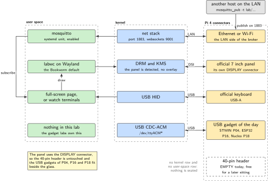
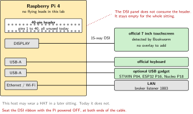
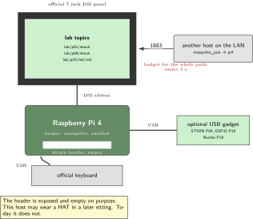
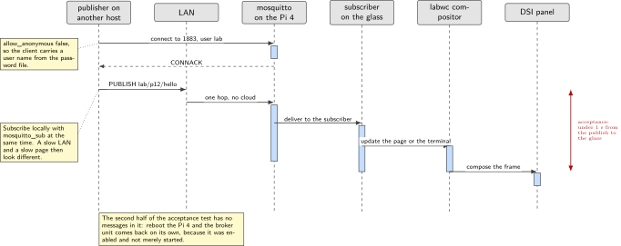

# P12. Official DSI operator glass and MQTT broker

> **Host:** Raspberry Pi 4 + official DSI touchscreen + official keyboard  
> **Owns:** the panel, the keyboard and the broker

> [!NOTE]
> **Why this lab is unique**
>
> Owns the 7 inch DSI panel, the keyboard, and the broker. No 40-pin HAT, so any USB gadget from P04, P16 and P18 can sit beside it.

> [!NOTE]
> **What the 198-page blueprint got wrong**
>
> Draft P14 is this lab plus ESP32 actuation. Keep the actuation in P16 so this chapter stays a console and broker lab.

## Intent

The Pi 4 with the official touchscreen runs labwc and Wayland, which is the Bookworm default, and it runs Mosquitto. A full-screen page shows fleet topics. The keyboard is the operator input. That is the whole product: a piece of glass that shows what the rest of the bench is saying, and a broker that the rest of the bench can publish into.

There is a reason the console and the broker are one lab rather than two. An operator console with nothing to show is a browser pointed at a blank page, and a broker with no display is a process you check by running a command. Putting them on the same host gives each one a purpose: the broker has an audience, and the glass has something to render that did not come from itself.

The second half of the lab is a coexistence statement. The official touchscreen connects to the DISPLAY connector, not to the 40-pin header, so this host keeps its header free. That is what makes it the natural home for the broker: it can wear the glass and still accept the USB gadgets from the other labs, the STWIN.box from P04, the ESP32 from P16 and the bare Nucleo from P18. The one thing it does not do today is wear a HAT.

> [!NOTE]
> **Kit from the bin**
>
> Pi 4, official Raspberry Pi touchscreen on the DISPLAY connector, official keyboard.

> [!IMPORTANT]
> **The header stays empty today**
>
> The DSI panel does not consume the 40-pin header. This host is allowed to wear a HAT in a later sitting. Today it does not.

## System architecture



*Figure 12.1. The DSI panel hangs off the DISPLAY connector and the keyboard off USB, so the 40-pin header is untouched and the USB bus is free for the gadgets of P04, P16 and P18. The broker sits in user space with a LAN listener and a local subscriber.*

Read the figure from the connector names rather than from the boxes. DISPLAY is a dedicated connector with its own ribbon, so the panel consumes no GPIO lines and no I2C addresses on the header. USB is a bus with several ports, so the keyboard and the gadget of the day share it without argument. The 40-pin header is drawn empty on purpose: it is the one resource this lab deliberately does not spend.

Mosquitto is the other half. It listens on 1883 for the LAN, it is enabled as a systemd unit so it comes back after a reboot, and it is locked with a password file rather than left open. A full-screen page renders the topics on the glass, either a local HTML file that subscribes over websockets on listener 9001, or three `watch` terminals tiled on the panel, which is the simpler version and works.

> [!NOTE]
> **Enabled is not the same as started**
>
> `systemctl start mosquitto` runs the broker now. `systemctl enable mosquitto` arranges for it to run after the next boot. The acceptance test measures the second one, and `enable --now` does both in a single command. A broker that was only started works perfectly until the reboot and then looks like a hardware problem.

| Resource on the Pi 4 | Used by this lab | Consequence |
| --- | --- | --- |
| DISPLAY connector | The official touchscreen | The panel has its own ribbon and its own connector |
| USB ports | Keyboard, and any gadget | STWIN.box (P04), ESP32 (P16), Nucleo (P18) all fit beside the glass |
| 40-pin header | Nothing | Free for a later sitting, empty today |
| Ethernet or Wi-Fi | The broker listener | Other hosts publish into 1883 |

*Table 12.1. What the lab spends and what it leaves alone. The header row is the reason this host can be the broker for the rest of the bench.*

## Wiring and schematic



*Figure 12.2. There is no flying-lead wiring in this lab. The drawing shows the two connectors that are used, the 40-pin header that is not, and the USB ports that stay available.*

| Connection | Connector | Note |
| --- | --- | --- |
| Official touchscreen | DISPLAY | 15-way ribbon, seated with the Pi powered off |
| Official keyboard | USB-A | Operator input |
| USB gadget of the day | USB-A | Optional: STWIN.box, ESP32 or Nucleo |
| Network | Ethernet or Wi-Fi | Carries the broker listener on 1883 |
| 40-pin header |  | Left empty for the whole sitting |

*Table 12.2. Connections. The source gives no flying leads for this lab, because there are none.*

```text
Pi 4                          Official 7 inch touchscreen
DISPLAY connector -------->   15-way DSI ribbon, seated with the Pi powered OFF
USB-A ------------------->    official keyboard
USB-A ------------------->    optional gadget: STWIN.box (P04), ESP32 (P16), Nucleo (P18)
Ethernet or Wi-Fi ------->    LAN, broker listener 1883

40-pin header:  EMPTY.  The DSI panel does not consume it.
                This host may wear a HAT in a later sitting. Today it does not.
```

## Bench layout



*Figure 12.3. Bench layout. The glass stands on its own frame, the keyboard sits in front of it, and the 40-pin header is visible and empty. The publishing host is somewhere else on the same LAN.*

Seat the DSI ribbon with the Pi powered off, both at the panel end and at the DISPLAY connector. Bookworm detects the official panel, so there is no overlay to add and nothing to configure for the display itself. Leave the header exposed rather than covered: this host is the one place on the bench where an empty header is the feature.

The publishing host in the drawing is deliberately vague. It can be the Pi 3B+ from P11, the NanoPi from P09, or a laptop with `mosquitto_pub` installed. What matters for the acceptance test is only that it is a different machine on the same network, because a publish from `localhost` measures nothing about the path the lab is claiming.

## Software design (UML)



*Figure 12.4. One publish crossing the LAN and reaching the glass. The acceptance number is on the right: the whole path has to complete in under one second, and every hop in it is local.*

The sequence is short because the path is short. A publisher on another host opens a connection to 1883 on this Pi, sends a message on a `lab/` topic, and the broker fans it out to whoever is subscribed. On this host the subscriber is either the local HTML page over websockets or a `watch` terminal, and either way the compositor draws the change on the panel. There is no cloud hop in the diagram, which is why one second is a generous budget rather than a tight one.

If the number is missed, the interesting question is which hop consumed it. A slow LAN shows up as a delay before the broker logs the message. A slow page shows up as a delay after it. Subscribing locally with `mosquitto_sub` while the page is also running separates the two without any instrumentation.

### The half of the acceptance test with no messages in it

The second clause of the acceptance test does not appear in the sequence at all, because it is not a message exchange. Reboot the Pi 4, wait, and check that the broker is running again without anyone having started it. That is the difference between `systemctl start` and `systemctl enable`, and it is the only part of this lab that cannot be faked by leaving a terminal open.

## Data flow (ASCII)

```text
  another host on the LAN                 Pi 4 with the glass
  +---------------------+                 +-------------------------------------+
  | mosquitto_pub       |                 |  mosquitto  (systemd unit, enabled) |
  |   -h pi4            |---- 1883 ------>|    listener 1883                    |
  |   -t lab/...        |                 |    allow_anonymous false            |
  +---------------------+                 |    password_file /etc/mosquitto/... |
                                          +------------------+------------------+
                                                             |
                                        +--------------------+-------------------+
                                        |                                        |
                                        v                                        v
                            mosquitto_sub -t 'lab/#' -v          websockets listener 9001
                            (a watch terminal on the glass)      (a local dash.html page)
                                        |                                        |
                                        +------------------+---------------------+
                                                           v
                                              labwc / Wayland compositor
                                                           v
                                              official 7 inch DSI panel
                                              budget for the whole path: under 1 s

  40-pin header: unused.  USB: keyboard + optional gadget from P04, P16 or P18.
```

## Steps

**Step 1.** **Seat the DSI ribbon with the Pi powered off.** Power on and confirm the desktop appears on the glass. Bookworm detects the official panel, so nothing has to be added to `config.txt` for the display.

**Step 2.** **Install the broker and confirm it is running and subscribable.**

```bash
sudo apt-get install -y mosquitto mosquitto-clients
sudo systemctl enable --now mosquitto
mosquitto_sub -h localhost -t 'lab/#' -v
```

The `enable` half of that command is the half the acceptance test checks: the unit has to come back on its own after a reboot.

**Step 3.** **Put the topics on the glass.** Either point a full-screen Chromium at a local file that subscribes over websockets, with the Mosquitto websockets listener on 9001, or keep it simpler and tile three `watch` terminals on the panel.

```bash
# the page version
chromium-browser --kiosk file:///home/pi/p12/dash.html
# the simpler version, three terminals tiled on the glass
watch -n 1 "mosquitto_sub -h localhost -t 'lab/p01/#' -v -C 5"
```

Three terminals are a legitimate answer here. The product of this lab is an operator console, not a web application.

**Step 4.** **Lock the broker to the LAN** rather than leaving it anonymous.

```text
# /etc/mosquitto/conf.d/lab.conf
listener 1883
allow_anonymous false
password_file /etc/mosquitto/passwd
```

Create the password file before restarting the unit, or every client on the bench stops being able to connect at once.

```bash
sudo mosquitto_passwd -c /etc/mosquitto/passwd lab
sudo systemctl restart mosquitto
systemctl status mosquitto
```

**Step 5.** **Publish from another host on the LAN** and watch the glass.

```bash
# on the other host
mosquitto_pub -h pi4 -t lab/p12/hello -m "from the bench" -u lab -P '...'
```

**Step 6.** **Reboot and check that nothing needed a human.** The broker unit comes back, the panel comes back, and the page or the terminals come back to whatever you arranged to start them.

## Acceptance test

- A publish from another host on the LAN appears on the glass in under 1 s.
- A reboot survives the broker unit: `systemctl is-enabled mosquitto` reports it enabled and the unit is active without anyone starting it.
- The 40-pin header is empty at the end of the sitting, as it was at the start.
- An anonymous connection is refused once `lab.conf` is in place.

## Practices

This host is allowed to wear a HAT in a later sitting. Today it does not. Keep that rule visible while the lab runs, because this Pi 4 is also the natural host for the MCC 118 in P05 and for the SIM7600 in P01, and the temptation to seat one of them while the glass is already working is exactly how a console lab turns into a debugging session about two things at once.

Keep the broker boring. One listener on 1883, one password file, one enabled unit. The websockets listener on 9001 is optional and exists only to serve the local page. Nothing in this book needs the broker to be reachable from outside the LAN, and the lab does not open it.

Write down the user name and the topic prefix somewhere the whole bench can see. Every other lab that publishes needs both, and a password file that only one person can remember turns a shared broker into a single-operator broker.

### What this lab hands to the rest of the book

P16 subscribes to this broker and drives its LEDs from it, which is why the actuation stays there and not here. P20 sweeps the fleet from this host or from any Pi with SSH keys, so the keyboard and the glass are a convenient place to watch that sweep run. P04 and P18 both want a USB port and a display, and both get them here without touching the header.

## Pitfalls

- **Seating the DSI ribbon under power.** Do it with the Pi powered off, at both ends of the cable.
- **Starting the broker without enabling it.** It works all afternoon and is gone after the reboot, which is the acceptance test failing on the one point it actually measures.
- **Writing `allow_anonymous false` without creating the password file.** Every client on the bench is refused at once, and the cause is the missing file rather than the clients.
- **Adding the ESP32 actuation here.** The LEDs and the subscribe-and-drive pattern belong to P16. This chapter stays a console and broker lab.
- **Seating a HAT because the header is free.** It is free on purpose. Tear down and seat it in a separate sitting, with the header rule from the front matter in view.
- **Measuring the one-second budget with the page as the only subscriber.** Subscribe with `mosquitto_sub` at the same time, so a slow broker and a slow page can be told apart.
- **Assuming the panel needs an overlay.** Bookworm detects the official display. An overlay copied from a third-party panel note is a way to lose a working screen.
- **Publishing from `localhost` and calling the test passed.** The acceptance test says another host on the LAN. A loopback publish exercises none of the path the number is about.
- **Leaving the broker anonymous because it is only a lab.** The bench is a network, other labs publish into it, and an unauthenticated broker on a shared network is a habit worth not forming.
- **Running the websockets page without the 9001 listener configured.** The page loads, shows nothing, and looks like a broker fault. Three `watch` terminals have none of that failure surface.

## Sources

- Raspberry Pi official touchscreen documentation and the DISPLAY connector, <https://www.raspberrypi.com/documentation/accessories/display.html>
- Raspberry Pi OS Bookworm release notes, labwc and the Wayland default
- Eclipse Mosquitto documentation, `mosquitto.conf`, listeners and websockets, <https://mosquitto.org/documentation/>
- `mosquitto_passwd(1)`, `mosquitto_pub(1)` and `mosquitto_sub(1)` manual pages
- `systemctl(1)` manual page, for the difference between `start` and `enable`
- Raspberry Pi hardware documentation, 40-pin header and the DISPLAY and CAMERA connectors, <https://www.raspberrypi.com/documentation/computers/raspberry-pi.html>
- labwc documentation, the compositor Bookworm uses by default, <https://labwc.github.io/>
- MQTT version 3.1.1 specification, for CONNECT, CONNACK and PUBLISH
- Chromium command-line switches, for the kiosk mode used by the page version

---

[Previous](11-explorer700-field-console.md) &nbsp;&nbsp;|&nbsp;&nbsp; [Contents](../README.md) &nbsp;&nbsp;|&nbsp;&nbsp; [Next](13-dual-radio-signalling-failover.md)
