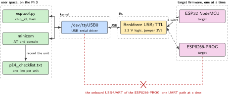
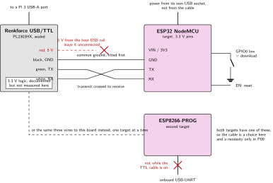
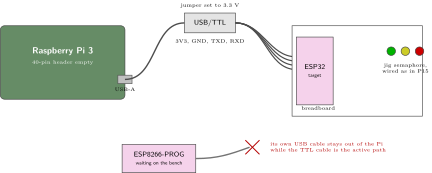
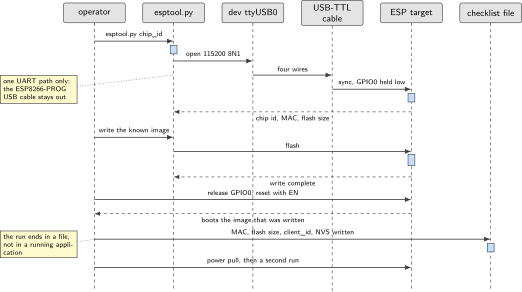

# P14. USB-TTL provisioning jig

> **Host:** Raspberry Pi 3 + Renkforce USB-TTL + ESP32 and ESP8266-PROG  
> **Owns:** the Renkforce cable as a factory tool

> [!NOTE]
> **Why this lab is unique**
>
> Owns the Renkforce cable as a factory tool, plus both ESP boards as targets. Not a sensor lab. The ESP32 becomes a product in P16 and the ESP8266 becomes a modem in P17; here they are units passing through a jig.

## Intent

The Pi 3 flashes and AT-provisions the ESP32 and the ESP8266 without either board becoming the product. The output of the lab is not a running device, it is a repeatable procedure and a written record: a chip that answers, an image that was written deliberately, and a checklist line that says which unit it was.

The jig is a Linux host, a 3.3 V serial cable and one target at a time. That last clause is the discipline of the chapter. The Renkforce cable is one UART path and the ESP8266-PROG carries its own USB-UART, so a bench that has both connected has two drivers for one set of pins.

> [!NOTE]
> **Kit from the bin**
>
> Pi 3, Renkforce USB/TTL cable, SBC-NodeMCU-ESP32, SBC-ESP8266-PROG, red, yellow and green LEDs, breadboard.

> [!NOTE]
> **One UART path**
>
> The ESP8266-PROG carries an onboard USB-UART. The Renkforce cable is a second one. Connect one of them at a time, never both at once. The lab sequence puts this lab second, after the rails of P15 and before the sidecars of P16 and P17, because both of those labs start with a board that was provisioned here.

## System architecture



*Figure 14.1. The jig. One Linux host, one serial character device, one 3.3 V cable, and one target at a time. The ESP8266-PROG carries a second USB-UART of its own, drawn as the path that stays unplugged.*

Linux owns the system here in the plainest possible way: the target has no storage, no clock and no network of its own during a provisioning run, and every artifact of the run lands in a file on the Pi. The tools are `esptool.py` for the flash side and `minicom` for the AT or console side, and both of them speak to the same character device.

Both tools are on the Linux side of the boundary, and so is every file the run produces. The target contributes an answer and nothing else. That is the same boundary the rest of the book draws between a Linux host and a microcontroller, stated here in its smallest form: the microcontroller is a unit under test, and the host is the instrument.

The kernel binds a USB serial driver to the Renkforce cable and presents `/dev/ttyUSB0`. Confirm which driver claims it with `dmesg` on the first plug: the fleet script in P20 looks for the same class of adapter by its USB vendor identifiers, `1a86` and `10c4`. When two adapters are plugged in at once the numbering is no longer predictable, which is the practical reason for one target at a time.

## Wiring and schematic



*Figure 14.2. Four wires to the target, with transmit crossed to receive. The adapter jumper is set to 3.3 V before anything is connected. GPIO0 is held low for an ESP32 download and released for a normal boot.*

| Renkforce USB-TTL | ESP target | Direction | Note |
| --- | --- | --- | --- |
| 3V3 | VIN or 3V3 | to the target | Jumper the adapter to 3.3 V first |
| GND | GND | common | Fit this wire before the others |
| TXD | RX | to the target | Transmit crossed to receive |
| RXD | TX | from the target | Receive crossed to transmit |
| (none) | GPIO0 | held low | ESP32 download mode only |
| (none) | EN | reset | Release GPIO0, then reset to run the image |

*Table 14.1. The four-wire mapping, plus the two ESP32 pins that select download mode. The ESP8266-PROG has an onboard USB-UART: use one UART path, not both at once.*

```text
USB-TTL 3V3  --> ESP VIN/3V3   (jumper the adapter to 3.3 V)
USB-TTL GND  --> ESP GND
USB-TTL TXD  --> ESP RX
USB-TTL RXD  --> ESP TX
ESP32: hold GPIO0 low for download, EN reset
ESP8266-PROG: onboard USB-UART may already exist --- use ONE
              UART path, not both at once
```

The LK-LED10 modules sit on the breadboard as jig status, driven from the host exactly as the semaphore of P15 is driven: the header pin feeds the module's signal pin, which is its anode side, and the module returns to the common ground rail, so a pin driven high is the lit state and each module's resistor is already inside it. The source gives no dedicated pin assignment for this lab, so reuse the P15 wiring rather than inventing a second one, and settle the polarity on one module first, as P15 does, because which way round the LED sits is not printed on the part.

## Bench layout



*Figure 14.3. Bench layout. One target is wired to the Renkforce cable. The other target waits on the bench, and the ESP8266-PROG USB cable stays out of the Pi while the TTL path is in use.*

Keep the jig small: the Pi, the cable, the breadboard and one target. Put the second target on the bench, not on the breadboard, so that the question "which board answered" never has to be asked. The ESP8266-PROG USB cable belongs beside its board, unplugged, whenever the Renkforce cable is the active path.

The Pi 3 wears no 40-pin HAT in this lab, so the header is free for the semaphore. That is worth noticing, because it is what makes this jig portable: the same procedure runs on whichever Linux host is free, and nothing about it competes for the exclusive header that P02, P05, P06, P11 and P19 each need.

## Software design (UML)



*Figure 14.4. A provisioning run. It begins with an identification read and ends in the checklist file, not in a running application.*

A provisioning run is a fixed sequence with a written result. Identify the chip, write an image you can rebuild, reset the board, confirm it boots, and record the unit. The checklist is the deliverable: the MAC address, the flash size, a unique client identifier and the fact that the Wi-Fi credentials were written to NVS. A run that ends without a checklist line has produced a board nobody can tell apart from the next one.

The last exchange in the diagram is the one that makes the run a test rather than a hope. Pull the power, let the board come back on its own, and confirm that it boots the image that was written. A target that only runs while the serial cable is attached has not been provisioned, it has been driven.

## Data flow (ASCII)

```text
  Pi 3                                Renkforce USB/TTL       one target at a time
  +-------------------------+         +-----------------+     +--------------------+
  | esptool.py / minicom    |         | 3.3 V logic     |     |  ESP32 NodeMCU     |
  |   |                     |  USB    | jumper set 3V3  | TXD-> RX                 |
  |   v                     |<=======>|                 | RXD<- TX                 |
  | /dev/ttyUSB0            |         |                 | 3V3-> VIN  GPIO0 low     |
  |   |                     |         |                 | GND-- GND  EN reset      |
  |   v                     |         +-----------------+     +--------------------+
  | p14_checklist.txt       |
  |   MAC, flash size,      |         ESP8266-PROG carries its own USB-UART.
  |   client_id, NVS ok     |         Use ONE UART path, never both at once.
  +-------------------------+
```

## Steps

**Step 1.** **Install the tools and identify each chip.** One target at a time on `/dev/ttyUSB0`.

```bash
sudo apt-get install -y python3-serial esptool minicom
esptool.py --chip esp32 --port /dev/ttyUSB0 chip_id
esptool.py --chip esp8266 --port /dev/ttyUSB0 chip_id
```

**Step 2.** **Flash a known AT or blink image.** Confirm the yellow LED script you wrote, not a random vendor blob you cannot reset. For the ESP32 the sequence is: hold GPIO0 low, reset with EN, run the write, release GPIO0, reset again.

When the image is an AT firmware, the same cable is the console. Open it and confirm that the board answers before the unit leaves the jig. The join sequence itself belongs to P17, where the ESP8266 is an AT modem rather than a unit under test.

```text
sudo minicom -D /dev/ttyUSB0 -b 115200
AT
```

**Step 3.** **Record a provisioning checklist.** MAC, flash size, a unique `client_id`, and Wi-Fi credentials written to NVS. One line per unit, in a file on the Pi.

```text
unit   chip      mac                 flash    client_id      nvs_wifi
0001   esp32     xx:xx:xx:xx:xx:xx   ____     p16-led-01     written
0002   esp8266   xx:xx:xx:xx:xx:xx   ____     p17-at-01      written
```

The four fields are not arbitrary. Each of them answers a question that comes up later:

- **MAC:** the only identifier the board carries before you give it one. It is what a broker log or an access point list will show.
- **Flash size:** what `esptool.py` read from the chip, not what a listing claimed. An image that does not fit is a flash that was assumed rather than measured.
- **client\_id:** the unique name the unit will use on a broker. P16 subscribes an ESP32 to `lab/p16/led/#`, and two boards with one identifier make that topic unreadable.
- **NVS Wi-Fi:** whether credentials were written to non-volatile storage, so the board joins without a console attached.

## Acceptance test

- Both chips report `chip_id` through `esptool.py`, each on its own run.
- A second run after a power pull still boots the image you flashed.
- The checklist file has one line per unit, with a MAC address, a flash size and a unique client identifier.
- Only one UART path is connected while either of those runs is in progress.

## Practices

3.3 V logic. Never 5 V TTL into ESP pins. Set the adapter jumper before the first connection rather than after the first failure, and fit ground first. Flash an image you can rebuild, so that a board can always be returned to a known state. Keep the two targets apart on the bench: the ESP32 goes on to be a peer in P16 and the ESP8266 goes on to be an AT slave in P17, and a mislabelled unit turns both of those labs into guesswork.

## Pitfalls

- **Two UART paths at once.** The Renkforce cable and the onboard USB-UART of the ESP8266-PROG drive the same pins. The symptom is a sync that fails at random, or a console that prints half the characters.
- **The adapter jumper left at 5 V.** ESP pins are 3.3 V. This is the connection to check before power, not after.
- **Transmit wired to transmit.** Nothing is damaged and nothing answers. `esptool.py` reports a failed connection and the cause is the pair of wires that were not crossed.
- **GPIO0 not held low.** The ESP32 boots the existing image instead of the serial bootloader, so the write never starts.
- **Two adapters plugged in.** `/dev/ttyUSB0` is then whichever enumerated first. Unplug one, or read `dmesg` and use the right node.
- **A vendor blob nobody can rebuild.** The board works until it does not, and there is no known image to return to.
- **No checklist line.** Two identical modules with no record is the same as one unknown module.
- **Ground fitted last.** Signal wires connected before the ground reference produce failures that look intermittent. Fit ground first, remove it last.
- **Treating a target as a product.** The ESP32 becomes a peer in P16 and the ESP8266 becomes an AT slave in P17. Neither role starts here, and a jig that grows an application stops being a jig.

## Sources

- Espressif esptool documentation, chip\_id and flash commands, <https://docs.espressif.com/projects/esptool/>
- Espressif ESP32 boot mode selection, GPIO0 and EN, <https://docs.espressif.com/projects/esptool/en/latest/esp32/advanced-topics/boot-mode-selection.html>
- JOY-iT SBC-NodeMCU-ESP32 product page and manual, <https://joy-it.net/en/products/SBC-NodeMCU-ESP32>
- JOY-iT SBC-ESP8266-PROG product page and manual, <https://joy-it.net/en/products/SBC-ESP8266-PROG>
- Renkforce USB to TTL serial cable documentation, 3.3 V logic level
- Linux USB serial drivers, <https://www.kernel.org/doc/html/latest/usb/usb-serial.html>

---

[Previous](13-dual-radio-signalling-failover.md) &nbsp;&nbsp;|&nbsp;&nbsp; [Contents](../README.md) &nbsp;&nbsp;|&nbsp;&nbsp; [Next](15-pow-bb-mixed-voltage-discipline.md)
