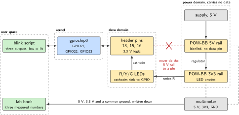
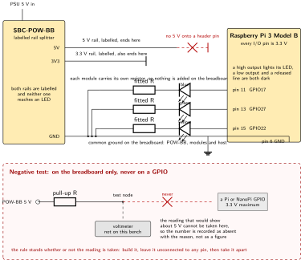
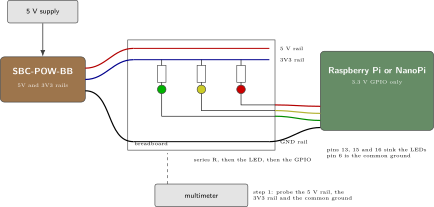
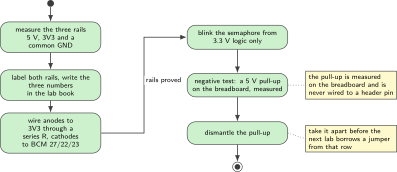

# P15. POW-BB mixed-voltage discipline

> **Host:** SBC-POW-BB + LK-LED10 modules + any Pi or NanoPi host  
> **Owns:** the electrical safety lab

> [!NOTE]
> **Why this lab is unique**
>
> Owns the electrical safety lab. No radio, no IMU. Every other lab in this book assumes the rails are labelled and the logic level is settled; this is where that happens.

## Intent

Label the rails. Prove that a 5 V circuit does not share a data pin with a 3.3 V system-on-chip input. The POW-BB is a labelled rail splitter, so the product of this lab is a bench where the 5 V rail and the 3.3 V rail are told apart by reading, not by guessing, and where what is known about each one is written in the lab book.

Three LK-LED10 modules become a semaphore driven from 3.3 V GPIO. Each module carries its own resistor, so nothing is added on the breadboard, and the breadboard's job in this lab is the common ground rail. The lab sequence puts this lab first and says do not skip it. The reason is arithmetic rather than caution: Pi, NanoPi and Nucleo I/O are 3.3 V, and a 5 V pull-up sits above that limit whatever the rest of the circuit does.

> [!NOTE]
> **Kit from the bin**
>
> Any Pi or NanoPi host, SBC-POW-BB, breadboard, jumpers, LK-LED10 modules. The bench this edition was built on has four, in blue, green, yellow and red.

> [!NOTE]
> **Measured on a Raspberry Pi 3 Model B on Friday 2 October 2026**
>
> This chapter was drafted with the LED anodes on the 3.3 V rail and the cathodes sinking into GPIO, so that a pin driven low was the lit state. On the bench the LK-LED10 is wired the other way round, and four observations say so. Driving the pin high lights it; driving it low puts it out; releasing the line to an input also puts it out; and the released line reads low, because it is pulled down through the LED and its own resistor rather than up towards a supply. The fourth is independent of the first three, which is why one sitting settled it.
>
> So the signal pin is the anode side, the header pin sources the current, and the POW-BB rails reach no LED at all. Which way round the LED sits is not printed on the module, so this is configuration rather than a constant: a module wired the other way sinks, and the three controls above are how to find out in a minute instead of debugging a script that is correct.
>
> The supply pin was settled the same way. One of the four modules had its `U` pin wired and the other three did not, which is the kind of asymmetry a later reader assumes is deliberate. Pulling that jumper changed nothing: the module lit exactly as before. The released-line reading says why. A module whose LED sat between `U` and `S1` would pull a floating `S1` up towards the supply, and this one reads low, so `U` is not in the lit circuit and the module needs signal and ground only.

> [!NOTE]
> **What each module draws, measured with the PPK2 on Saturday 3 October 2026**
>
> The one instrument on this bench is a Power Profiler Kit II, and it answers the question a voltmeter cannot: how much current each module actually takes. Each module was taken off the Pi entirely, its `S1` wired to the PPK2's `VOUT` and its `G` to the PPK2's `GND`, and read in source-meter mode at 5.000 V and then at 3.300 V, with the averaging window placed on the lit stretch of the trace and not across the step. Two points per module solve two unknowns, because `I = (V - Vf) / R`.
>
> |  | blue | green | yellow | red |
> | --- | --- | --- | --- | --- |
> | at 5.000 V | 9.81 mA | 15.98 mA | 13.10 mA | 13.16 mA |
> | at 3.300 V | 2.94 mA | 7.39 mA | 6.20 mA | 6.34 mA |
> | fraction kept at 3.3 V | 0.30 | 0.46 | 0.47 | 0.48 |
> | effective resistance | 247 ohm | 198 ohm | 246 ohm | 249 ohm |
> | derived forward voltage | 2.57 V | 1.84 V | 1.77 V | 1.72 V |
>
> *Table 15.1. Four LK-LED10 modules at the two supply voltages that matter here. The resistance is effective: a two-point fit lumps the fitted resistor with the diode's own slope, and two points cannot separate them.*
>
> **The resistor sets the current at 5 V. The forward voltage sets how much of it survives at 3.3 V.** The fraction a module keeps is `(3.3 - Vf) / (5 - Vf)`, which contains no resistor, and it reproduces every measured fraction above to two places. So a module that is dim on a 3.3 V pin is not dim because its resistor was sized for 5 V, which is only why it is as bright as it is at 5 V. It is dim because its forward voltage eats most of the 3.3 V, and that is a property of the colour's chemistry rather than of the module's design.
>
> **Blue stands alone, and the prediction about green was wrong.** The expectation written before measuring was that blue and green would both lose most of their current at 3.3 V, because modern greens sit near 3 V like blue. This green does not: at 1.84 V it is the older low-forward-voltage type and it keeps 46 per cent, beside yellow and red. Blue keeps 30. A reader should not infer a forward voltage from a colour name, which is exactly what that prediction did.
>
> **Three modules share an effective resistance** within three ohms and green sits at 198. With three different forward voltages giving the same figure, that figure is mostly the fitted resistor rather than the diode slope, so green most likely carries a different resistor. Most likely is as far as two points go.
>
> **The semaphore on the Pi draws 16.5 mA at 3.3 V**, blue, green and yellow together, which is under what one pin may source and well under the budget for the whole header. The three lit at once in the earlier note were never near a limit.

> [!NOTE]
> **Where this lab sits in the order**
>
> The lab sequence in the appendix opens with P15 rails, and adds: do not skip. Everything after it assumes a labelled 5 V rail, a labelled 3.3 V rail and a ground that is common to the host, the breadboard and the supply. The jig of P14 and the sidecars of P16 and P17 are the next three labs, and each of them puts 3.3 V logic on a wire you can reach.

## System architecture



*Figure 15.1. Two domains that meet only at ground. The power domain carries no data, the data domain carries no 5 V, and the LED current comes out of a header pin rather than off a rail.*

There are two domains on this bench and exactly one point where they meet. The power domain runs from the supply through the POW-BB into a labelled 5 V rail and a labelled 3.3 V rail. The data domain runs from a blink program through `gpiochip0` to three header pins. The header pins source the LED current and the modules return it to the common ground rail, so the only shared conductor is ground, and neither rail is part of the lit circuit.

Read the architecture figure as a statement about what is missing. Nothing connects the 5 V rail to a header pin, and in this wiring nothing connects the 3.3 V rail to anything either. That absence is the lab, and the negative test at the end of the procedure is there to show what the absent connection would have measured.

There is no microcontroller in this chapter, which makes it the plainest example of the rule that Linux owns the system. The host holds the program, the state and the record. Every later lab adds a peripheral to this picture, whether it is a modem on USB, a Nucleo on USB-CDC or an ESP on a UART, and none of them changes the voltage that arrives at a header pin.

## Wiring and schematic



*Figure 15.2. The rails, the semaphore and the negative test. Each module's resistor is already inside it, the header pin feeds the anode, and the cathode returns to the common ground rail, so a pin driven high is the lit state. The dashed fragment at the bottom is the negative test, and it lives on the breadboard.*

| Signal | Header pin | BCM GPIO | Note |
| --- | --- | --- | --- |
| POW-BB 5 V rail | none | none | Labelled, and connected to no header pin |
| POW-BB 3V3 rail | none | none | Labelled, and in this wiring it feeds no LED |
| Ground | 6 | GND | One jumper from the breadboard ground rail to the host |
| Blue module, S1 | 11 | GPIO17 | Lit when the pin is driven high |
| Green module, S1 | 13 | GPIO27 | Lit when the pin is driven high |
| Yellow module, S1 | 15 | GPIO22 | Lit when the pin is driven high |
| Each module, G | none | none | To the breadboard ground rail |
| Each module, U and S2 | none | none | Unconnected. One module had U wired and lit unchanged without it |
| Series resistor | none | none | None. The LK-LED10 carries its own |

*Table 15.2. Wiring for a Raspberry Pi 3 Model B, as measured. The draft of this chapter used BCM 27/22/23 with the cathodes on the pins; the bench uses BCM 17/27/22 with the anodes on the pins. Confirm the arrangement on your own module before writing a program, with the three controls in the note above.*

On a NanoPi NEO Air the same circuit uses pin 6 GND on the 24-pin header, and SYS\_3V3 only if a module turns out to need a supply. The NEO Air GPIO chosen for each module is not fixed by this book: pick three free pins and confirm them against the silkscreen before wiring. The one number that does not change is the logic level. The NEO Air is an Allwinner H3 board with 3.3 V I/O, and its 3.3 V pin is named SYS\_3V3 rather than 3V3, which is the kind of difference that a labelled rail prevents from becoming a mistake.

Two details in the schematic carry the whole chapter. The first is the direction of the LED, because it decides which logic level is lit and it is not printed on the part: here the anode is on the header pin, so the pin sources the current and a high output is the lit state. The second is that both rails end at a label and go nowhere else. Neither is difficult to build. Both are easy to build the other way round by accident, which is why they are drawn.

```text
PSU 5V ---- POW-BB 5V rail   (label it, then leave it)
POW-BB 3V3 rail labelled     (and in this wiring, unused)
GND common on the breadboard
GPIO ---> module S1 (anode, resistor already inside) ---> G ---> GND rail
Never tie a 5V pull-up to a Pi GPIO.
```

## Bench layout



*Figure 15.3. Bench layout. The POW-BB sits between the supply and the breadboard, the breadboard carries the common ground rail, and the host contributes the ground and three pins that source the LEDs.*

Put the POW-BB between the supply and the breadboard, not beside the host. That placement is a reminder of where the current comes from. The breadboard earns its place here as the common ground rail: three module grounds land on it and one jumper carries that node to the host.

The host contributes two things to this bench and nothing else: a ground and three pins that can source a few milliamps. No jumper runs from the 5 V rail toward the header. A bench that looks like this one is a bench where the next lab can be wired without rechecking the rails.

One consequence of the shared return is worth knowing before it is debugged. All three modules come back through one ground rail and one jumper, so three LEDs that go dark together is that jumper, and one LED dark on its own is its own signal wire. That is a free diagnostic and it costs nothing to remember.

## Software design (UML)



*Figure 15.4. The procedure as an activity. One module is wired and settled before the other two go on, and the negative test ends in a dismantle step rather than in a connection to a header pin.*

The software in this lab is three output pins and a loop, so the interesting design is the procedure rather than the program. Label, wire one, settle its polarity with three controls, write the polarity down, wire the rest, blink, then run the negative test and take it apart. The dismantle step is part of the procedure and not an afterthought: a pull-up left on the breadboard is a 5 V source sitting within jumper reach of a 3.3 V input for the rest of the week.

The blink program sets every pin low before it does anything else, because low is the unlit state when the pin sources. It also restores the pins on the way out. A semaphore that is left in an arbitrary state at the end of a run is a semaphore the next lab cannot read, and the same colours carry meaning in P01, P02 and P03, where green means registered, yellow means a default route and red means an event.

## Data flow (ASCII)

The current path and the information path are drawn together below. Current leaves the header pin, passes the resistor inside the module and then the LED, and returns along the breadboard ground rail to the host ground. Information travels the other way: the state of the program decides whether the pin drives high, and the colour on the bench is the only output.

```text
   PSU 5 V
      |
      v
  +------------------+   5V rail  ---> labelled, ends here
  |   SBC-POW-BB     |
  |  rail splitter   |   3V3 rail ---> labelled, ends here too
  +------------------+
      |
      | GND            Pi header pin 11 / 13 / 15
      |                       |
      |                       v  anode, resistor inside the module
      |                     LED
      |                       |  cathode
      +--- common ground -----+   GPIO high = LED on
                                  GPIO low  = LED off
                                  line released = LED off

  Negative test (breadboard only):
      5V rail --- pull-up R --- test node
      test node ---> a GPIO:  never.  Build it, read it if you can, take it apart.
```

## Steps

**Step 1.** **Label both rails, and record what this bench cannot measure.** The two rail voltages want a voltmeter, and the bench this edition was built on does not have one: its only instrument is an nRF PPK2, which measures current and can source a voltage but does not read the voltage at an arbitrary node. So the two numbers are recorded as absent, with the reason, rather than left as blank lines that read like an oversight or filled in from the label.

```text
lab book, P15
  5V rail        not measured: no voltmeter on this bench
  3V3 rail       not measured: no voltmeter on this bench
  GND continuity POW-BB to breadboard to host   shown by the LEDs themselves
  note: no 5 V on header pins
```

The ground line is the one that can still be settled without an instrument. A module lit from a GPIO has its return path through the breadboard rail and the ground jumper, so a lit LED is a continuity check on that node, and three lit LEDs check it three times.

**Step 2.** **Wire one module and settle its polarity before writing any program.** Signal pin to a free GPIO, ground pin to the breadboard ground rail, and then three controls in this order, looking at the LED between each one. Driving high, driving low, and releasing the line to an input. On this bench the result was lit, dark, dark, with the released line reading low.

```text
pi3b+ $ pinctrl set 17 op dh ; pinctrl get 17     # lit
pi3b+ $ pinctrl set 17 op dl ; pinctrl get 17     # dark
pi3b+ $ pinctrl set 17 ip    ; pinctrl get 17     # dark, and reads lo
```

Lit on high is the sourcing arrangement in the table above. Lit on low instead means the module sinks, and then every polarity in the rest of this chapter inverts. Write down which one you have, because it is the fact a later program is built on.

**Step 3.** **Blink the semaphore from 3.3 V logic.** Drive the three modules from their pins, without ever connecting those GPIOs to the 5 V rail. For a first light `pinctrl` is enough and it leaves the pin in the state it set. A program that holds the lines wants libgpiod v2, which is what the host carries and what the bench's own `bench-status` uses; the v1 `gpioset chip line=value` form is refused by v2, which needs the chip as an option.

```text
pi3b+ $ gpiodetect
gpiochip0 [pinctrl-bcm2835] (54 lines)

pi3b+ $ gpioset --version | head -1
gpioset (libgpiod) v2.2.1

pi3b+ $ gpioset -c gpiochip0 17=1
```

All three lit at once is worth doing deliberately, because it is the only check that three modules drawing together stay inside what the header can supply. Three modules at a few milliamps each are comfortably inside it, and the point of the check is to see it rather than to assume it.

**Step 4.** **Run the negative test on the breadboard only, not on a GPIO.** Build a 5 V pull-up on the breadboard and show that it sits above 3.3 V. Without a voltmeter the reading cannot be taken here, so record that as absent with the reason: the rule does not depend on the measurement, and the pull-up is still built, still kept away from every header pin, and still dismantled before the sitting ends. Nothing in this step touches a header pin at any point.

> [!IMPORTANT]
> **The 3.3 V rule in the rest of the book**
>
> - Pi, NanoPi and Nucleo I/O are 3.3 V. The POW-BB is a labelled rail splitter.
> - Never 5 V TTL into ESP pins (P14).
> - Do not put 5 V onto SYS\_3V3 on the NanoPi NEO Air (P09).
> - Never exceed <span class="math">±</span>10.1 V on an MCC 118 input, and Pi GPIO is not an analog source (P05).
> - Never source a Cat-4 power amplifier from the PPK2 (P10).

## Acceptance test

- Both rails are labelled, and the lab book says what was measured and what could not be, with the reason named rather than a blank.
- The ground is shown to be common to the POW-BB, the breadboard and the host, by a module lighting from a host pin.
- One module's polarity is settled by three controls, high then low then released, and written down.
- A blink program runs three modules as a semaphore from the host's own pins, and all three are seen lit at once.
- The lab book carries a sentence that says "no 5 V on header pins".
- The breadboard is clear of the negative-test pull-up when the sitting ends.
- No jumper runs between the 5 V rail and any header pin, on any host, at any point in the lab.

## Practices

The source gives this lab no practices paragraph of its own, so the practices are its own sentences. Label the rails on the POW-BB and treat the label as the instrument: it is a rail splitter, not a supply with a display. Settle the LED polarity on one module before wiring three, because the wrong assumption produces a program that is correct and a bench that shows the opposite.

Say what the bench cannot measure. A missing instrument recorded with its reason is a finding that the next person can act on; the same gap left as an empty line reads as carelessness, and filled in from a label it is worse than either.

Keep every I/O pin on this bench at 3.3 V: Pi, NanoPi and Nucleo I/O are 3.3 V, and that number is the same in every other lab in the book. The negative test exists to be seen once and then removed. Build one lab at a time, and do not skip this one, which is why it is first in the lab sequence.

## Pitfalls

- **A 5 V pull-up on a GPIO.** The symptom ranges from an input that reads high and never changes to a pin that stops responding altogether. This is the one connection the lab exists to prevent.
- **An unlabelled rail.** Two red jumpers, two rails, one guess. Label the rails and the guess disappears.
- **Assuming the polarity instead of testing it.** This chapter asserted the sinking arrangement and the module turned out to source. The three controls take a minute, and without them a correct program shows the wrong colour on every LED and looks like a logic bug.
- **Adding a series resistor the module already has.** Two resistors in series make the LED dimmer than it should be, which reads as a weak pin or a bad contact. Check the module before adding anything. A module that is dim at 3.3 V is not a fault either, and the measured table in the note above says which colour loses most and why.
- **Ground not common.** If the POW-BB ground and the host ground are separate, the LED either stays dark or lights in a way that does not follow the program. Three dark together is the shared ground jumper; one dark alone is its own signal wire.
- **Driving the supply pin.** The module has a supply pin that this wiring leaves unconnected. If it is ever used, it goes to 3.3 V and never to 5 V, because a module that puts its LED between supply and signal leaves the signal pin sitting at the supply voltage whenever the pin is not driving.
- **The negative test left standing.** A 5 V pull-up that stays on the breadboard is a hazard to the next lab that borrows a jumper from the same row.
- **Two red jumpers from the same strip.** Colour is a convention, not a measurement. The label on the POW-BB is what settles which rail a wire came from.
- **Reaching for the v1 command.** `gpioset gpiochip0 17=1` is refused by libgpiod v2 with an invalid-line-value complaint, which reads like a wiring fault and is not one. On v2 the chip is an option: `gpioset -c gpiochip0 17=1`.

## Sources

- JOY-iT SBC-POW-BB breadboard power supply documentation, <https://joy-it.net/en/products/SBC-POW-BB>
- Raspberry Pi hardware documentation, 40-pin header and GPIO electrical limits, <https://www.raspberrypi.com/documentation/computers/raspberry-pi.html>
- FriendlyElec NanoPi NEO Air wiki, 24-pin header pinout, <https://wiki.friendlyelec.com/wiki/index.php/NanoPi_NEO_Air>
- libgpiod and the character-device GPIO interface, which is what the host actually carries, <https://git.kernel.org/pub/scm/libs/libgpiod/libgpiod.git/>
- `pinctrl` in the Raspberry Pi utilities, for setting and reading one pin without holding the line, <https://github.com/raspberrypi/utils>
- JOY-iT LinkerKit LED module documentation, for the pinout and the fitted resistor, <https://joy-it.net/en/>

---

[Previous](14-usb-ttl-provisioning-jig.md) &nbsp;&nbsp;|&nbsp;&nbsp; [Contents](../README.md) &nbsp;&nbsp;|&nbsp;&nbsp; [Next](16-esp32-wi-fi-ble-sidecar.md)
