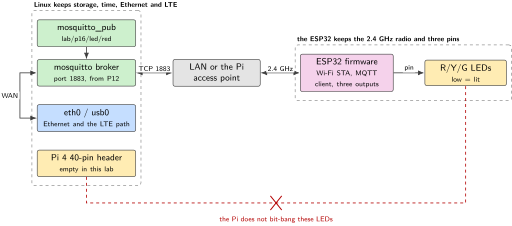
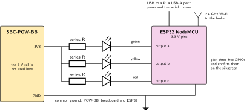
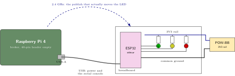
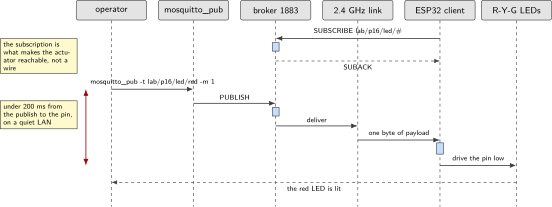

# P16. ESP32 Wi-Fi/BLE sidecar

> **Host:** Raspberry Pi 4 + SBC-NodeMCU-ESP32  
> **Owns:** the sidecar pattern and LED actuation

> [!NOTE]
> **Why this lab is unique**
>
> Owns the sidecar pattern: Linux keeps Ethernet and LTE, the ESP32 keeps the 2.4 GHz radio personality. The actuator LEDs from the P12 broker live here.

> [!NOTE]
> **What the 198-page blueprint got wrong**
>
> Draft P14 mixed the glass and the actuator. Split them. The panel, the keyboard and the broker stay in P12. The radio and the LEDs are this lab.

## Intent

The ESP32 joins the Pi 4 access point or the LAN, subscribes to `lab/p16/led/#`, and drives red, yellow and green. The Pi never bit-bangs those LEDs. That last sentence is the pattern: an actuator that is reached through a topic can be moved to the other side of the room without changing the publisher.

The division of labour is the teaching. Linux keeps the parts of the system that need storage, time and a routable network: the broker, the log, and whatever wide-area path P01 or P03 provided. The ESP32 keeps the 2.4 GHz radio personality and three output pins. Neither side reaches into the other, and the contract between them is a topic name.

> [!NOTE]
> **Kit from the bin**
>
> Pi 4, with the P12 broker welcome but not required, SBC-NodeMCU-ESP32, SBC-POW-BB, red, yellow and green LEDs, USB for power and serial.

> [!NOTE]
> **What the ESP32 arrives with**
>
> The board that lands on this bench came through the jig of P14, so it already has a known image, a recorded MAC and a unique client identifier. Provision it there, not here. In P17 the other ESP board takes the opposite role, an AT slave on a UART rather than a peer on the LAN.

## System architecture



*Figure 16.1. The sidecar. Linux keeps Ethernet and the cellular path, the ESP32 keeps the 2.4 GHz radio, and the only thing crossing between them is an MQTT topic. The path from the Pi header to the LEDs is the one that is deliberately absent.*

There are two radios in this picture and they do not compete. Whatever wide-area or wired path the Pi holds stays with Linux, and the 2.4 GHz personality lives on the ESP32. A publisher on the Pi writes to a topic; a subscriber on the ESP32 reads it and moves a pin. The broker in the middle is either the Mosquitto instance of P12 or a public test broker, and nothing in the design changes when that choice changes.

Note what the figure does not contain: a wire from the Pi 40-pin header to the LEDs. The Pi could drive them, as it does in P15, and that is exactly the design this lab rejects. Once the actuator is behind a topic it can be re-homed, duplicated or replaced by a second ESP32 without the publisher learning anything new.

## Wiring and schematic



*Figure 16.2. The sidecar wiring. USB carries power and the serial console, the POW-BB 3.3 V rail feeds the LED anodes through series resistors, and three ESP32 outputs sink the cathodes. The pin choice is yours: confirm it against the silkscreen.*

| Signal | Where | Note |
| --- | --- | --- |
| USB | ESP32 to the Pi | Power and serial console in one cable |
| POW-BB 3V3 rail | LED anodes | Through a series resistor, as in P15 |
| Ground | Common | POW-BB, breadboard and ESP32 |
| Three ESP32 outputs | LED cathodes | Three free GPIOs, confirm them against the silkscreen |
| Wi-Fi | 2.4 GHz | The ESP32 radio, not the Pi radio |

*Table 16.1. The sidecar has four wires and one radio link. The source names three GPIOs but not which three: pick them on the board in front of you and record the choice with the unit.*

The source for this lab gives a kit and a behaviour, not a pin map. Take the electrical convention from P15 without inventing anything else: anodes on the 3.3 V rail through a series resistor, cathodes sinking into an output pin, one common ground. ESP pins are 3.3 V, which is the same rule P14 states for the jig.

```text
POW-BB 3V3 rail --- series R --- LED anode
LED cathode     --- ESP32 output pin        (three of them, low = lit)
POW-BB GND      --- ESP32 GND               (common)
ESP32 USB       --- Pi USB-A                (power and serial console)
Wi-Fi           --- 2.4 GHz to the broker   (the ESP32 radio, not the Pi radio)
Never 5 V into an ESP pin.
```

## Bench layout



*Figure 16.3. Bench layout. The ESP32 sits on the breadboard with the LEDs and the POW-BB rail. The only connections to the Pi are a USB cable for power and console, and a radio link that carries the actual work.*

Put the ESP32 far enough from the Pi that the USB cable is doing something visible. The point of the layout is that the cable could be replaced by any 5 V source and the lab would still work, because the traffic arrives over the air. If the P12 broker is on the glass beside the bench, the publish and the LED are visible in one glance, which is the fastest way to see the latency figure.

## Software design (UML)



*Figure 16.4. One publish, end to end. The budget is 200 ms from the command on the Pi to the pin moving on the ESP32, on a quiet LAN.*

The sequence has four hops and one deadline. A publish enters the broker, the broker delivers to the subscriber, the subscriber parses one byte of payload, and the pin moves. Everything in that chain is small, so when the number is missed the cause is almost always the network rather than the code: a busy channel, a retry, or an access point that put the client to sleep.

Keep the payload trivial. The topic carries the colour and the message carries the state, exactly as the source's publish line shows. A subscriber that has to parse JSON to turn on a light has been given a second job it does not need.

## Data flow (ASCII)

```text
  Pi 4  (the P12 broker is welcome)        2.4 GHz         ESP32 sidecar
  +-------------------------------+                    +--------------------+
  | mosquitto_pub -t              |                    | Wi-Fi STA          |
  |   lab/p16/led/red -m 1        |                    | MQTT client        |
  |        |                      |                    |   sub lab/p16/led/#|
  |        v                      |    TCP over        |        |           |
  | mosquitto broker :1883        |====  Wi-Fi  ======>|        v           |
  |                               |                    | three output pins  |
  | eth0 / usb0 stay with Linux   |                    +--------|-----------+
  +-------------------------------+                             v
                                                        R / Y / G LEDs
  budget: publish to LED flip in under 200 ms on a quiet LAN
  the Pi 40-pin header drives nothing in this lab
```

## Steps

**Step 1.** **Write the sidecar sketch.** An ESP32 Arduino or ESP-IDF sketch: Wi-Fi STA, MQTT client, three GPIOs. Subscribe to `lab/p16/led/#` and map the last topic element to a pin. If the broker is the P12 instance, it has `allow_anonymous false` and a password file, so the client carries a user and a password.

```c
/* outline only: Wi-Fi STA, MQTT client, three outputs */
void on_message(const char *topic, const char *payload, int len)
{
    int pin = pin_for_colour(topic);   /* lab/p16/led/red -> the red pin */
    if (pin < 0)
        return;
    gpio_set_level(pin, payload[0] == '1' ? 0 : 1);   /* low = lit */
}
```

**Step 2.** **Publish from the Pi.** One topic, one byte of payload.

```bash
mosquitto_pub -h localhost -t lab/p16/led/red -m 1
```

**Step 3.** **Optional BLE.** The ESP32 advertises a lab UUID; the Pi uses `bluetoothctl` only as a presence check. Do not build a phone app.

## Acceptance test

- A topic flip toggles the matching LED in under 200 ms on a quiet LAN.
- All three colours respond to their own topic, and no other colour moves.
- No process on the Pi holds a GPIO for these LEDs. The header is empty of them.
- With BLE enabled, `bluetoothctl` sees the advertised lab UUID. Nothing else is built on top of it.

## Practices

The source gives this lab no practices paragraph of its own, so the practices are its own sentences. Linux keeps Ethernet and LTE; the ESP32 keeps the 2.4 GHz radio personality. The Pi never bit-bangs those LEDs. Keep the BLE work to a presence check and do not build a phone app. Measure the 200 ms figure on a quiet LAN, because that is the condition the acceptance test names, and record which broker answered.

Provision the board in P14 before it arrives here, and leave the other ESP board for P17. The two labs use the same family of silicon in opposite roles, and the difference between a peer and an AT slave is the thing worth keeping straight.

## Pitfalls

- **The Pi driving the LEDs "just to test".** It works, and it removes the entire point of the lab. The actuator is on the far side of a topic or it is not a sidecar.
- **An anonymous client against the P12 broker.** That broker sets `allow_anonymous false`. The symptom is a client that connects and is immediately dropped.
- **A busy channel during the measurement.** The 200 ms budget is quoted for a quiet LAN. A scan, a large transfer or a crowded access point makes the number meaningless.
- **Power saving on the station.** An ESP32 that is allowed to sleep between beacons answers late and inconsistently, which looks exactly like a broker problem.
- **5 V into an ESP pin.** The same rule as P14 and P15: ESP pins are 3.3 V.
- **A payload that grew.** One byte is enough. A JSON document for a light means the subscriber now has a parser to get wrong.
- **Two boards with one client identifier.** The broker disconnects one when the other connects. This is why P14 records a unique identifier per unit.

## Sources

- Eclipse Mosquitto documentation, `mosquitto_pub` and broker configuration, <https://mosquitto.org/documentation/>
- Espressif ESP-IDF MQTT client component, <https://docs.espressif.com/projects/esp-idf/en/latest/esp32/api-reference/protocols/mqtt.html>
- Espressif ESP-IDF Wi-Fi station and power-save modes, <https://docs.espressif.com/projects/esp-idf/en/latest/esp32/api-guides/wifi.html>
- Arduino core for the ESP32, <https://github.com/espressif/arduino-esp32>
- JOY-iT SBC-NodeMCU-ESP32 product page and manual, <https://joy-it.net/en/products/SBC-NodeMCU-ESP32>
- BlueZ `bluetoothctl` documentation, for the presence check only, <http://www.bluez.org/>

---

[Previous](15-pow-bb-mixed-voltage-discipline.md) &nbsp;&nbsp;|&nbsp;&nbsp; [Contents](../README.md) &nbsp;&nbsp;|&nbsp;&nbsp; [Next](17-esp8266-at-modem-on-the-nanopi.md)
