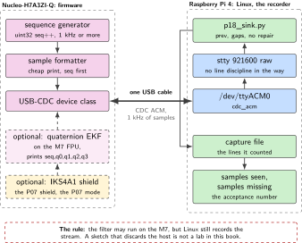
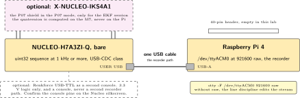
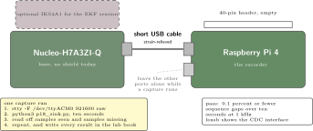
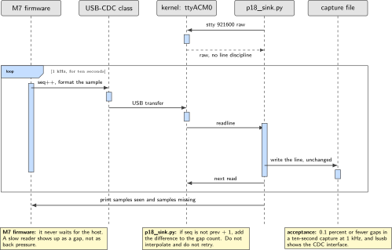

# P18. Nucleo USB-CDC recorder

> **Host:** Raspberry Pi 4 + bare Nucleo-H7A3ZI-Q, optional X-NUCLEO-IKS4A1  
> **Owns:** high-rate USB gadget traffic

> [!NOTE]
> **Why this lab is unique**
>
> Owns high-rate USB gadget traffic from the bare Nucleo. Linux is the recorder. An EKF may run on the H7 FPU; it must not replace the Linux host.

> [!NOTE]
> **What the 198-page blueprint got wrong**
>
> Draft P15 discards Linux entirely. That is out of scope for an embedded-Linux book unless a host still captures the UART or CDC stream. We keep the host.

## Intent

The Nucleo-H7A3ZI-Q streams a packed binary or text sample at 1 kHz or more over USB-CDC. The Pi 4 writes a file with sequence numbers. That is the entire product, and it is a harder product than it looks: a thousand samples a second through a character device, for ten seconds, with a counter that lets you prove afterwards how many of them arrived.

The optional half of the lab is a quaternion EKF on the M7 floating-point unit, using the P07 shield. It is optional because it changes nothing about the architecture. The filter runs on the microcontroller, the host still records the stream, and the acceptance test is still about sequence gaps rather than about the elegance of the filter. A bare-metal sketch is allowed in this book exactly when a Linux host still records what it produces, which is what this chapter demonstrates.

> [!NOTE]
> **Kit from the bin**
>
> Pi 4, Nucleo-H7A3ZI-Q, USB cable, optional X-NUCLEO-IKS4A1, optional Renkforce USB-TTL as a second console.

## System architecture



*Figure 18.1. The recorder. A sequence generator on the M7 produces samples at 1 kHz, the USB-CDC class carries them, and a Python sink on the Pi counts gaps before it writes. The shield and the EKF are drawn as the option they are.*

There are only two moving parts, and the interesting one is the counter. The firmware increments a `uint32` sequence number and emits it with every sample. The sink on the Pi keeps the previous value and compares. A gap means samples went missing somewhere between the two, and the count of gaps over a known interval is the quality number for the whole path: firmware timing, USB scheduling, the character device and the reader loop, all in one figure you can quote.

The Linux side must be told not to interpret the stream. A terminal device applies a line discipline by default, which edits characters on their way through and echoes them back. The `stty` call that sets the port to raw at 921600 baud is not decoration: without it, the capture is a record of what the terminal driver decided to do with the data rather than a record of what the microcontroller sent.

## Wiring and schematic



*Figure 18.2. One cable is the whole mandatory wiring. The shield and the USB-TTL console are optional, drawn dashed, and neither of them changes the recorder path.*

| Signal or part | Connector | Setting | Note |
| --- | --- | --- | --- |
| Nucleo USB | Pi 4 USB-A | CDC ACM | The mandatory link, the recorder path |
| Character device | Pi | /dev/ttyACM0 | More than one ACM node can appear |
| Line settings | Pi | 921600 raw | Set with `stty` before reading, see the steps |
| Sample rate | firmware | 1 kHz or more | A `uint32` sequence with every sample |
| X-NUCLEO-IKS4A1 | Nucleo Arduino UNO headers | optional | Only for the EKF session, the P07 shield with the P07 jumper mode |
| Renkforce USB-TTL | Pi USB-A | optional | 3.3 V logic, a second console only, never a second recorder path |
| Nucleo and Pi I/O | both | 3.3 V | Confirm the console pins on the Nucleo silkscreen before connecting the cable |
| Pi 40-pin header | Pi 4 | empty | No HAT in this lab |

*Table 18.1. Wiring. The recorder needs one USB cable. Everything else in the table is an option that the acceptance test does not depend on.*

```text
Mandatory:
  Nucleo USER USB  -->  Pi 4 USB-A        CDC ACM, /dev/ttyACM0
  stty -F /dev/ttyACM0 921600 raw
  firmware: uint32 sequence, 1 kHz or more

Optional, and only after the recorder passes:
  X-NUCLEO-IKS4A1 on the Nucleo Arduino headers   (the P07 shield, P07 mode)
  quaternion EKF on the M7 FPU, printing seq,q0,q1,q2,q3
  Renkforce USB-TTL as a second console, 3.3 V logic

Pi 40-pin header: empty.  Linux does not run the filter.
```

The optional shield is the P07 shield and nothing about it changes here, so set it up as P07 describes and come back. The Renkforce cable is the P14 jig's tool used as a console; it does not become a second data path, because two recorders of one stream produce two files that disagree and no way to say which is right.

## Bench layout



*Figure 18.3. Bench layout. A short USB cable, a Pi with an empty header, and nothing else competing for the bus during a capture. The optional shield and console are drawn where they would go.*

Use a short cable and leave the other USB ports alone while a capture runs. A ten-second capture at 1 kHz is ten thousand samples, and anything that makes the host busy at the wrong moment shows up as a gap that has nothing to do with the firmware. Strain-relieve the cable so a knock on the bench does not re-enumerate the device in the middle of the run.

## Software design (UML)



*Figure 18.4. The 1 kHz stream and the gap count. The firmware emits sequence numbers without waiting for anyone. The sink reads, compares each sequence number with the previous one, counts what is missing, and writes. The gap count is the acceptance number.*

The sink is a loop with two pieces of state: the previous sequence number and a gap counter. Every line either continues the sequence or does not, and when it does not, the difference is added to the counter rather than being repaired. Nothing is interpolated and nothing is retried, because the point of the exercise is to measure loss, not to hide it. At the end of ten seconds the loop prints the number of samples it saw and the number it did not, and those two numbers are the result of the lab.

## Data flow (ASCII)

```text
  Nucleo-H7A3ZI-Q  (bare, optional shield)       Pi 4  (the recorder)
  +-------------------------------+              +------------------------------+
  | uint32 seq++                  |              | stty 921600 raw              |
  |   1 kHz or more               |              |   |                          |
  |   |                           |    USB       |   v                          |
  |   v                           |=============>| /dev/ttyACM0                 |
  | USB-CDC class                 |   CDC ACM    |   |                          |
  +-------------------------------+              |   v                          |
        ^                                        | p18_sink.py                  |
        |  optional session only                 |   seq - prev == 1 ?          |
  +-------------------------------+              |     no  -> gaps += diff - 1  |
  | X-NUCLEO-IKS4A1 (P07 shield)  |              |   write the line             |
  | quaternion EKF on the M7 FPU  |              |   |                          |
  | prints seq,q0,q1,q2,q3        |              |   v                          |
  +-------------------------------+              | capture file + gap count     |
                                                 +------------------------------+

  Linux does not run the filter.  Linux records, counts and keeps the file.
```

## Steps

**Step 1.** **Write the firmware.** A Cube or Arduino USB-CDC sketch that increments a `uint32` sequence and prints it. Aim for 1 kHz. Keep the formatting cheap: a thousand lines a second leaves little room for an expensive print, and the first thing to check when the rate will not hold is how much work happens between two samples.

**Step 2.** **Confirm the device enumerated as CDC.**

```bash
lsusb
ls /dev/ttyACM*
```

The CDC interface must appear in `lsusb`. If more than one `ttyACM` node exists, the one carrying sequence numbers is the one to record.

**Step 3.** **Set the port raw and start the sink.**

```bash
stty -F /dev/ttyACM0 921600 raw
python3 p18_sink.py          # counts gaps in the sequence
```

**Step 4.** **Write the sink so that it counts rather than repairs.** Two pieces of state, one comparison, no interpolation.

```python
import sys, time, serial
ser = serial.Serial("/dev/ttyACM0", 921600, timeout=1)
prev = None
seen = 0
gaps = 0
t_end = time.monotonic() + 10.0
with open("p18_capture.txt", "w") as out:
    while time.monotonic() < t_end:
        line = ser.readline().decode(errors="ignore").strip()
        if not line:
            continue
        try:
            seq = int(line.split(",")[0])
        except ValueError:
            continue
        if prev is not None and seq != prev + 1:
            gaps += seq - prev - 1
        prev = seq
        seen += 1
        out.write(line + "\n")
print("samples", seen, "gaps", gaps)
```

**Step 5.** **Run a ten-second capture and quote the two numbers.** Samples seen and samples missing. A capture at 1 kHz that reports 0.1 percent or fewer sequence gaps passes. Run it more than once: a single clean run on a quiet host is a weaker claim than three runs with the numbers written down.

**Step 6.** **Optional EKF session.** Reuse the P07 shield, compute a quaternion on the M7 floating-point unit, and print `seq,q0,q1,q2,q3`. Linux does not run the filter. Keep the sequence number in the first field so the same sink still counts gaps, and keep this capture in its own file: it is a different stream from the bare recorder run.

## Acceptance test

- A 10-second capture at 1 kHz has 0.1 percent or fewer sequence gaps.
- `lsusb` shows the CDC interface.
- The sink prints both numbers, samples seen and samples missing, and the capture file holds the lines it counted.
- In the optional session, the quaternion is computed on the M7 and Linux still writes the file.

## Practices

Linux owns the system. A bare-metal sketch is allowed in this book only when a Linux host still records the stream, which is the whole reason this chapter exists. The filter, if you run one, belongs on the M7; the file, the clock and the gap count belong to the host.

Count gaps rather than trusting the stream. A recorder that cannot say how much it lost is not a recorder, it is a listener. Keep the capture short and repeat it: ten seconds at 1 kHz is enough to expose a scheduling problem, and three runs of ten seconds say more than one run of a minute. Leave the other USB ports alone while a capture runs, and keep the optional console as a console.

## Pitfalls

- **Forgetting `stty ... raw`.** The line discipline edits and echoes the stream. The symptom is a capture that looks plausible, loses characters at the boundaries and does not reproduce.
- **Recording the wrong `ttyACM` node.** With the ST-LINK present, more than one appears. The wrong one is silent rather than an error.
- **An expensive print in the firmware loop.** Formatting costs time that the 1 kHz budget does not have. The symptom is a rate that sits well under 1 kHz with no dropped samples at all, which is a different fault from a gap.
- **Interpolating over a gap.** A sink that fills in a missing sample discards the only measurement the lab produces. Count, do not repair.
- **Ignoring the `uint32` wrap.** After about four billion samples the counter returns to zero. It will not happen in ten seconds, but a sink that runs for a week needs the comparison written for it.
- **Running the filter on the Pi.** That is the opposite of the optional session and it proves nothing about the M7. Equally, discarding Linux is the draft-P15 error this chapter corrects.
- **Busy USB during a capture.** A copy, a scan or a second gadget on the same controller shows up as gaps that the firmware never caused.
- **Treating the console cable as a second data path.** Two recorders produce two files that disagree. The USB-TTL cable is a console, and 3.3 V logic at that.

## Sources

- ST NUCLEO-H7A3ZI-Q board page, <https://www.st.com/en/evaluation-tools/nucleo-h7a3zi-q.html>
- ST STM32CubeH7 USB device library, CDC class examples, <https://github.com/STMicroelectronics/STM32CubeH7>
- STM32duino core for STM32, for the Arduino USB-CDC path, <https://github.com/stm32duino/Arduino_Core_STM32>
- Linux USB CDC ACM driver documentation, <https://www.kernel.org/doc/html/latest/usb/index.html>
- `stty` and the terminal line discipline, in the coreutils manual, <https://www.gnu.org/software/coreutils/manual/coreutils.html>
- pySerial documentation, for the reader loop, <https://pyserial.readthedocs.io/>
- ST X-NUCLEO-IKS4A1 expansion board page, for the optional session, <https://www.st.com/en/ecosystems/x-nucleo-iks4a1.html>

---

[Previous](17-esp8266-at-modem-on-the-nanopi.md) &nbsp;&nbsp;|&nbsp;&nbsp; [Contents](../README.md) &nbsp;&nbsp;|&nbsp;&nbsp; [Next](19-spi-lcd-tilt-meter.md)
