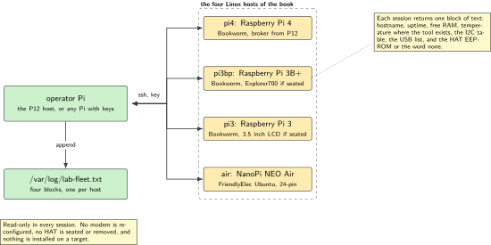
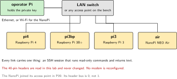
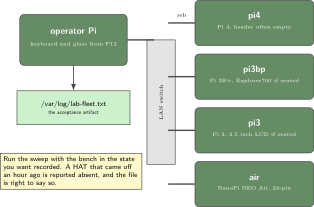
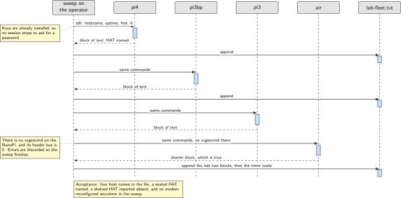

# P20. Four-host fleet health

> **Host:** all four Linux hosts over SSH  
> **Owns:** orchestration, no new physics

> [!NOTE]
> **Why this lab is unique**
>
> Owns orchestration across the Pi 4, the Pi 3B+, the Pi 3 and the NanoPi. No new physics.

## Intent

From P12, or from any Pi that has SSH keys to the others, a script of about forty lines reaches all four hosts and records what each one is: `uname`, free RAM, which 40-pin HAT EEPROM answers, and which USB gadgets are present. The output goes to `/var/log/lab-fleet.txt` on a timer, and that file is the acceptance artifact.

There is no new hardware and no new measurement in this chapter. Every board in it has already been brought up by an earlier lab, and this one only asks each board what it currently is. That is why the source puts it last in the working order: the fleet file is worth having when it reflects a known sitting, and worth very little when it reflects a bench that is half torn down.

> [!NOTE]
> **Kit from the bin**
>
> The four Linux hosts already built in the earlier labs: Pi 4, Pi 3B+, Pi 3 and NanoPi NEO Air, on one LAN, with SSH keys from the operator host to the other three.

> [!IMPORTANT]
> **This lab changes nothing**
>
> No step here reconfigures a modem, seats a HAT, or edits a device tree. It reads and it reports. A HAT that is on the shelf is reported absent, honestly.

## System architecture



*Figure 20.1. The four hosts and the operator Pi. Every arrow is an SSH session that runs a read-only command and returns text, and the only thing this lab writes is one file on the operator host.*

The shape is one operator and four targets, and the operator is usually the Pi 4 from P12, because it already has a keyboard and a panel to watch the sweep on. Nothing in the design requires that host specifically: any Pi with keys to the other three will do, including a Pi that is currently wearing a HAT for a different lab, since the sweep neither needs the header nor touches it.

Three of the targets are Raspberry Pi hosts running Bookworm and one is the NanoPi NEO Air running FriendlyElec Ubuntu. That difference is visible in the output rather than in the script: `vcgencmd` exists on the Pi hosts and not on the NanoPi, and the header bus that P09 established on the NanoPi is 0 rather than 1. The script is written with error output redirected so that it stays quiet where a command does not apply, and so that the sweep completes rather than stopping at the first host that lacks a tool.

| Name in the script | Board | Operating system | What the sweep expects to find |
| --- | --- | --- | --- |
| `pi4` | Raspberry Pi 4 | Bookworm | The broker from P12, USB gadgets, often an empty header |
| `pi3bp` | Raspberry Pi 3B+ | Bookworm | The Explorer700 from P11 if it is still seated |
| `pi3` | Raspberry Pi 3 | Bookworm | The 3.5 inch LCD from P06 or P19 if it is still seated |
| `air` | NanoPi NEO Air | FriendlyElec Ubuntu | About 512 MB of RAM, no HAT, and no `vcgencmd` |

*Table 20.1. The fleet. The four names in the loop are the four hosts of the book, and nothing else is ever added to that list.*

## Wiring and schematic



*Figure 20.2. The only wiring in this lab is the network. Each host has an address the operator can reach and a key that lets the operator in without a password prompt.*

| Connection | Medium | Note |
| --- | --- | --- |
| Operator to `pi4` | LAN | SSH key, no password prompt during the sweep |
| Operator to `pi3bp` | LAN | SSH key |
| Operator to `pi3` | LAN | SSH key |
| Operator to `air` | LAN over Wi-Fi | The NanoPi joined its access point in P09 |
| 40-pin headers |  | Read, never changed |

*Table 20.2. Connections. There are no flying leads, no jumpers and no HAT work in this chapter.*

```text
operator Pi (P12, or any Pi with keys)
   |
   +-- ssh pi4    -> Raspberry Pi 4,    Bookworm
   +-- ssh pi3bp  -> Raspberry Pi 3B+,  Bookworm
   +-- ssh pi3    -> Raspberry Pi 3,    Bookworm
   +-- ssh air    -> NanoPi NEO Air,    FriendlyElec Ubuntu, joined in P09

Every session runs read-only commands and returns text.
No step in this lab reconfigures a modem.
```

## Bench layout



*Figure 20.3. Bench layout for a sweep. Whatever is seated on a header stays seated: the point of the file is to record the bench as it actually is.*

Run this lab last in a sitting, with the bench in the state you want recorded. If a HAT came off an hour ago, the file will say the header is empty, and it will be right. The failure mode to avoid is the opposite one: tearing down after the sweep and then treating the file as current.

There is very little to lay out. Four boards, a switch or an access point, and the operator's keyboard and panel. The only physical requirement is that all four hosts are reachable at the same moment, which for the NanoPi means the Wi-Fi connection from P09 is still saved and still joining on its own.

## Software design (UML)



*Figure 20.4. One sweep. The operator opens a session per host in turn, each session answers with a block of text, and the four blocks are appended to `/var/log/lab-fleet.txt`.*

The sweep is a loop with no state carried between iterations. Each host is asked the same questions, each answer is text, and the operator concatenates them. That is the entire design, and it is deliberately not a monitoring system: there is no agent on the targets, nothing to install, and nothing that keeps running after the session closes.

The one piece of judgement in the script is what to do when a command is missing. `vcgencmd` is not on the NanoPi and `i2cdetect` may not be installed everywhere, so both are written with error output discarded. The sweep then produces a shorter block for that host rather than an error, and a shorter block is a true statement about that host.

> [!NOTE]
> **The file is the product**
>
> Everything else in this chapter exists to produce `/var/log/lab-fleet.txt`. There is no dashboard, no database and no alerting. When the acceptance test is run, it is run against that file, and the question asked of it is whether it matches the bench a person can see.

## Data flow (ASCII)

```text
  operator Pi                       four hosts                      artifact
  +-----------------+               +-----------------+             +----------------------+
  | for h in        |  ssh, key     | hostname        |             |                      |
  |   pi4 pi3bp     |-------------->| uptime          |             | /var/log/            |
  |   pi3 air       |               | free -h         |             |   lab-fleet.txt      |
  |                 |<--------------| vcgencmd temp   |  text       |                      |
  | append the text |   one block   | i2cdetect head  |------------>| four blocks,         |
  | to the log      |   per host    | lsusb | grep    |             | one per host         |
  +-----------------+               | /proc/.../hat   |             +----------------------+
         ^                          +-----------------+
         |
         +-- a timer runs the sweep again; the file is the acceptance artifact

  read-only everywhere: no modem is reconfigured, no HAT is seated or removed
```

## Steps

**Step 1.** **Put SSH keys on the three targets** from the operator Pi, so that the sweep runs without a password prompt. A sweep that stops to ask for a password is a sweep that cannot run on a timer.

```bash
ssh-keygen -t ed25519
ssh-copy-id pi4
ssh-copy-id pi3bp
ssh-copy-id pi3
ssh-copy-id air
ssh pi4 true && ssh pi3bp true && ssh pi3 true && ssh air true && echo "all four reachable"
```

**Step 2.** **Write the sweep.** This is the outline from the source, and it is about as long as the script needs to be.

```bash
for h in pi4 pi3bp pi3 air; do
  ssh $h 'hostname; uptime; free -h; vcgencmd measure_temp 2>/dev/null
          i2cdetect -y 1 2>/dev/null | head
          lsusb | grep -iE "st|sim|nordic|1a86|10c4"'
done
```

The redirects are load bearing. `vcgencmd` does not exist on the NanoPi, and the header bus there is 0 rather than 1, as P09 established. Both facts show up as a shorter block for that host, which is the honest result.

**Step 3.** **Detect the HAT EEPROM** at the ID bus, and report `none` when the header is empty.

```bash
ssh pi3bp 'test -d /proc/device-tree/hat && \
  cat /proc/device-tree/hat/product 2>/dev/null || echo none'
```

The honest report is the point. A header with nothing on it should produce `none` in the file, not a blank line that could mean anything.

**Step 4.** **Write the output to the log** and put the sweep on a timer. That file is the acceptance artifact.

```bash
sudo touch /var/log/lab-fleet.txt
sudo chown "$USER" /var/log/lab-fleet.txt
{ date -Is; ./fleet.sh; } >> /var/log/lab-fleet.txt
```

**Step 5.** **Read the file and check it against the bench.** Four host names, and a HAT named where one is seated and reported absent where one is not.

```bash
tail -n 60 /var/log/lab-fleet.txt
```

## Acceptance test

- Four host names appear in `/var/log/lab-fleet.txt`.
- A HAT that is physically seated is named.
- A HAT that is on the shelf is reported absent.
- No step in this lab reconfigures a modem.

## Practices

Run P20 last, so the fleet file reflects a known sitting. That is the source's own working order, and it is the only reason the file means anything: a sweep taken in the middle of a teardown records a bench that existed for ten minutes.

Keep the lab read-only. The commands in the sweep report state and do not change it, and the moment one of them starts fixing something the file stops being a record and becomes a side effect. If a host needs work, do the work in that host's own lab and run the sweep again afterwards.

Keep the host list at four names. The fleet of this book is the Pi 4, the Pi 3B+, the Pi 3 and the NanoPi NEO Air, and every one of them was brought up by a chapter that came earlier. A fifth entry is either a duplicate or a machine this book has not built, and in both cases the file becomes harder to trust rather than more complete.

## Pitfalls

- **No SSH keys.** The sweep stops at the first password prompt, which also means it can never run on a timer.
- **Expecting `vcgencmd` on the NanoPi.** It is a Raspberry Pi tool. The redirect is there so that its absence produces a shorter block rather than an error.
- **Expecting bus 1 on the NanoPi.** The header bus there is 0, as P09 established. The `i2cdetect -y 1` line in the sweep is written to stay quiet where it does not apply.
- **A blank line where a HAT should be named.** Report `none` explicitly. A blank line reads as a broken script rather than as an empty header.
- **Running the sweep in the middle of a teardown.** The file then describes a bench that no longer exists.
- **Adding a fifth name to the loop.** The fleet is four hosts. A fifth name is a host this book has not brought up.
- **Letting the sweep fix things.** A repair inside the sweep makes the artifact a record of what the script did rather than of what the bench was.

## Sources

- OpenSSH documentation, `ssh(1)`, `ssh-keygen(1)` and `ssh-copy-id(1)`
- Raspberry Pi documentation, the HAT ID EEPROM and `/proc/device-tree/hat`, <https://www.raspberrypi.com/documentation/computers/raspberry-pi.html>
- Raspberry Pi `vcgencmd` documentation, for `measure_temp`
- `i2c-tools` manual pages, `i2cdetect(8)` and its bus argument
- `lsusb(8)` and the USB vendor identifier list, for the 1a86 and 10c4 bridges
- `systemd.timer(5)`, for running the sweep on a schedule

---

[Previous](19-spi-lcd-tilt-meter.md) &nbsp;&nbsp;|&nbsp;&nbsp; [Contents](../README.md) &nbsp;&nbsp;|&nbsp;&nbsp; [Next](21-appendix.md)
